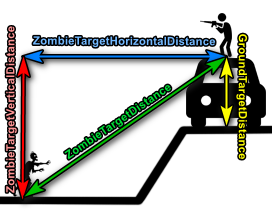

# Введение

Модификация изменяет AI зомби, а также некоторые характеристики и механику (все функции опциональны и гибко настраиваются).

Новые возможности зомби:
* У них есть режим поиска, в котором они очень долго ищут цель;
* Могут пинать и сломать (дверь больше нельзя будет закрыть) двери;
* Они лучше видят и слышат, агрессивнее и сильнее (HP, мощность, защита, слух, зрение, обоняние настраиваются в конфиге);
* Ночью они видят гораздо хуже, чем днем, но еще хорошо слышат;
* Они кричат, когда игрок обнаружен, и крик привлекает других зомби (шанс крика и радиус привлечения - настраивается);
* Могут пробивать блок игрока, нанося уменьшенный урон различных типов;
* Могут атаковать потерявших сознание игроков (количество ударов может быть ограничено);
* Их можно сделать враждебными к любому животному, в том числе и пользовательскому, но по умолчанию это отключено;
* Могут прыгать вверх и вниз по препятствиям, а также сбивать с них игроков (высота прыжка - настраивается);
* Они могут бросать в игрока различные предметы с большого расстояния, аналогично игроки могут бросать предметы в игроков/заражённых/животных;
* Они могут оглушить игрока обычными ударами, даже когда блокируют, но с меньшим шансом оглушить игрока в блоке. (подробнее о том, как это работает и настраивается [здесь](FAQ#when-dealing-damage-the-infected-stun-the-player-and-apply-various-debuffs-how-can-i-configure-this));
* У них есть накопительная система шокового урона для оглушения. То есть одиночный выстрел из MP5 зараженных не оглушит, а вот стрельба очередями их точно оглушит. То же самое относится и к выстрелам из дробовика, анимация оглушения зависит от попадания каждой дроби в тело.
* При попадании они могут передать игроку различные заболевания. Вероятность, условия и агенты [настраивается](#zombiesdiseasestoplayeragents);
* Они могут наносить урон разным конечностям игрока, накладывая различные дебаффы в зависимости от конечности, а также могут сломать любую конечность. (подробнее о том, как это работает и настраивается [здесь](FAQ#when-dealing-damage-the-infected-stun-the-player-and-apply-various-debuffs-how-can-i-configure-this));
* Они могут атаковать транспортное средство и игрока в нем, если разобьют оконное стекло;
* Могут реагировать на свет фар автомобиля в ночное время, звук двигателя автомобиля (вылет зависит от оборотов), сигнал автомобиля;
* Ночью реагируют на светящиеся предметы (костер, химический свет, фонарики, лампы и т.п.);
* Могут реагировать на шумовые объекты (генератор, будильник, фейерверк и т.п.);
* Они могут разрушать объекты, которые их раздражали (фары автомобиля, лампы, электрогенератор и т.п.);
* Они могут реагировать на раздражители пользовательских модов. (настраивается [здесь](#zombiescustomirritants));
* Могут реагировать на запахи игрока (новая механика: запахи распространяются с ветром);
* Они могут реагировать на симптомы игрока — кашель, чихание, смех, сильную боль и рвоту;
* Могут реагировать на падение игрока с препятствия или перепрыгивание через забор;
* Они могут реагировать на шум падения тел других зомби;
* Они могут реагировать на звук закрытия дверей, чтобы противостоять этому - у игрока есть возможность тихо закрыть дверь;
* Вы можете настроить множители урона по зомби для любого типа оружия или боеприпасов;
* У них есть кровеносная система, они могут умереть от потери крови ([видео](https://youtu.be/7slen4aUZTw)), и брызги или капли крови падают на землю или стены во время повреждений и кровотечения ([видео](https://youtu.be/R4k9jgGgRBs));
* Они могут получать различные дебаффы при повреждении конечностей, например, снижение атаки при ранении рук или снижение скорости при повреждении ног;
* Они могут сломать ноги при падении с большой высоты и даже умереть;
* Вы можете определить список камуфляжной одежды для игрока с соответствующими множителями видимости, тем самым влияя на вероятность обнаружения игрока зомби;
* Чтобы получить добычу от зомби - игроку необходимо обыскать тело зомби;
* Вы можете настроить скорость зомби для любого режима;
* Тело зомби можно разделывать так же, как и животных (полученные предметы настраиваются под любой тип зомби);
* Они могут игнорировать урон от токсичных зон (по умолчанию включено только для NBC Zombies);
* Они больше не застревают у окна дома, если видят игрока, а бегут к нему через двери или другими доступными способами;
* Более 100 вариантов конфигурации, настраиваемых под любой тип зомби;

Other features:
* Существует [система лечения боли и травм](Inedia-Pain-system-guide) (глубокие раны, переломы всех конечностей, внутреннее кровотечение и огнестрельные ранения). Кроме того, существуют медицинские изделия, позволяющие лечить эти травмы и снимать боль, с возможностью придания своим нестандартным предметам любых медицинских свойств.
* Транспортное средство получает повреждения при столкновении с зомби, игроками и животными. Систему боли можно полностью отключить с помощью параметра _Players.PainSystemIsActive_;
* Транспортное средство замедляется по закону сохранения импульса при столкновении с зомби, игроками и животными. ([видео](https://youtu.be/WJggWQo-uaU));
* В зависимости от скорости воспроизводятся соответствующие звуки столкновения автомобиля с зомби, игроками или животными;
* Медведи могут атаковать как элементы автомобиля, так и игрока внутри него, тогда как волки могут атаковать игрока только в том случае, если они разобьют стекла, или если транспортное средство не оснащено стеклом в своей конструкции;
* Животные могут умереть от потери крови;
* Животные могут получить дебафф скорости передвижения при повреждении ног;

# Configuration file

The configuration file is available here (created after server starts):

    %DayZserverDir%/profiles/Inedia/InediaInfectedAIConfig.json

If an error is present in the configuration file, upon entering the game, the administrator will be issued a corresponding message, and the default configuration file will be used. However, to receive this message, it is necessary to add your SteamID to the admin config file (how to do this read [here](#admin-privileges-and-commands)). Also, administrators have access to the **\ireload** command (entered in the game chat), allowing them to reload the mod configuration without restarting the server.

If you have received this error message, it means you need to check your configuration file for errors.

First, check content of the config file using : [JSON validator](https://jsonlint.com/). Just copy contents of the file, paste it into text area and click "Validate JSON" button, the validator will output errors if there are any.

Also be sure to check the server crash report, as the online validator cannot detect parameter type mismatch errors:

    %DayZserverDir%/profiles/crash_*.log

#### Updating the configuration file

You don't need to update the configuration after the modification update. If certain parameters are not present, default values will be used. You should only add new parameters if you want to change the default value if it doesn't suit your needs.

You can always check the default configuration file [here](Default-configuration-file). This file is updated after each modification update.

Additionally, there is a parameter _SaveConfigAfterInit_ that allows automatic addition of new parameters to the file after the update.

I believe that auto-editing your configuration file after an update is a bad practice, so you should enable this feature yourself, but please read the description carefully:

[SaveConfigAfterInit](#saveconfigafterinit)

# Admin privileges and commands

To access admin commands and functions, you need to add your SteamID to the administrators configuration file. This file will be created upon the server's first launch:

    %DayZserverDir%/profiles/Inedia/InediaAdminsConfig.json

⚠️ It's important that the SteamID is a string, otherwise, the configuration file will be completely ignored.

✅ Correct:

    {
        "AdminsSteamIds": ["77777777777777777", "78888888888888888"]
    }

❌ Incorrect:

    {
        "AdminsSteamIds": [77777777777777777, 78888888888888888]
    }

After adding your SteamID, you will become an administrator, and if there are any errors in the configuration file, you will receive a notification about them in the game chat when joining the server as an administrator.

Also after adding the SteamID, the following testing commands (entered in the game chat) become available for this player:
* **\ireload** - With this command, you can reload the game configuration file (InediaInfectedAIConfig.json) without restarting the server. That is, after making changes to the configuration file, it is not necessary to restart the server, it is sufficient to execute this command. If there are errors in the configuration file after reloading, the default configuration file will be used, and a corresponding warning will be displayed in the in-game chat. Please note that the configs for creatures are reloaded only for living beings;
* **\idmgdebug** - The command enables the damage debugging mode for incoming damage to infected/animals/players. When activated, administrators will receive chat messages with information about the damage received by the infected or players (source class, ammo, target class, damage zone, damage, shock damage, remaining HP);
* **\iirrdebug** - The command enables the output of debug messages about various Inedia-irritants affecting the activation of the infected search mode (irritant name, irritant type, irritant radius, etc.). Note that the command shows a fixed radius of effect for the irritant, without taking into account the sensitivity of the infected, which is configured individually for each infected;
* **\ihide [playerName|playerSteamID]** - Activates/deactivates hide mode for the current or specified player. This means that creatures will stop seeing the player, and infected ones will stop reacting to the player's irritants such as smells, footsteps, shots, light, etc. If [playerName|playerSteamID] is not specified, the command will be executed for the current player;
* **\igm [playerName|playerSteamID]** - Activates/deactivates god (invincibility) mode for the current or specified player. This means that creatures will stop dealing any damage to the player, but will still react to them as usual. Additionally, this command disables any other damage, such as from falls, collisions, explosions, etc. If [playerName|playerSteamID] is not specified, the command will be executed for the current player. There is also a command \ifgm, which activates invisibility, invincibility, infinite ammo, and automatic equipment repair (the command only enables all these features, they will have to be disabled individually);
* **\iheal [playerName|playerSteamID]** - Heals the current or specified player, including this mod's specialized debuffs. If [playerName|playerSteamID] is not specified, the command will be executed for the current player;
* **\irep [playerName|playerSteamID]** - Repairs all equipment of the current or specified player to pristine condition. If [playerName|playerSteamID] is not specified, the command will be executed for the current player;
* **\ieq [playerName|playerSteamID]** - Removes all equipment of the current or specified player and replaces it with test equipment. If [playerName|playerSteamID] is not specified, the command will be executed for the current player. There are also other equipment setups **\ieq2 \ieq3 \ieq4 \ieq5** for testing suppressed shots, submachine gun, shotgun, crossbow, and testing heavy defence or heavy load;
* **\iammo [playerName|playerSteamID]** - Activates unlimited ammo mode and also fills the current weapon in the player's hands with ammunition. If [playerName|playerSteamID] is not specified, the command will be executed for the current player;
* **\iday**, **\inight** - Activates day or night on the server (for quick testing of light irritants);
* **\irain \<0...100\>** - The command sets the rain intensity in percentage, or disables it if set to "0". Keep in mind that for testing purposes, this command fixes the weather and prevents it from changing for 10 hours or until the next server restart;
* **\isnow \<0...100\>** - The command sets the snowfall intensity in percentage, or disables it if set to "0". Keep in mind that for testing purposes, this command fixes the weather and prevents it from changing for 10 hours or until the next server restart;
* **\iwind \<0...20\>** - The command sets the wind speed in m/s, or disables it if set to "0". The wind direction is set according to the player's view. Keep in mind that for testing purposes, this command fixes the weather and prevents it from changing for 10 hours or until the next server restart;
* **\icar** - The command spawns a car ("Hatchback_02_Blue") in the direction the player is looking, 3 meters away from them;
* **\izmb [distance] [amount]** - The command removes all infected within a 1-kilometer radius around the player and spawns [amount] random low STR/DEF infected in the direction the player is looking, [distance] meters away from them.
    * The parameters [distance] and [amount] are optional, if not specified, a [distance] = 10 and [amount] = 1 meters will be used;
* **\izmbm [distance] [amount]** - Similar to the \izmb command, but spawns only medic zombies (medium STR/DEF).
* **\izmbs [distance] [amount]** - Similar to the \izmb command, but spawns only military zombies (high STR/DEF).
* **\iplayer [distance] [armor] [reversepain]** - The command removes all test players within a 1-kilometer radius around the player and spawns one test player in the direction the player is looking, [distance] meters away from them.
    * The [armor] parameter takes two values, "0" or "1". If set to "0", a test player will spawn without armor, otherwise, they will spawn with armor.
    * The [reversepain] parameter also takes two values, "0" or "1". If set to 1, the spawned test player will have activated reverse pain damage against whoever inflicts damage upon them, if set to "0", such reverse damage will be disabled.
    * The parameters [distance], [armor], [reversepain] optional, if not specified, a [distance] = 10, [armor] = 1 and [reversepain] = 1 will be used;
* **\iwolf [distance] [amount]** - The command removes all wolves within a 1-kilometer radius around the player and spawns [amount] wolves in the direction the player is looking, [distance] meters away from them.
    * The parameters [distance] and [amount] are optional, if not specified, a [distance] = 10 and [amount] = 1 meters will be used;
* **\ibear [distance] [amount]** - The command removes all bears within a 1-kilometer radius around the player and spawns [amount] bears in the direction the player is looking, [distance] meters away from them.
    * The parameters [distance] and [amount] are optional, if not specified, a [distance] = 10 and [amount] = 1 meters will be used;
* **\ideer [distance] [amount]** - The command removes all deers within a 1-kilometer radius around the player and spawns [amount] deers in the direction the player is looking, [distance] meters away from them.
    * The parameters [distance] and [amount] are optional, if not specified, a [distance] = 10 and [amount] = 1 meters will be used;
* **\iclear [radius]** - Removes all zombies, animals, test players, items and vehicles within a radius of [radius] meters around the player.
    * The [radius] parameter is optional, if not specified, a value of 500 meters will be used.

# Configuration options

⚠ **ANY** ⚠ _Zombies.*_ configuration parameter (excluding the _Zombies.Groups_, _Zombies.CustomIrritants_ and _Zombies.ThrowingProjectiles_ configuration lists) can be set for a specific class, for a base class, for a group, or for all zombies on the server.

Class names of zombies are not case-sensitive.

For example, this is how you can set resistance to toxic zones only for NBC zombies:

    "Zombies": {
        ...
        "ResistContaminatedEffect": {
            "all": 0,
            "ZmbM_NBC_Grey": 1,
            "ZmbM_NBC_Yellow": 1
        },
        ...
    }

In this case - NBC zombies will be immune to toxic zones, while all other zombies will not.

"all" - means that this value will be applied to all zombies on the server if a separate value is not configured for them, "all" is a sort of default value applied to creatures that don't have their own settings,
"all" is always present, even if you delete "all" in the config, the mod will set it to the default value hardcoded in the code.

You can also set parameter for specific group of zombies (уou can read more about the groups in the description of the [Zombies.Groups](Description#zombiesgroups) parameter).

For example, this is how you can give all military zombies immunity to toxic zones:

    "Zombies": {
        ...
        "ResistContaminatedEffect": {
            "all": 0,
            "military": 1
        },
        ...
    }

Or, for example, in chase mode, we'll limit the speed of all zombies to walking, while fast-running zombies (will specify their base classes) will jog:

    "Zombies": {
        ...
        "SpeedLimitInChaseMode": {
            "all": 1,
            "ZmbM__Runner_Base": 2.1
            "ZmbF_Runner_Base": 2.1
        },
        ...
    }

There are also base classes that allow you to set values for any type of creature (ZombieBase, AnimalBase, SurvivorBase). For example, this is how you can disable weapon knocking for players for all zombies while keeping this ability for other creatures:

    "Zombies": {
        ...
        "DisarmToPlayerChancePercent": {
            "all": 1,
            "ZombieBase": 0
        },
        ...
    }

An exact class name takes precedence over a base class, while a base class takes precedence over a group, and a group takes precedence over "all".

You can find more detailed information about the groups in the description of parameter [Zombies.Groups](Description#zombiesgroups).

Some parameters, ⚠ **this is indicated in their description** ⚠, can also be configured for animals or survivors. When setting a parameter for survivors, a special class "SurvivorBase" is used. If the parameter description doesn't specify which creatures it applies to, it ⚠ **works only for infected and does not apply to survivors or animals** ⚠.

***

### Zombies.Groups

This parameter represents a global list of groups and is not configured individually for each creature.

The parameter contains creature groups that can be used in configuration options instead of specifying the exact class of the creature.

By default, the following groups are created for infected:
* city
* villagers
* industrial
* military
* police
* prisoners
* firefighters
* medics
* hunters
* fishermen
* priests

Special groups have also been created for infected, allowing for quick configuration of protection and damage by associating the infected or their group with one of these groups:
* lowstr
* lowdef
* mediumstr
* mediumdef
* highstr
* highdef

Following groups were created for animals:
* bears
* wolves

**All groups support nesting**

That is, for example, we can add groups "police" and "military" inside the "highstr" group. After that, all settings configured for the "highstr" group will also apply to the "police" and "military" groups.
The maximum allowed nesting is 10. If exceeded, the game's crash log will display a corresponding warning about the recursion depth. This is done to prevent situations where groups loop back on themselves, for example, if in the above example, the "highstr" group is added inside the "police" group, these two groups will loop back on themselves, resulting in a crash log message with the name of the group where the looping occurred.

**One infected in multiple groups**

If an infected belongs to multiple groups, and these groups are used in the same configuration parameter, the multiplier of the first encountered group will be selected. Currently, there is no implemented priority between groups, and due to the peculiarities of the JSON parser's operation, the priority is independent of the sequence, thus, a completely random group may be selected.

Therefore, if a zombie belongs to multiple groups, the optimal solution would be to specify the multiplier for the exact or base class of that zombie, as the exact or base class takes precedence over the group.

**The default content of the groups**

The contents of the groups can be viewed in the [default configuration file](Default-configuration-file). You can modify or add your own groups in your configuration file.

Classes within groups are not case-sensitive, and base classes are also supported.

***

### Zombies.CustomIrritants

This parameter represents a global list of custom irritants and is not configured individually for each infected. To customize the infected's reaction to these irritants, there are parameter [Zombies.ReactCustomIrritants](#zombiesreactcustomirritants).

Here you can define a list of custom zombie irritant items.

You can't specify vanilla irritants (flashlights, chemlight, etc.) and the mod objects that inherit from them here. The reaction to vanilla irritants is adjusted by  parameters _Zombies.React#IRRITANT#_ and _Zombies.ReactAndDestroy#IRRITANT#_. The radii of vanilla irritants are fixed and cannot be affected at this time. Information on vanilla irritants radii can be found [here](Description#more-information-about-zombiesreactirritant-parameters).

Now, about custom irritants...

A mandatory condition is that the custom irritant item must be a descendant of "ItemBase" class, and it must operate through the "ComponentEnergyManager" (all vanilla items that can be turned on and off operate through it). If your item does not meet these conditions, the custom irritants functionality will not work for it. In this case, the only way to make your item or trigger work is to call a special static method of this mod in your scripts, which allows switching infected in a specific area to search mode. For more details, see [here](FAQ#how-can-i-activate-the-search-mode-for-infected-in-my-scripts).

If your item meets the conditions above, let's look at adding a custom irritant using matches and candles from the "SimpleMatch" modification as an example:

    "Zombies": {
        ...
        "CustomIrritants": {
            "matches": {
                "Classes": [
                    "Single_Match",
                    "New_Candle"
                ],
                "RadiusOutdoorDay": 0.0,
                "RadiusOutdoorNight": 25.0,
                "RadiusIndoorDay": 0.0,
                "RadiusIndoorNight": 5.0,
                "Type": 0,
                "Priority": 1
            },
            "othercustomirritantname": {
                "Classes": [
                    "Class1",
                    "Class2",
                    "Class3"
                ],
                "RadiusOutdoorDay": 50,
                "RadiusOutdoorNight": 50,
                "RadiusIndoorDay": 10,
                "RadiusIndoorNight": 10,
                "Type": 1,
                "Priority": 1
            }
        },
        ...
    }

Where:
* "_matches, othercustomirritantname_"
    * The irritant's name, it must be unique among other irritants. It can be used to configure the reaction to the irritant for a specific type of zombie.
* "_Classes_"
    * Item classes related to this irritant, for which the irritant's radius and priority settings will apply. You can specify not only the exact irritant class name but also the name of the base class from which it inherits. The class name is not case-sensitive.
* "_RadiusOutdoorDay_", "_RadiusOutdoorNight_", "_RadiusIndoorDay_", "_RadiusIndoorNight_"
    * The radius of effect for the irritant under different conditions (day, night, indoors, or outdoors).
* "_Type_"
    * An integer, type of irritant. "0" - visual irritant, "1" - noise irritant.
    * The type of irritant determines whether certain features will affect the radius of irritation. For example, noise irritants can be heard worse when it is raining. Also, the type of irritant affects the mechanics of the _Zombies.ReactBehind*Multiplier_ multipliers.
* "_Priority_"
    * An integer, the irritant's priority.
    * The higher the number, the higher the priority of this irritant for zombies compared to other irritants. This means that if a zombie is within the range of several irritants, it will prefer the irritant with the highest priority. If priorities are equal, the zombie will follow the irritant it first reacted to.

By default, vanilla irritants in the game have the following priorities:
* Weapon Shot, Explosive Items, Fireworks, FuelStation Explosion, Player Footsteps/Voice/Falls/Symptoms, Zombie Scream - **777**;
* Fireplace, Spotlight, Car Light, Car Horn, Car Engine, Power Generator, Doors Sounds, Hard Mining - **4**;
* Roadflare, Torch/Broom, Portable Gas Lamp, Smoke Grenade, Light Mining, Building, Saw Planks - **3**;
* Flashlights, Kitchen Timer, Alarm Clock - **2**;
* Chemlight, Bodyfall, Bodyfall Backstab - **1**;

The _LightInHouseMultiplier_ and _SoundInHouseMultiplier_ parameters have no effect on custom irritants, this effect is configured in the irritant itself (_RadiusOutdoor*_, _RadiusIndoor*_).

Configuring the reaction of a specific type of zombie to custom irritants can be done in the _Zombies.ReactCustomIrritants_ parameter.

***

### Zombies.ThrowingProjectiles

This parameter represents a global list of projectiles and is not configured individually for each infected. For individual customization of infected, there are parameters [Zombies.ThrowingProjectilesHandler*](#zombiesthrowingprojectileshandlerisactive).

With this parameter, you can define projectiles and their parameters, which can later be added to any type of infected, and they will throw them at players.

Here is an example of how you can add a projectile, which is ground garbage that infected can pick up to throw at players:

    "Zombies": {
        ...
        "ThrowingProjectiles": {
            ...
            "Garbage": {
                "ItemClasses": [
                    "WoodenStick",
                    "SmallStone"
                ],
                "Parameters": {}
            },
            ...
        },
        ...
    }

Where:
* "_Garbage_"
    * The name of the projectile to be used when adding this projectile to the infected.
* "_ItemClasses_"
    * Item classes related to this projectile and its parameters. When thrown, a random item is selected. Multiple identical items can be specified, thereby increasing the "weight" of the item, i.e., the likelihood that it will be thrown. Any item class must inherit from "InventoryItem" class, otherwise it won't be able to fly. Keep in mind that some objects in DayZ are replaced by other objects upon destruction, such as car wheels. For these objects, it is recommended to set the parameter _Parameters.DestroyProjectileAfterSeconds_ to "-1" so that they do not get destroyed at all, because otherwise, they will lose their physics after destruction, and they will not be removed from the server after some time following the throw, meaning they will ignore the value of the parameter _Parameters.DeleteProjectileAfterSeconds_. Currently, the only items I know of that behave this way are car wheels, so 99.9% of the other items will work normally. You will understand that it is such an item if, after configuring the projectile, it does not fly but simply appears next to the infected that threw it in a destroyed state.
* "_Parameters_"
    * The parameters of this projectile. Parameters can influence various characteristics of the projectile such as initial velocity, accuracy, launch conditions, throw chance, damage, grenade activation, and so on. If a parameter is not specified, the default value of the parameter is used. Therefore, in the example above, we obtain a projectile with all default parameters.

Now let's explore the parameters further:

#### _Parameters.HavingProjectileChancePercent_
* With this parameter, you can specify the percentage chance that this projectile will be available to the infected. The chance is calculated upon the spawn of the infected. If the chance does not trigger, the infected will not have this projectile.
* Default value: 100
#### _Parameters.InitialSpeed_
* Initial velocity of the projectile (m/s). It determines how far the projectile will fly. Before the throw, based on the target's position and the projectile's initial velocity, the throwing angle is calculated. If the velocity is insufficient for the projectile to reach the target, there will be no throw, consider this aspect. Typically, a velocity of 20 m/s is enough to throw projectiles a distance of approximately 25 meters.
* I do not recommend setting this parameter above 50 m/s, since the projectile hit handler may not have enough frequency to detect a hit.
* Default value: 20
#### _Parameters.AccuracySpread_
* Accuracy spread when throwing the projectile. This value ranges from "0" to "1", but you can set it higher. Projectiles are always thrown to a point located at the player's head position. Increasing spread causes this point to shift in a random direction by a distance equal to `distanceToTarget * AccuracySpread`, where distanceToTarget is the current distance between the infected and the target.
* Default value: 0.05
#### _Parameters.TargetHealthDamage_
* The Health Damage that the projectile will inflict on the target. The value ranges from 0 to 100.
* If this value is set to -1, the health damage will be determined based on the vanilla health damage of a heavy melee attack with this weapon. If this health damage is zero, then the health damage is determined by the weight of the weapon, ranging from 0 (0 kg) to 30 (3 kg). Please note that if you set the value of this parameter to "-1", items weighing less than 150 grams will not inflict damage as they have a very light weight.
* This damage depends on the multiplier _Zombies.ThrowingProjectilesHandlerDamageMultiplier_, which can be adjusted to alter the damage depending on the type of infected.
* Please note that this value is influenced by the character's armor.
* Default value: -1
#### _Parameters.TargetShockDamage_
* The Shock Damage that the projectile will inflict on the target. The value ranges from 0 to 100.
* If this value is set to -1, the shock damage will be determined based on the vanilla shock damage of a heavy melee attack with this weapon. If this shock damage is zero, then the shock damage is determined by the weight of the weapon, ranging from 0 (0 kg) to 30 (3 kg). Please note that if you set the value of this parameter to "-1", items weighing less than 150 grams will not inflict damage as they have a very light weight.
* This damage depends on the multiplier _Zombies.ThrowingProjectilesHandlerDamageMultiplier_, which can be adjusted to alter the damage depending on the type of infected.
* Please note that this value is influenced by the character's armor.
* Default value: -1
#### _Parameters.TargetPainMultiplier_
* When receiving damage from a projectile, the player experiences pain (InediaInfectedAI pain system). Pain is determined based on shock damage. For example, if the player receives 20 units of shock damage, they experience 20 units of pain in the limb hit by the projectile. This parameter can be used to specify a multiplier and affect the pain damage. For instance, setting this parameter to "0.5" would result in the player receiving 20 * 0.5 = 10 points of pain damage to the limb.
* Default value: 1
#### _Parameters.TargetStaminaDamage_
* The stamina damage percentage that the projectile will inflict on the target.
* The value ranges from -1 to 100.
* If this value is set to -1, the stamina damage will be determined based on the vanilla shock damage of a heavy melee attack with this weapon. If this shock damage is zero, then the stamina damage is determined by the weight of the weapon, ranging from 0% (0 kg) to 30% (3 kg). Please note that if you set the value of this parameter to "-1", items weighing less than 150 grams will not inflict damage as they have a very light weight.
* This damage depends on the multiplier _Zombies.ThrowingProjectilesHandlerDamageMultiplier_, which can be adjusted to alter the damage depending on the type of infected.
* Please note that this value is influenced by the character's armor.
* Default value: -1
#### _Parameters.TargetBloodDamage_
* The blood loss damage percentage that the projectile will inflict on the target.
* The value ranges from -1 to infinity.
* 100% represents the amount of blood from full to critical. That is, if the player has full blood, receiving 100% of this damage will reduce the blood value to critical. If the player with full blood receives 101% or even 100.001%, they will die.
* If this value is set to -1, the blood damage will be determined based on the vanilla health damage of a heavy melee attack with this weapon. If this health damage is zero, then the blood damage is determined by the weight of the weapon, ranging from 0 (0 kg) to 30 (3 kg). Please note that if you set the value of this parameter to "-1", items weighing less than 150 grams will not inflict damage as they have a very light weight.
* This damage depends on the multiplier _Zombies.ThrowingProjectilesHandlerDamageMultiplier_, which can be adjusted to alter the damage depending on the type of infected.
* Please note that this value is influenced by the character's armor.
* Default value: 0
#### _Parameters.TargetStunChancePercent_
* The percentage chance that upon hitting the player, the projectile will stun him or her. That is, his or her animation will be interrupted, he or she won't be able to do anything for about a second, and he or she will be slightly knocked back, increasing the likelihood of falling from a height.
* If this value is set to -1, the chance of stunning will be determined based on the vanilla shock damage from a heavy melee attack with this weapon. If this shock damage is equal to zero, the chance of stunning will be determined by the weight of the weapon, ranging from 0% (0 kg) to 100% (3 kg). Please note that if you set the value of this parameter to "-1", items weighing less than 150 grams will never stun the player as they have a very light weight.
* This chance depends on the multiplier _Zombies.ThrowingProjectilesHandlerDamageMultiplier_, which can be adjusted to alter the damage depending on the type of infected.
* Please note that this value is influenced by the character's armor.
* Default value: -1
#### _Parameters.TargetBleedingChancePercent_
* The percentage chance that upon hitting the player, the projectile will cause them to bleed.
* If this value is set to -1, the chance of bleeding will be determined based on the weapon type from the vanilla game configuration. Please note that if you set the value of this parameter to "-1", items weighing less than 150 grams will never cause bleeding to the player as they have a very light weight.
* This chance depends on the multiplier _Zombies.ThrowingProjectilesHandlerDamageMultiplier_, which can be adjusted to alter the damage depending on the type of infected.
* Please note that this value is influenced by the character's armor.
* Default value: -1
#### _Parameters.TargetBreakChanceMultiplier_
* Using this multiplier, you can influence the player's chance of sustaining a fracture from projectile damage (Inedia pain system). Setting the multiplier to "0" completely disables fractures for this projectile.
* Default value: 1
#### _Parameters.TargetDeepWoundChanceMultiplier_
* If a projectile causes vanilla bleeding upon impact, the logic for receiving a deep wound (Inedia pain system) is triggered. The player's chance of getting a deep wound is calculated based on the bleeding chance parameter (_Parameters.TargetBleedingChancePercent_). However, using this parameter as a multiplier, you can adjust this chance or completely disable deep wounds for the projectile by setting it to "0".
* Default value: 1
#### _Parameters.TargetArmsPainDisarmMultiplier_
* TMultiplier used to calculate the chance that upon hitting a player's damaged arm, the projectile will disarm them. This parameter functions similarly to its counterpart for infected _Zombies.PainToPlayerArmsDisarmMultiplier_. For a better understanding of its operation, refer to the description of this parameter.
* Default value: 0.3
#### _Parameters.ThrowConditionZombieTargetDistanceMax_
#### _Parameters.ThrowConditionZombieTargetDistanceMin_
#### _Parameters.ThrowConditionZombieTargetVerticalDistanceMax_
#### _Parameters.ThrowConditionZombieTargetVerticalDistanceMin_"
#### _Parameters.ThrowConditionZombieTargetHorizontalDistanceMax_
#### _Parameters.ThrowConditionZombieTargetHorizontalDistanceMin_
#### _Parameters.ThrowConditionGroundTargetDistanceMax_
#### _Parameters.ThrowConditionGroundTargetDistanceMin_
* Conditions based on various distances between the infected and the target, or between the ground and the target, under which the projectile will be thrown, otherwise, it will not be thrown.
* Keep in mind that if you want the infected to throw items from top to bottom, the minimum vertical distance to the target (_Parameters.ThrowConditionZombieTargetVerticalDistanceMin_) should be negative.
* "GroundTargetDistance" is the distance between the ground and the player. Objects on the ground are not considered the ground, therefore, this condition can be used to check if the player is sitting on an obstacle by setting a minimum value greater than zero. For example, "GroundTargetDistance" will increase if the player is sitting on a car, a building, or any other object that is not the ground.
* A picture is worth a thousand words, this picture shows all the distances used in these conditions.

* Default values:
    * _Parameters.ThrowConditionZombieTargetDistanceMax_ = 50
    * _Parameters.ThrowConditionZombieTargetDistanceMin_ = 0
    * _Parameters.ThrowConditionZombieTargetVerticalDistanceMax_ = 25
    * _Parameters.ThrowConditionZombieTargetVerticalDistanceMin_ = -25
    * _Parameters.ThrowConditionZombieTargetHorizontalDistanceMax_ = 25
    * _Parameters.ThrowConditionZombieTargetHorizontalDistanceMin_ = 0
    * _Parameters.ThrowConditionGroundTargetDistanceMax_ = 50
    * _Parameters.ThrowConditionGroundTargetDistanceMin_ = 0
#### _Parameters.ThrowConditionAllowThrowingForCrawlers_
* Should crawlers (infected with broken legs) be allowed to throw this projectile? This parameter takes a boolean value, either 0 or 1.
* Default value: 1
#### _Parameters.ThrowConditionAllowThrowingToPlayers_
* Should infected be allowed to throw this projectile at players? This parameter takes a boolean value, 0 or 1.
* Default value: 1
#### _Parameters.ThrowConditionAllowThrowingToAnimals_
* Should infected be allowed to throw this projectile at animals? This parameter takes a boolean value, 0 or 1.
* Default value: 1
#### _Parameters.ThrowConditionAllowThrowingToVehicles_
* Should infected be allowed to throw this projectile at vehicles? This parameter takes a boolean value, 0 or 1.
* Since the projectile does not have settings for attacking vehicle elements, the projectile damage parameters will not work for the vehicle. Instead, the car attack settings of the infected who threw the projectile at the vehicle will be used.
* Default value: 1
#### _Parameters.ThrowConditionAllowThrowingAtDaytime_
#### _Parameters.ThrowConditionAllowThrowingAtNight_
* This parameters takes only two values, "0" or "1".
* Conditions allowing the projectile to be thrown only at specific times of the day.
* Default values
    * _Parameters.ThrowConditionAllowThrowingAtDaytime_ = 1
    * _Parameters.ThrowConditionAllowThrowingAtNight_ = 1
#### _Parameters.ThrowConditionThrowChancePercent_
* The probability of the projectile being thrown if all conditions for throwing are met. Even if the throw attempt fails, a cooldown of _Parameters.ThrowConditionCooldownSeconds_ will be triggered.
* Default value: 100
#### _Parameters.ThrowConditionCooldownSeconds_
* For this duration of seconds after throwing the projectile (both successful and unsuccessful, see parameter _Parameters.ThrowConditionThrowChancePercent_), it cannot be thrown again.
* There is no point in setting the value of this parameter below 3 seconds, as the projectile cannot be thrown more frequently than the animation delay. Therefore, any value below 3 will be adjusted to 3.
* Default value: 0
#### _Parameters.ThrowConditionAmountOfProjectiles_
* The number of projectiles of this type available to the infected. This means that if the quantity, for example, is "2", the infected, having thrown the projectile "2" times, will no longer be able to use this projectile. If you specify the quantity as "-1", the projectile can be thrown infinitely.
* Default value: -1
#### _Parameters.DestroyProjectileAfterSeconds_
* This parameter allows you to specify the number of seconds after which the projectile item will be destroyed, i.e., its state will change to destroyed, and players will not be able to use it.
* If you specify "-1", the projectile item will never be destroyed.
* If you specify "0", the projectile item will be destroyed upon hitting a player or any other object (for example, it will fall to the ground).
* This parameter allows for certain tricks with specific items that activate specific logic upon destruction. For example, you can detonate a claymore upon hitting a player or any other object, or detonate it after a certain time. The same can be done, for example, with a gas canister.
* Note that if you set this time to be greater than "0", the item will be destroyed in the player's inventory upon disconnection. This is done to prevent abuses, as the item loses its timers after re-login.
* Keep in mind that some objects in DayZ are replaced by other objects upon destruction, such as car wheels. For these objects, it is recommended to set this parameter to "-1" so that they do not get destroyed at all, because otherwise, they will lose their physics after destruction, and they will not be removed from the server after some time following the throw, meaning they will ignore the value of the parameter _Parameters.DeleteProjectileAfterSeconds_. Currently, the only items I know of that behave this way are car wheels, so 99.9% of the other items will work normally. Уou will understand that it is such an item if, after configuring the projectile, it does not fly but simply appears next to the infected that threw it in a destroyed state.
* Default value: 0.001
#### _Parameters.DeleteProjectileAfterSeconds_
* Using this parameter, you can set the number of seconds after which the projectile item will be removed from the server. This way, a large number of items won't burden the server.
* If you specify "-1", the projectile item will never be removed.
* If you specify "0", the projectile item will be removed upon hitting a player or any other object (for example, it will fall to the ground).
* Note that if you set this time to be greater than "0", the item will be destroyed in the player's inventory upon disconnection. This is done to prevent abuses, as the item loses its timers after re-login.
* Default value: 60
#### _Parameters.ActivateGrenadeAfterSeconds_
* This parameter only works for explosive grenades inherited from the "Grenade_Base" class. Keep in mind that it will not work for smoke grenades, as they are activated through the Energy Manager, and smoke grenades should be activated using the _Parameters.StartWorkingAfterSeconds_ parameter.
* Using this parameter, you can specify the number of seconds after which the grenade will explode.
* If you specify "-1", the projectile item will never be exploded.
* If you specify "0", the projectile item will be exploded upon hitting a player or any other object (for example, it will fall to the ground).
* Keep in mind that the gas grenade always explodes upon collision with anything, this is a vanilla script that is not altered by this parameter.
* Note that if you set this time to be greater than "0", the item will be destroyed in the player's inventory upon disconnection. This is done to prevent abuses, as the item loses its timers after re-login.
* Default value: -1
#### _Parameters.StartWorkingAfterSeconds_
* This parameter works for items that operate through vanilla Energy Manager, i.e., can be turned on and off. For example, items like Roadflare, Smoke grenades, Flashlights, PowerGenerator (who would need to throw a generator :)), and so on.
* Using this parameter, you can set the number of seconds after which the projectile item will be activated, for example, Roadflare will start burning.
* If you specify "-1", the projectile item will never be activated.
* If you specify "0", the projectile item will be activated upon hitting a player or any other object (for example, it will fall to the ground).
* If you need instant activation of the item right after the throw, set this parameter in fractions of a second, for example, "0.001".
* Note that if you set this time to be greater than "0", the item will be destroyed in the player's inventory upon disconnection. This is done to prevent abuses, as the item loses its timers after re-login.
* Also, please note that some item will not be able to activate in the player's inventory.
* Default value: -1

If one of the parameters _Parameters.DestroyProjectileAfterSeconds_, _Parameters.DeleteProjectileAfterSeconds_, _Parameters.ActivateGrenadeAfterSeconds_, _Parameters.StartWorkingAfterSeconds_ is greater than zero, then having such a projectile item in the player's inventory during disconnection will result in the item being destroyed. This is done to prevent abuses, as upon disconnection, the timers for completion will not be able to execute certain logic with projectile items, and consequently, they will remain on the server and can be used by the player.

**Examples**

Thus, we can modify the projectile "Garbage" described above. For example, we can make it so that infected only throw the projectile at the player when the player is on an obstacle higher than the infected. Additionally, we can prohibit throwing the projectile more often than once every 5 seconds. Also, we will define the various types of damage inflicted by this projectile.

    "Zombies": {
        ...
        "ThrowingProjectiles": {
            ...
            "Garbage": {
                "ItemClasses": [
                    "WoodenStick",
                    "SmallStone"
                ],
                "Parameters": {
                    "TargetHealthDamage": 10.0,
                    "TargetShockDamage": 20.0,
                    "TargetStunChancePercent": 30.0,
                    "TargetBleedingChancePercent": 5.0,
                    "ThrowConditionZombieTargetVerticalDistanceMin": 0.5,
                    "ThrowConditionGroundTargetDistanceMin": 0.5,
                    "ThrowConditionCooldownSeconds": 5.0
                }
            },
            ...
        },
        ...
    }

Or, for example, we can create a grenade that will explode after 5 seconds of being thrown:

    "Zombies": {
        ...
        "ThrowingProjectiles": {
            ...
            "HEGrenade": {
                "ItemClasses": [
                    "RGD5Grenade"
                ],
                "Parameters": {
                    "DestroyProjectileAfterSeconds": -1,
                    "ActivateGrenadeAfterSeconds": 5
                }
            }
            ...
        },
        ...
    }

Using parameters, you can create a projectile for any purpose with practically any characteristics.

Keep in mind that regardless of the conditions, the infected cannot make a throw more often than once every 3 seconds, and also cannot make a throw if the distance to the player exceeds 50 meters. This is done to save server FPS, reduce the distance of raycasts, and their quantity. He can also throw projectiles only in a state of chasing, otherwise he simply does not see the target.

Also, please note that damage from projectiles is not considered damage from infected, so all damage configuration multipliers of this mod will not affect this damage. This is done deliberately to avoid conflicts with mods that apply various statuses on damage from infected, such as virus Z, and these statuses should not be transmitted through projectiles.

Regarding player clothing damage, due to implementation specifics, this cannot be adjusted through this mod's configuration. However, there is a way to influence this for all projectiles, more details are available [here](FAQ#how-to-change-the-damage-of-players-clothing-by-projectiles-thrown-by-infected-and-players).

You can read more about how to configure the projectile throwing system [here](FAQ#how-to-configure-the-projectiles-throwing-system).

***

### Zombies.BreakingDoorsHandlerIsActive

The parameter takes a boolean value, "0" or "1".

Enable or disable door breaking handler.

This parameter **will not work and makes no sense if** the _Zombies.SearchHandlerIsActive_ parameter is disabled, as infected interactions with doors only occur in search mode.

If the search mode is enabled, then this parameter should only be disabled if you are using door-breaking functionality from another mod. If you disable this functionality without connecting the features of another mod, the infected will get stuck at the doors for a long time, attempting to pass through.

If you are not using other mods but still want to disable the door-breaking feature, do it through parameters _Zombies.BreakingDoorsOpenChancePercent_ and _Zombies.BreakingDoorsOpenLockPickChancePercent_ by setting the door-breaking chance to 0%. In this case, the infected will lose interest in the door after one hit, change the target and everything will work correctly.

***

### Zombies.BreakingDoorsRestrictedDoors

Here you can specify doors that zombies cannot break down.

In this case, zombies will still try to break down such doors, but will not be able to knock them down and will lose interest in it, just as they lose interest when trying to break down a door locked with lockpick.

Example:

    "Zombies": {
        ...
        "BreakingDoorsRestrictedDoors": {
            "all": {
                "land_house_1w07": []
            },
            "police": {
                "land_house_1w07": [2, 0, 1],
                "land_factory_lathes": [1]
            },
            "military": {}
        },
        ...
    }

Explanation of logic in the example above:
* Military zombies - can knock down any door of any building;
* Police zombies are prohibited from knocking down doors with indexes "0", "1", "2" in building "land_house_1w07", as well as door with index "1" in building "land_factory_lathes", they are allowed to knock down all other doors of other buildings;
* Rest of zombies are prohibited from knocking down all doors of building "land_house_1w07" (if the array of door indexes is left empty, this will mean "all doors"). They are allowed to knock down all doors of other buildings;

In case you are using modifications that add custom doors - just add door class as a building (since all custom doors are buildings), and leave door indexes array empty, example for "DNA Keycards" modification:

    "Zombies": {
        ...
        "BreakingDoorsRestrictedDoors": {
            "all": {
                "DNA_Strongroom_ColourBase": [],
                "DNA_Strongroom_Open_Base": [],
                "DNA_Lockout_ColourBase": [],
                "DNA_Lockout_OneWayDoor": [],
                "DNA_Lockout_Dbl_ColourBase": [],
                "DNA_Door_NoLock_ColourBase": [],
                "DNA_WarpDoor_NoLock": [],
                "DNA_Door_NoLock_Dbl_ColourBase": [],
                "DNA_LockoutSteel_ColourBase": []
            }
        },
        ...
    }

You can find the door classes in the documentation of the modification that adds them or by contacting the author of that modification.

By default, I have already included support for the following mods in the config file: "DNA Keycards", "Custom Keycards", "KeyCard-Rooms", "Banov". So if you are using any of these mods and you have an up-to-date config file, you don't need to add anything. If you have an old configuration file, the current list of doors can be found in the default configuration file, which is available at [this link](Default-configuration-file).

You can specify not only the exact class name but also the name of the base class from which it inherits.

The class name of the building is not case-sensitive.

If _Zombies.BreakingDoorsHandlerIsActive_ parameter is disabled, this parameter will not work.

This parameter will not work and makes no sense if the _Zombies.SearchHandlerIsActive_ parameter is disabled, as infected interactions with doors only occur in search mode.

***

### Zombies.BreakingDoorsDestroyAfterOpenChancePercent

Chance that door will be broken when opened and can no longer be closed.

With the parameter [Players.DestroyedDoorNotificationType](Description#playersdestroyeddoornotificationtype) you can change the type of notification the player receives when attempting to open a destroyed door or disable it entirely.

If _Zombies.BreakingDoorsHandlerIsActive_ parameter is disabled, this parameter will not work.

This parameter will not work and makes no sense if the _Zombies.SearchHandlerIsActive_ parameter is disabled, as infected interactions with doors only occur in search mode.

***

### Zombies.BreakingDoorsOpenChancePercent

Chance that when hitting door - it will be opened.

If _Zombies.BreakingDoorsHandlerIsActive_ parameter is disabled, this parameter will not work.

This parameter will not work and makes no sense if the _Zombies.SearchHandlerIsActive_ parameter is disabled, as infected interactions with doors only occur in search mode.

***

### Zombies.BreakingDoorsOpenLockPickChancePercent

Chance that when hitting a door locked with lockpick - it will be opened.

If _Zombies.BreakingDoorsHandlerIsActive_ parameter is disabled, this parameter will not work.

This parameter will not work and makes no sense if the _Zombies.SearchHandlerIsActive_ parameter is disabled, as infected interactions with doors only occur in search mode.

***

### Zombies.BreakingDoorsLossInterestAfterHitChancePercent

Chance that after hitting a door  - zombie will lose interest in its current goal and choose a new goal.

This only works in search mode. In chase mode - zombie will never change goal, but if the zombie does not see target - chase mode does not last long.

If _Zombies.BreakingDoorsHandlerIsActive_ parameter is disabled, this parameter will not work.

This parameter will not work and makes no sense if the _Zombies.SearchHandlerIsActive_ parameter is disabled, as infected interactions with doors only occur in search mode.

***

### Zombies.BreakingDoorsLossInterestAfterHitLockPickChancePercent

Chance that after hitting a door closed with lockpick - zombie will lose interest in its current goal and choose a new goal.

This only works in search mode. In chase mode - zombie will never change goal, but if the zombie does not see target - chase mode does not last long.

If _Zombies.BreakingDoorsHandlerIsActive_ parameter is disabled, this parameter will not work.

This parameter will not work and makes no sense if the _Zombies.SearchHandlerIsActive_ parameter is disabled, as infected interactions with doors only occur in search mode.

***

### Zombies.BreakingDoorsCrawlersChanceMultiplier

Parameter accepts float values from "0" to infinity.

This parameter allows setting a multiplier for the chance of door-breaking for crawling infected.

This multiplier is applied to parameters _Zombies.BreakingDoorsOpenChancePercent_ and _Zombies.BreakingDoorsOpenLockPickChancePercent_.

For example, if the door-breaking chance (_Zombies.BreakingDoorsOpenChancePercent_) is "30%", and the multiplier value is "0.5", then a crawling infected will break the door on a hit with a chance of 30% * 0.5 = 15%.

Setting this multiplier to "0" will deprive crawling infected of the ability to break the door, i.e., they will lose interest in the door after the first hit.

If _Zombies.BreakingDoorsHandlerIsActive_ parameter is disabled, this parameter will not work.

This parameter will not work and makes no sense if the _Zombies.SearchHandlerIsActive_ parameter is disabled, as infected interactions with doors only occur in search mode.

***

### Zombies.AttackPlayersUnconsciousHandlerIsActive

The parameter takes a boolean value, "0" or "1".

Enables or disables the zombie attack handler for unconscious players.

If this parameter is disabled, the game will use the fully vanilla mechanics or mechanics from other mods.

***

### Zombies.AttackPlayersUnconsciousHitsLimit

The parameters accepts integer values from "-1" to infinity.

This parameter allows you to specify the number of hits that infected are allowed to make on the player while the player is unconscious.

This parameter prevents the infected from hitting the player more than the specified number of times.
It works as follows:
* The player has a counter that tracks the number of hits received while unconscious, which is global for all infected.
* When the player loses consciousness, this counter is reset.
* The infected checks the value of this parameter (which can be adjusted for any type of infected) against the counter, and if the parameter is greater, the infected hits the player and increases the counter until it reaches the parameter's value.
Thus, the player loses the ability to safely lose consciousness, as even when unconscious, they can be noticed by the infected and the counter will be completed.

The purpose of introducing this parameter is to prevent abuse, where, with attacks on unconscious players disabled, players with fractures could deliberately lose consciousness in dangerous moments to avoid threats.

Now, losing consciousness will always cost the player a certain number of hits, making them think twice about whether it's worth the risk. And at least in the behavior of the zombie, some logic appears. It hits the body for a while, after which it thinks the victim is dead and loses interest in them, as they cannot determine whether the victim is alive or not. There will also no longer be illogical behavior where a zombie immediately loses interest in the prey it's chasing if the prey loses consciousness. With this parameter, the infected will always hit a target a certain number of times before losing interest, preventing her from "hiding" in unconsciousness.

According to my tests, the ideal value for this parameter in the default configuration was "5" hits, which generally prevents the player from dying but leaves serious consequences from losing consciousness, often resulting in fractures. As a result, players will think twice before engaging in an unequal fight.

If you want the infected to always kill unconscious players, set the value of this parameter to "-1".

If you want the infected to ignore unconscious players, set this parameter value to "0".

#### Description of the logic behind the loss of interest by zombies in search mode towards unconscious players.

I'll describe how losing interest in an unconscious player works now, to avoid unnecessary questions and misunderstandings. After losing consciousness - the player becomes a beacon, which every 5 seconds puts all infected within a radius of 50 meters in vanilla mode for 5 seconds, thus keeping in vanilla mode all the infected around, including those who have entered the area of the beacon again. Since in vanilla mode the infected don't kick down doors and don't search for players - here it is possible to abuse, when one player is unconscious and the other player kills the infected safely. To prevent this, the above logic of switching infected to vanilla mode will not work if there is another player within 30 meters of the unconscious player. In essence, this means that the infected will not scatter away from the unconscious player if another player is within 30 meters.

If _Zombies.AttackPlayersUnconsciousHandlerIsActive_ or _Zombies.AttackPlayersUnconscious_ parameters is disabled, this parameter will not work.

***

### Zombies.AttackAnimalsHandlerIsActive

The parameter takes a boolean value, "0" or "1".

Disables all _Zombies.AttackAnimal*_ functions.

I recommend disabling this parameter only if the processing of relationships between infected and animals is handled by another mod, otherwise, by disabling this parameter, all infected and animals will default to being enemies.

Keep in mind that _Zombies.AttackAnimals*_ parameters may not function correctly if one of your mods affects the relationships between infected and predators in the config.cpp file. For instance, some mods may make infected and predators friends by altering the parameters:

`AIParams AgentTeams Predator friends[]` or `AIParams AgentTeams Zombies friends[]`

Be cautious not to waste a lot of time figuring out potential issues.

***

### Zombies.AttackAnimalsCow

The parameter takes a boolean value, "0" or "1".

Whether zombies can attack cows.

This parameter affects all animals inherited from the base class. If you are using custom animals inherited from the same class and need to configure their relationships with infected separately, use the _Zombies.AttackAnimalsCustom_ parameter, as it takes precedence over this parameter.

If _Zombies.AttackAnimalsHandlerIsActive_ parameter is disabled, this parameter will not work.

***

### Zombies.AttackAnimalsPig

The parameter takes a boolean value, "0" or "1".

Whether zombies can attack pigs.

This parameter affects all animals inherited from the base class. If you are using custom animals inherited from the same class and need to configure their relationships with infected separately, use the _Zombies.AttackAnimalsCustom_ parameter, as it takes precedence over this parameter.

If _Zombies.AttackAnimalsHandlerIsActive_ parameter is disabled, this parameter will not work.

***

### Zombies.AttackAnimalsSheep

The parameter takes a boolean value, "0" or "1".

Whether zombies can attack sheeps.

This parameter affects all animals inherited from the base class. If you are using custom animals inherited from the same class and need to configure their relationships with infected separately, use the _Zombies.AttackAnimalsCustom_ parameter, as it takes precedence over this parameter.

If _Zombies.AttackAnimalsHandlerIsActive_ parameter is disabled, this parameter will not work.

***

### Zombies.AttackAnimalsGoat

The parameter takes a boolean value, "0" or "1".

Whether zombies can attack goats.

This parameter affects all animals inherited from the base class. If you are using custom animals inherited from the same class and need to configure their relationships with infected separately, use the _Zombies.AttackAnimalsCustom_ parameter, as it takes precedence over this parameter.

If _Zombies.AttackAnimalsHandlerIsActive_ parameter is disabled, this parameter will not work.

***

### Zombies.AttackAnimalsWildBoar

The parameter takes a boolean value, "0" or "1".

Whether zombies can attack wild boars.

This parameter affects all animals inherited from the base class. If you are using custom animals inherited from the same class and need to configure their relationships with infected separately, use the _Zombies.AttackAnimalsCustom_ parameter, as it takes precedence over this parameter.

If _Zombies.AttackAnimalsHandlerIsActive_ parameter is disabled, this parameter will not work.

***

### Zombies.AttackAnimalsDeer

The parameter takes a boolean value, "0" or "1".

Whether zombies can attack deers.

This parameter affects all animals inherited from the base class. If you are using custom animals inherited from the same class and need to configure their relationships with infected separately, use the _Zombies.AttackAnimalsCustom_ parameter, as it takes precedence over this parameter.

If _Zombies.AttackAnimalsHandlerIsActive_ parameter is disabled, this parameter will not work.

***

### Zombies.AttackAnimalsRoeDeer

The parameter takes a boolean value, "0" or "1".

Whether zombies can attack roe deers.

This parameter affects all animals inherited from the base class. If you are using custom animals inherited from the same class and need to configure their relationships with infected separately, use the _Zombies.AttackAnimalsCustom_ parameter, as it takes precedence over this parameter.

If _Zombies.AttackAnimalsHandlerIsActive_ parameter is disabled, this parameter will not work.

***

### Zombies.AttackAnimalsCustom

If you are using custom animals on your server, you can use this parameter to specify the relationships between these animals and infected. By default, all custom animals and infected are friends.

This parameter takes precedence over any _Zombies.AttackAnimals*_ parameter, so you can use it if you are using custom animals inherited from one of the vanilla classes and you need to customize their relationship with infected separately.

Here is an example of how you can add several custom animals that will be attacked by the infected:

    "Zombies": {
        ...
        "AttackAnimalsCustom": {
            "all": {
                "all": 0,
                "CustomAnimalClass1": 1,
                "CustomAnimalClass2": 1
            }
        },
        ...
    }

These settings do not apply to animals from certain mods that manage relationships between these animals and the infected themselves, for example, the "DayZ-Dog" mod.

The class name of a custom animal can take either the exact class name or the name of the base class, and it is not case-sensitive.

If a custom animal is not present in the list and is not inherited from any of the vanilla animal classes, it will use the "all" value. In the example above, this value is set to "0", meaning that such an animal will be friendly with infected.

If _Zombies.AttackAnimalsHandlerIsActive_ parameter is disabled, this parameter will not work.

***

### Zombies.FriendlyNPC

With this parameter, you can specify the classes or base classes of survivor NPCs (including AI bots) that creatures will not attack. They will also not react to the irritants of these NPCs, such as shots, smells, noise, and light. An important condition is that the NPC class must be a descendant of "SurvivorBase".

Thus, it becomes possible to make certain creatures friendly towards NPCs, while leaving others hostile.

Currently, NPC support from the "DayZ-Expansion-AI" modification is fully implemented. This means that if an NPC from this modification is specified, not only will the creature cease attacking it, but the NPC will also stop attacking the creature.

As for other modifications, it's hard to say. Most likely, using this parameter will disable attacks by creature on NPCs, but not vice versa. This is because to disable attacks by NPCs on creature, one would need to study and modify the specific mod. This has been done for "DayZ-Expansion-AI" but not for other mods.

Here's an example of how to make multiple survivor NPCs from "DayZ-Expansion-AI" friendly to all creatures:

    "Zombies": {
        ...
        "FriendlyNPC": {
            "all": [
                "eAI_SurvivorM_Boris",
                "eAI_SurvivorM_Mirek"
            ]
        },
        ...
    }

If you want to make an creatures friendly towards all NPCs on the server, use the "SurvivorBase" class.

This parameter can be set not only for infected classes, but also for animals.

***

### Zombies.SearchHandlerIsActive

The parameter takes a boolean value, "0" or "1".

Enables or disables search mode, in which zombie searches for a player for a long time. When this mode is disabled, many other functions (breaking doors, reaction to light, noise, smells, screams) will not work.

***

### Zombies.SearchSphereRadiusIncreaseEverySeconds

By how many meters will radius of search sphere increase every second.

***

### Zombies.SearchSphereDistanceToRadiusMultiplier

Parameter accepts float values from "0" to "1".

The multiplier by which distance from zombie to source of irritation will be multiplied and as a result radius of search sphere will be obtained.

***

### Zombies.SearchSphereRadiusMin

Minimum radius of search sphere.

If, after creating the sphere, its radius is less than the value specified in this parameter, it will be set to the value specified in this parameter.

***

### Zombies.SearchSphereRadiusMax

The maximum radius of search sphere.

If, after creating the sphere, its radius exceeds the value specified in this parameter, it will be set to the value specified in this parameter.

***

### Zombies.SearchSphereRadiusBurst

The maximum radius of search sphere. If this radius is exceeded, the sphere bursts and zombie goes into vanilla calm mode.

***

### Zombies.SpeedHandlerIsActive

The parameter takes a boolean value, "0" or "1".

Switches zombie speed processing to vanilla mode.

If vanilla mechanics are required or zombie speed is handled by another mod - set this parameter to "0".

***

### Zombies.SpeedMinimumInCalmMode
### Zombies.SpeedLimitInCalmMode
### Zombies.SpeedMinimumInSearchMode
### Zombies.SpeedLimitInSearchMode
### Zombies.SpeedMinimumInChaseMode
### Zombies.SpeedLimitInChaseMode

The parameters accepts float values from "0" to "3".

Using these parameters, you can specify the maximum and minimum speed of infected in calm, search and chase modes.

Based on my tests, these values correspond to the following types of movement:
* "1" - walking
* "2.1" - jogging
* "3" - sprinting

Vanilla infected do not support speeds higher than "3", and there is also no possibility to speed up/slow down the infected in the walking or jogging animation.

To have the ability to influence these speeds more flexibly, you can use the _Zombies.SpeedMultiplier*_ parameters. For more details on how they work, refer to the parameter descriptions.

Remember that:
* The infected speed in search mode cannot be less than "1", so values of parameter _Zombies.SpeedLimitInSearchMode_ below "1" are meaningless.

If _Zombies.SpeedHandlerIsActive_ parameter is disabled, this parameters will not work.

***

### Zombies.SpeedMultiplierInCalmMode
### Zombies.SpeedMultiplierInSearchMode
### Zombies.SpeedMultiplierInChaseMode

The parameters accepts float values.

Vanilla infected do not support speeds higher than "3", and there is also no possibility to speed up/slow down the infected in the walking or jogging animation. Therefore, these parameters were introduced to enhance or diminish the influence on the infected's speed.

If the value of this parameter is different from "1", then each frame the position of the infected will be shifted in the direction or against the direction of its movement depending on the multiplier. A multiplier of "0.5" means that the infected speed will be half of the vanilla speed, while a multiplier of "2" means that the infected speed will be twice the vanilla speed. If the multiplier is "1", there will be no influence on the speed.

Thus, this parameter does not alter the animation of the infected but merely nudges them in one direction or another. Therefore, in the case of high speeds, a skating effect will be observed, these are the costs of this functionality.

No matter what value is set for this parameter, the speed of the infected will never exceed ~50 km/h and will be capped at this value. This is because at high speeds, the distance moved by the infected within one frame becomes very large, allowing them to pass through doors and textures.

If _Zombies.SpeedHandlerIsActive_ parameter is disabled, this parameters will not work.

***

### Zombies.SpeedNoLimitsFromDistanceMeters

This parameter allows specifying the distance in meters between the player and the infected, within which there will be no speed restrictions for the infected.

In this way, for those who prefer slow, walking infected, there is an opportunity to make them slightly more dangerous, as they approach the player, they will be able to accelerate from a certain distance.

If _Zombies.SpeedHandlerIsActive_ parameter is disabled, this parameter will not work.

***

### Zombies.SmellsHandlerIsActive

The parameter takes a boolean value, "0" or "1".

Whether smells handler is active. If "1" - zombie will react to players smells.

***

### Zombies.SmellsSphereRadius

The radius of sphere around zombie that it smells inside.

If _Zombies.SmellsHandlerIsActive_ parameter is disabled, this parameter will not work.

***

### Zombies.SmellsAllowStealthKills

The parameter takes a boolean value, "0" or "1".

If the parameter is enabled, the infected will not react to the player smell when they are nearby from behind the infected. This eliminates situations where the infected would respond to the smell of a player attempting a stealth kill, preventing them from completing it. Now, performing a stealth kill will be much easier.

The player being nearby means being within a distance less than _Zombies.SmellsSphereRadius_ * 3 meters.

If _Zombies.SmellsHandlerIsActive_ parameter is disabled, this parameter will not work.

***

### Zombies.SmellsLossInterestAfterReactionForSeconds

The parameter allows specifying the number of seconds for which the smell mechanics will be disabled after the infected detects the player's smell.

This is necessary in situations where the radius of the infected's olfaction sphere (parameter _Zombies.SmellsSphereRadius_) is significantly increased.

For example, if the olfaction sphere radius is set to 30 meters, infected will constantly react to the player's smell and won't disperse even if the player hides on a rooftop, preventing them from escaping.

If you set this parameter to, for example, 300 seconds (5 minutes), after the initial reaction, the infected won't respond to the player's smell for 5 minutes. Consequently, they will disperse while the player remains on the rooftop, thus enabling the player to escape.

If _Zombies.SmellsHandlerIsActive_ parameter is disabled, this parameter will not work.

***

### Zombies.UpJumpHandlerIsActive

The parameter takes a boolean value, "0" or "1".

Whether zombies can jump on obstacles up.

***

### Zombies.UpJumpHeightMax

Maximum height a zombie can jump.

This parameter will not work if _Zombies.UpJumpHandlerIsActive_ is disabled.

***

### Zombies.UpJumpImpulseDamageChancePercent

With this parameter, you can set the percentage chance that a zombie, during the moment of collision with a player while jumping, will inflict damage on them.

This parameter will not work if _Zombies.UpJumpHandlerIsActive_ is disabled.

***

### Zombies.UpJumpChancePercent

With this parameter, you can specify the chance in percent that the infected will jump when given the opportunity.

This parameter works well in conjunction with the _Zombies.UpJumpCooldownSeconds_ parameter, allowing you to specify a cooldown in seconds. During this cooldown, the infected is not allowed to jump, whether it is after successfully executing a jump or experiencing a failed attempt.

This parameter will not work if _Zombies.UpJumpHandlerIsActive_ is disabled.

***

### Zombies.UpJumpCooldownSeconds

With this parameter, you can specify the cooldown in seconds, during which the infected is not allowed to jump after either successfully executing a jump or experiencing a failed attempt.

The cooldown is activated anyway, even if the jump chance failed due to the _Zombies.UpJumpChancePercent_ parameter being less than 100%.

This parameter will not work if _Zombies.UpJumpHandlerIsActive_ is disabled.

***

### Zombies.DownJumpHandlerIsActive

The parameter takes a boolean value, "0" or "1".

Whether zombies can jump on obstacles down.

***

### Zombies.DownJumpHeightMax

Maximum height a zombie can jump from.

This parameter will not work if _Zombies.DownJumpHandlerIsActive_ is disabled.

***

### Zombies.StuckJumpHandlerIsActive

The parameter takes a boolean value, "0" or "1".

In this modification, there is a mechanic that allows the infected to escape from situations when they get stuck, for example, due to a faulty navigation mesh or for some other reasons. In this case, the infected performs a jump towards the player, attempting to get out of the stuck state.

With this parameter, you can disable this mechanic if necessary.

***

### Zombies.FallHandlerIsActive

The parameter takes a boolean value, "0" or "1".

If this option is enabled - the infected may break legs when falling and even die if the height is sufficient.

The fall logic is calculated after the infected has made a jump, so in the case of infected flying as a result of glitches or collisions - they will not be damaged.

***

### Zombies.FallHandlerLegBreakHeightMin

The minimum fall height, after exceeding which the infected has a chance of breaking their legs.

The percentage chance that an infected will break their legs is calculated using a formula:

`100 * (#FALL_HEIGHT# - Zombies.FallHandlerLegBreakHeightMin) / (Zombies.FallHandlerLegBreakHeightMax - Zombies.FallHandlerLegBreakHeightMin)`

If _Zombies.FallHandlerLegBreakHeightMax_ and _Zombies.FallHandlerLegBreakHeightMin_ are equal, then if the jump height is less or equal than _Zombies.FallHandlerLegBreakHeightMax_ - the chance will be 0%, and if greater than - 100%.

This parameter will not work if _Zombies.FallHandlerIsActive_ is disabled.

***

### Zombies.FallHandlerLegBreakHeightMax

The height of the fall, after exceeding which the infected will break their legs with a 100% chance.

The percentage chance that an infected will break their legs is calculated using a formula:

`100 * (#FALL_HEIGHT# - Zombies.FallHandlerLegBreakHeightMin) / (Zombies.FallHandlerLegBreakHeightMax - Zombies.FallHandlerLegBreakHeightMin)`

If _Zombies.FallHandlerLegBreakHeightMax_ and _Zombies.FallHandlerLegBreakHeightMin_ are equal, then if the jump height is less or equal than _Zombies.FallHandlerLegBreakHeightMax_ - the chance will be 0%, and if greater than - 100%.

This parameter will not work if _Zombies.FallHandlerIsActive_ is disabled.

***

### Zombies.FallHandlerDeathHeightMin

The minimum fall height, after exceeding which the infected has a chance of dying.

The percentage chance that an infected will die is calculated using a formula:

`100 * (#FALL_HEIGHT# - Zombies.FallHandlerDeathHeightMin) / (Zombies.FallHandlerDeathHeightMax - Zombies.FallHandlerDeathHeightMin)`

If _Zombies.FallHandlerDeathHeightMax_ and _Zombies.FallHandlerDeathHeightMin_ are equal, then if the jump height is less or equal than _Zombies.FallHandlerDeathHeightMax_ - the chance will be 0%, and if greater than - 100%.

This parameter will not work if _Zombies.FallHandlerIsActive_ is disabled.

***

### Zombies.FallHandlerDeathHeightMax

The height of the fall, after exceeding which the infected will die with a 100% chance.

The percentage chance that an infected will die is calculated using a formula:

`100 * (#FALL_HEIGHT# - Zombies.FallHandlerDeathHeightMin) / (Zombies.FallHandlerDeathHeightMax - Zombies.FallHandlerDeathHeightMin)`

If _Zombies.FallHandlerDeathHeightMax_ and _Zombies.FallHandlerDeathHeightMin_ are equal, then if the jump height is less or equal than _Zombies.FallHandlerDeathHeightMax_ - the chance will be 0%, and if greater than - 100%.

This parameter will not work if _Zombies.FallHandlerIsActive_ is disabled.

***

### Zombies.InjuryHandlerIsActive

The parameter takes a boolean value, "0" or "1".

If this parameter is enabled, the infected will be susceptible to various debuffs when taking damage. For instance, their attacks may become weaker when their arm is damaged, or they may experience difficulty running and jumping when their legs are injured.

This parameter can be set not only for infected classes, but also for animals.

You can find more detailed information about the injury mechanics [here](FAQ#how-does-the-injury-and-debuff-system-work).

***

### Zombies.InjuryHandlerInjuryOnExplosiveDamageChancePercent

With this parameter, you can adjust the chance that a creature takes limb injury when it takes explosion damage.

This parameter can be set not only for infected classes, but also for animals.

You can find more detailed information about the injury mechanics [here](FAQ#how-does-the-injury-and-debuff-system-work).

***

### Zombies.InjuryHandlerDamageThresholdToInjuryArm

This parameter sets the damage that the arm needs to accumulate to sustain an injury. The accumulated damage is compared to this parameter. The received damage ignores the protective multipliers of the infected _Zombies.DamageToZombie*Multiplier_.

For example, if the infected arm receives several hits, one for 10 HP and another for 15 HP, and the value of this parameter is 20 HP, then the arm will be injured because (10 + 15) > 20.

You can find more detailed information about the injury mechanics [here](FAQ#how-does-the-injury-and-debuff-system-work).

This parameter will not work if parameter _Zombies.InjuryHandlerIsActive_ is disabled.

***

### Zombies.InjuryHandlerRestoreInjuredArmAfterSeconds

This parameter allows you to set the time in seconds, after which the arm of the infected will completely regenerate after being damaged.

If you specify 0 seconds, it will mean never.

This parameter does not affect infected that have spawned with damaged arms.

You can find more detailed information about the injury mechanics [here](FAQ#how-does-the-injury-and-debuff-system-work).

This parameter will not work if parameter _Zombies.InjuryHandlerIsActive_ is disabled.

***

### Zombies.InjuryHandlerInjuredOneArmAttackMultiplier
### Zombies.InjuryHandlerInjuredBothArmsAttackMultiplier

This parameters accepts float values from "0" to infinity.

Attack multiplier for the infected when one or both their arms is damaged.

You can find more detailed information about the injury mechanics [here](FAQ#how-does-the-injury-and-debuff-system-work).

This parameter will not work if parameter _Zombies.DamageToPlayerHandlerIsActive_ is disabled.

This parameter will not work if parameter _Zombies.InjuryHandlerIsActive_ is disabled.

***

### Zombies.InjuryHandlerInjuredOneArmBreakingDoorChanceMultiplier
### Zombies.InjuryHandlerInjuredBothArmsBreakingDoorChanceMultiplier

This parameters accepts float values from "0" to infinity.

The multiplier for the chance of infected breaking down doors when one or both their arms is damaged.

You can find more detailed information about the injury mechanics [here](FAQ#how-does-the-injury-and-debuff-system-work).

This parameter will not work if parameter _Zombies.InjuryHandlerIsActive_ is disabled.

***

### Zombies.InjuryHandlerInjuredOneArmStunChanceMultiplier
### Zombies.InjuryHandlerInjuredBothArmsStunChanceMultiplier

This parameters accepts float values from "0" to infinity.

Chance multiplier for stunning the player (_Zombies.StunToPlayer*_ mechanic), applied when one or both infected's arms is damaged.

You can find more detailed information about the injury mechanics [here](FAQ#how-does-the-injury-and-debuff-system-work).

This parameter will not work if parameter _Zombies.InjuryHandlerIsActive_ is disabled.

***

### Zombies.InjuryHandlerInjuredOneArmPainMultiplier
### Zombies.InjuryHandlerInjuredBothArmsPainMultiplier

This parameters accepts float values from "0" to infinity.

A multiplier for pain inflicted on the player (_Zombies.PainToPlayer*_ mechanic), applied when one or both infected's arms is damaged.

You can find more detailed information about the injury mechanics [here](FAQ#how-does-the-injury-and-debuff-system-work).

This parameter will not work if parameter _Zombies.InjuryHandlerIsActive_ is disabled.

***

### Zombies.InjuryHandlerInjuredOneArmBleedingChanceMultiplier
### Zombies.InjuryHandlerInjuredBothArmsBleedingChanceMultiplier

This parameters accepts float values from "0" to infinity.

A multiplier for the chance of causing bleeding to a player (_Zombies.DamageToPlayerBleeding*_ mechanic), applied when one or both infected's arms is damaged.

This will only work with the bleeding mechanics introduced by this mod (parameters _Zombies.DamageToPlayerBleeding*_) and will not work with the vanilla mechanics.

You can find more detailed information about the injury mechanics [here](FAQ#how-does-the-injury-and-debuff-system-work).

This parameter will not work if parameter _Zombies.InjuryHandlerIsActive_ is disabled.

***

### Zombies.InjuryHandlerDamageThresholdToInjuryLeg

This parameter sets the damage that the leg needs to accumulate to sustain an injury. The accumulated damage is compared to this parameter. The received damage ignores the protective multipliers of the infected _Zombies.DamageToZombie*Multiplier_.

For example, if the infected leg receives several hits, one for 10 HP and another for 15 HP, and the value of this parameter is 20 HP, then the leg will be injured because (10 + 15) > 20.

This parameter can be set not only for infected classes, but also for animals.

You can find more detailed information about the injury mechanics [here](FAQ#how-does-the-injury-and-debuff-system-work).

This parameter will not work if parameter _Zombies.InjuryHandlerIsActive_ is disabled.

***

### Zombies.InjuryHandlerRestoreInjuredLegAfterSeconds

This parameter allows you to set the time in seconds, after which the leg of the infected will completely regenerate after being damaged.

If you specify 0 seconds, it will mean never.

This parameter does not affect infected that have spawned with damaged legs.

This parameter can be set not only for infected classes, but also for animals.

You can find more detailed information about the injury mechanics [here](FAQ#how-does-the-injury-and-debuff-system-work).

This parameter will not work if parameter _Zombies.InjuryHandlerIsActive_ is disabled.

***

### Zombies.InjuryHandlerInjuredOneLegSpeedLimit
### Zombies.InjuryHandlerInjuredBothLegsSpeedLimit

The speed limit for the infected if one or both legs is damaged.

Value of this parameter probably depends on zombie model you are using, but for standard models the value ranges from 0...3.

Based on my tests, these values correspond to the following types of movement:
* "1" - walking
* "2.1" - jogging
* "3" - sprinting

Vanilla infected do not support speeds higher than "3", and there is also no possibility to speed up/slow down the infected in the walking or jogging animation.

To have the ability to influence these speeds more flexibly, you can use the _Zombies.SpeedMultiplier*_ parameters. For more details on how they work, refer to the parameter descriptions.

You can find more detailed information about the injury mechanics [here](FAQ#how-does-the-injury-and-debuff-system-work).

This parameter will not work if parameter _Zombies.SpeedHandlerIsActive_ is disabled.

This parameter will not work if parameter _Zombies.InjuryHandlerIsActive_ is disabled.

***

### Zombies.InjuryHandlerInjuredOneLegJumpHeightMultiplier
### Zombies.InjuryHandlerInjuredBothLegsJumpHeightMultiplier

This parameters accepts float values from "0" to infinity.

Multiplier of the infected's maximum up jump height if one or both legs is damaged.

This multiplier does not affect vanilla jumps, only jumps introduced by this mod.

You can find more detailed information about the injury mechanics [here](FAQ#how-does-the-injury-and-debuff-system-work).

This parameter will not work if parameter _Zombies.InjuryHandlerIsActive_ is disabled.

***

### Zombies.InjuryHandlerSpawnWithInjuredOneArmChancePercent
### Zombies.InjuryHandlerSpawnWithInjuredBothArmsChancePercent
### Zombies.InjuryHandlerSpawnWithInjuredOneLegChancePercent
### Zombies.InjuryHandlerSpawnWithInjuredBothLegsChancePercent

These parameters take a floating-point percentage value ranging from 0 to 100.

Using these parameters, it is possible to specify the chances that, upon the spawn of an infected, any of its limbs will be damaged.

First and foremost, the chance of damaging both limbs is calculated, and in case of failure, the chance of damaging a single limb is then computed.

You can find more detailed information about the injury mechanics [here](FAQ#how-does-the-injury-and-debuff-system-work).

This parameter will not work if parameter _Zombies.InjuryHandlerIsActive_ is disabled.

***

### Zombies.AttackCarHandlerIsActive

The parameter takes a boolean value, "0" or "1".

If "0" - disables all _Zombies.AttackCar*_ functions.

All _Zombies.AttackCar*_ parameters can also accept animals (predator classes groups: "bears", "wolves") alongside zombie classes.

***

### Zombies.AttackCarPlayersIsActive

Whether zombies or animals (bears, wolves) can attack players in car.

This parameter can be configured not only for infected but also for animals.

***

### Zombies.AttackCarPlayersDistanceMeters

Distance at which zombie or animals (bears, wolves) can attack player (if there are no doors with intact glass on the way).

This parameter can be configured not only for infected but also for animals.

***

### Zombies.AttackCarElementsIsActive

Whether zombies or animals (bears, wolves) can attack car elements (fenders, bumbers, engine, etc.).

This parameter can be configured not only for infected but also for animals.

***

### Zombies.AttackCarElementsDistanceMeters

Distance at which zombie or animals (bears, wolves) can attack car elements (fenders, bumbers, engine, etc.).

This parameter can be configured not only for infected but also for animals.

***

### Zombies.AttackCarElementsGlobalDamageMultiplier

This parameter accepts float values from "0" to infinity.

Global damage multiplier for car elements when receiving damage from zombies or animals (bears, wolves).

The resulting damage that the car element will sustain is calculated using the formula:

`Zombies.AttackCar#ELEMENT#DamagePercent * Zombies.AttackCarElementsGlobalDamageMultiplier * Zombies.AttackCarElementsMultiplierByCarClassId`

For example, if:
* Radiator takes damage (Zombies.AttackCarRadiatorDamagePercent = 10%);
* Zombies.AttackCarElementsGlobalDamageMultiplier = 1;
* For this car Zombies.AttackCarElementsMultiplierByCarClassId = 0.35;

In this case, the radiator will take damage:

`10% x 1 x 0.35 = 3.5%`

This parameter can be configured not only for infected but also for animals.

***

### Zombies.AttackCarElementsByCollisionsIsActive

Whether car can be damaged by a collision with zombies or animals (bears, wolves).

This parameter can be configured not only for infected but also for animals.

***

### Zombies.AttackCarElementsByCollisionsGlobalDamageMultiplier

This parameter accepts float values from "0" to infinity.

Global damage multiplier for car elements when colliding with zombies or animals (bears, wolves).

The resulting damage that the car element will sustain is calculated using the formula:

`Zombies.AttackCar#ELEMENT#DamagePercent * 0.05 * ZombieDamageReceivedInHP * Zombies.AttackCarElementsByCollisionsGlobalDamageMultiplier * Zombies.AttackCarElementsMultiplierByCarClassId`

For example, if:
* Radiator takes damage during a collision (Zombies.AttackCarRadiatorDamagePercent = 10%);
* Zombies.AttackCarElementsByCollisionsGlobalDamageMultiplier = 1;
* Zombie takes 27 HP damage (ZombieDamageReceivedInHP);
* For this car Zombies.AttackCarElementsMultiplierByCarClassId = 0.35;

In this case, the radiator will take damage after collision:

`10% x 0.05 x 27 x 1 x 0.35 = 4.725%`

This parameter can be configured not only for infected but also for animals and players. For players, use the class "SurvivorBase".

This parameter will not work if _Zombies.AttackCarElementsByCollisionsIsActive_ parameter is disabled.

***

### Zombies.AttackCarElementsMultiplierByCarClassId

Damage multiplier of zombies or animals (bears, wolves) against a specific class of vehicle. This multiplier applies both to the damage creatures inflict on the vehicle through direct attacks and to the damage the vehicle receives from collisions with creatures.

"1" is the vanilla damage multiplier.

In other words, if, for example, a vehicle receives from attacker 80 HP of vanilla damage, then if you set the multiplier to "0.1", it will receive only 80 * 0.1 = 8 HP of damage.

You can specify not only the exact class name but also the name of the base class from which it inherits.

Class name is not case-sensitive.

This parameter can be configured not only for infected but also for animals.

***

### Zombies.AttackCarWindowDamagePercent

Percentage of damage to window when it is hit by zombie or animals (bears, wolves).

This parameter can be configured not only for infected but also for animals.

***

### Zombies.AttackCarDoorDamagePercent

Percentage of damage to car door when it is hit by zombie or animals (bears, wolves).

This parameter can be configured not only for infected but also for animals.

***

### Zombies.AttackCarDoorChancePercent

The chance that when attacking the player, a zombie will damage a door, thus the door will act as a shield for the player, absorbing damage on their behalf.

This parameter can be configured not only for infected but also for animals.

***

### Zombies.AttackCarRadiatorDamagePercent

Percentage of damage to radiator when it is hit by zombie or animals (bears, wolves).

This parameter can be configured not only for infected but also for animals.

***

### Zombies.AttackCarCarBatteryDamagePercent

Percentage of damage to car battery when it is hit by zombie or animals (bears, wolves).

This parameter can be configured not only for infected but also for animals.

***

### Zombies.AttackCarPlugDamagePercent

Percentage of damage to spark or glow plug when it is hit by zombie or animals (bears, wolves).

This parameter can be configured not only for infected but also for animals.

***

### Zombies.AttackCarEngineDamagePercent

Percentage of damage to car engine when it is hit by zombie or animals (bears, wolves).

This parameter can be configured not only for infected but also for animals.

***

### Zombies.AttackCarLightsDamagePercent

Percentage of damage to car headlight when it is hit by zombie or animals (bears, wolves).

This parameter can be configured not only for infected but also for animals.

***

### Zombies.AttackCarFenderDamagePercent

Percentage of damage to fender when it is hit by zombie or animals (bears, wolves).

This parameter can be configured not only for infected but also for animals.

***

### Zombies.AttackCarBumperDamagePercent

Percentage of damage to bumper when it is hit by zombie or animals (bears, wolves).

This parameter can be configured not only for infected but also for animals.

***

### Zombies.AttackCarHoodDamagePercent

Percentage of damage to hood when it is hit by zombie or animals (bears, wolves).

This parameter can be configured not only for infected but also for animals.

***

### Zombies.AttackCarFuelTankDamagePercent

Percentage of damage to fuel tank when it is hit by zombie or animals (bears, wolves).

This parameter can be configured not only for infected but also for animals.

***

### Zombies.ReactHandlerIsActive

The parameter takes a boolean value, "0" or "1".

If "0" - disables all _Zombies.React*_ functions.

Be careful when disabling this parameter, as it will also disable the _Zombies.ReactWeaponShotNoise_, _Zombies.ReactExplosiveItemNoise_, _Zombies.ReactFootsteps*_ settings. This means that infected in search mode in MINDSTATE_ALERTED mode won't react to player vanilla footsteps, gunshots, explosions until they exit this mode and calm down. For example, a zombie will run towards a gunshot or any other irritant and won't react to the vanilla footsteps noise for some time. These are the trade-offs associated with disabling this parameter. However, if you also have search mode disabled (parameter _Zombies.SearchHandlerIsActive_ => 0), then everything will be fine, and this information is not relevant.

Disables only search mode activation, this does not affect vanilla functionality, which remained unchanged.

***

### Zombies.ReactBehindVisualMultiplier, Zombies.ReactBehindNoiseMultiplier

This is floating value from "0" to "1".

The parameters allow specifying a multiplier for the radius of the object irritation if it is located behind the infected. That is, shining a light in the face and in the back of the infected will have a different effect.

For example, the radius of the flashlight irritation is 50 meters. If you set _Zombies.ReactBehindVisualMultiplier_ to "0.2", the irritation radius in the face of the infected will be 50 meters, and in the back it will be 50 * 0.2 = 10 meters.

The same applies to noise irritants, the parameter _Zombies.ReactBehindNoiseMultiplier_.

This only affects the irritation mechanics of this mod and does not affect the vanilla sound irritation mechanics.

If _Zombies.ReactHandlerIsActive_ parameter is disabled, these parameters will not work.

***

### Zombies.ReactFireplaceVisual

Zombie reaction to fireplace at night.

[Here](#more-information-about-zombiesreactirritant-parameters) you can read about the values this parameter can take.

If _Zombies.ReactHandlerIsActive_ parameter is disabled, this parameter will not work.

***

### Zombies.ReactFireplaceDayVisual

Zombie reaction to fireplace (smoke, crackling fire, etc.) at daytime.

[Here](#more-information-about-zombiesreactirritant-parameters) you can read about the values this parameter can take.

If _Zombies.ReactHandlerIsActive_ parameter is disabled, this parameter will not work.

***

### Zombies.ReactFlashlightsVisual

Zombie reaction to flashlights (flashlight, headtorch, weapon flashlights) at night.

[Here](#more-information-about-zombiesreactirritant-parameters) you can read about the values this parameter can take.

If _Zombies.ReactHandlerIsActive_ parameter is disabled, this parameter will not work.

***

### Zombies.ReactHeadtorchRedVisual

Zombie reaction to red headtorch at night.

[Here](#more-information-about-zombiesreactirritant-parameters) you can read about the values this parameter can take.

If _Zombies.ReactHandlerIsActive_ parameter is disabled, this parameter will not work.

***

### Zombies.ReactRoadflareVisual

Zombie reaction to roadflare at night.

[Here](#more-information-about-zombiesreactirritant-parameters) you can read about the values this parameter can take.

If _Zombies.ReactHandlerIsActive_ parameter is disabled, this parameter will not work.

***

### Zombies.ReactRoadflareNoise

Zombie reaction to roadflare at daytime.

[Here](#more-information-about-zombiesreactirritant-parameters) you can read about the values this parameter can take.

If _Zombies.ReactHandlerIsActive_ parameter is disabled, this parameter will not work.

***

### Zombies.ReactChemlightVisual

Zombie reaction to chemlight at night.

[Here](#more-information-about-zombiesreactirritant-parameters) you can read about the values this parameter can take.

If _Zombies.ReactHandlerIsActive_ parameter is disabled, this parameter will not work.

***

### Zombies.ReactChemlightRedVisual

Zombie reaction to red chemlight at night.

[Here](#more-information-about-zombiesreactirritant-parameters) you can read about the values this parameter can take.

If _Zombies.ReactHandlerIsActive_ parameter is disabled, this parameter will not work.

***

### Zombies.ReactPortableGasLampVisual

Zombie reaction to portable gas lamp at night.

[Here](#more-information-about-zombiesreactirritant-parameters) you can read about the values this parameter can take.

If _Zombies.ReactHandlerIsActive_ parameter is disabled, this parameter will not work.

***

### Zombies.ReactFlammablesVisual

Zombie reaction to flammable items (torches, burning broom) at night.

[Here](#more-information-about-zombiesreactirritant-parameters) you can read about the values this parameter can take.

If _Zombies.ReactHandlerIsActive_ parameter is disabled, this parameter will not work.

***

### Zombies.ReactSpotlightVisual

Zombie reaction to spotlight at night.

[Here](#more-information-about-zombiesreactirritant-parameters) you can read about the values this parameter can take.

If _Zombies.ReactHandlerIsActive_ parameter is disabled, this parameter will not work.

***

### Zombies.ReactCarLightVisual

Zombie reaction to car headlights at night.

[Here](#more-information-about-zombiesreactirritant-parameters) you can read about the values this parameter can take.

If _Zombies.ReactHandlerIsActive_ parameter is disabled, this parameter will not work.

***

### Zombies.ReactPowerGeneratorNoise

Zombie reaction to power generator noise.

[Here](#more-information-about-zombiesreactirritant-parameters) you can read about the values this parameter can take.

If _Zombies.ReactHandlerIsActive_ parameter is disabled, this parameter will not work.

***

### Zombies.ReactCarHornNoise

Zombie reaction to car horn noise.

[Here](#more-information-about-zombiesreactirritant-parameters) you can read about the values this parameter can take.

Disables only search mode activation, this does not affect vanilla functionality, which remained unchanged.

If _Zombies.ReactHandlerIsActive_ parameter is disabled, this parameter will not work.

***

### Zombies.ReactKitchenTimerNoise

Zombie reaction to kitchen timer noise.

[Here](#more-information-about-zombiesreactirritant-parameters) you can read about the values this parameter can take.

Disables only search mode activation, this does not affect vanilla functionality, which remained unchanged.

If _Zombies.ReactHandlerIsActive_ parameter is disabled, this parameter will not work.

***

### Zombies.ReactAlarmClockNoise

Zombie reaction to alarm clock noise.

[Here](#more-information-about-zombiesreactirritant-parameters) you can read about the values this parameter can take.

Disables only search mode activation, this does not affect vanilla functionality, which remained unchanged.

If _Zombies.ReactHandlerIsActive_ parameter is disabled, this parameter will not work.

***

### Zombies.ReactFuelStationNoise

Zombie reaction to fuel station explosion noise.

[Here](#more-information-about-zombiesreactirritant-parameters) you can read about the values this parameter can take.

Disables only search mode activation, this does not affect vanilla functionality, which remained unchanged.

If _Zombies.ReactHandlerIsActive_ parameter is disabled, this parameter will not work.

***

### Zombies.ReactFireworksNoise

Zombie reaction to fireworks explosions noise.

[Here](#more-information-about-zombiesreactirritant-parameters) you can read about the values this parameter can take.

Disables only search mode activation, this does not affect vanilla functionality, which remained unchanged.

If _Zombies.ReactHandlerIsActive_ parameter is disabled, this parameter will not work.

***

### Zombies.ReactExplosiveItemNoise

Zombie reaction to grenade and other explosive items explosion noise.

[Here](#more-information-about-zombiesreactirritant-parameters) you can read about the values this parameter can take.

Keep in mind that this parameter only affects the range of the Inedia irritant, but there is also a vanilla irritant that cannot be influenced by this parameter. You can read more about why this react-parameter was introduced and what can still be done [here](FAQ#why-do-some-zombiesreact-parameters-not-affect-the-irritation-radius-of-the-infected).

Be careful when disabling this parameter, as infected in MINDSTATE_ALERTED mode won't be able to react to vanilla explosion noise until they exit this mode and calm down.

Disables only search mode activation, this does not affect vanilla functionality, which remained unchanged.

If _Zombies.ReactHandlerIsActive_ parameter is disabled, this parameter will not work.

***

### Zombies.ReactCarEngineNoise

Zombie reaction to car engine noise.

[Here](#more-information-about-zombiesreactirritant-parameters) you can read about the values this parameter can take.

Disables only search mode activation, this does not affect vanilla functionality, which remained unchanged.

If _Zombies.ReactHandlerIsActive_ parameter is disabled, this parameter will not work.

***

### Zombies.ReactSmokeGrenadeVisual

Zombie reaction to smoke from smoke grenades.

[Here](#more-information-about-zombiesreactirritant-parameters) you can read about the values this parameter can take.

If _Zombies.ReactHandlerIsActive_ parameter is disabled, this parameter will not work.

***

### Zombies.ReactScreamNoise

Zombie reaction to other zombies screams.

[Here](#more-information-about-zombiesreactirritant-parameters) you can read about the values this parameter can take.

If _Zombies.ReactHandlerIsActive_ parameter is disabled, this parameter will not work.

***

### Zombies.ReactWeaponShotNoise

Zombie reaction to weapon shot noise.

[Here](#more-information-about-zombiesreactirritant-parameters) you can read about the values this parameter can take.

Keep in mind that this parameter only affects the range of the Inedia irritant, but there is also a vanilla irritant that cannot be influenced by this parameter. You can read more about why this react-parameter was introduced and what can still be done [here](FAQ#why-do-some-zombiesreact-parameters-not-affect-the-irritation-radius-of-the-infected).

Be careful when disabling this parameter, as infected in MINDSTATE_ALERTED mode won't be able to react to vanilla gunshot noise until they exit this mode and calm down.

If _Zombies.ReactHandlerIsActive_ parameter is disabled, this parameter will not work.

***

### Zombies.ReactFootstepsJogDayNoise
### Zombies.ReactFootstepsJogNightNoise
### Zombies.ReactFootstepsCrouchSprintDayNoise
### Zombies.ReactFootstepsCrouchSprintNightNoise
### Zombies.ReactFootstepsSprintDayNoise
### Zombies.ReactFootstepsSprintNightNoise

Zombie reaction to noise of player jogging, sprinting or crouch sprinting, separate settings for day and night.

[Here](#more-information-about-zombiesreactirritant-parameters) you can read about the values this parameter can take.

Keep in mind that this parameters only affects the range of the Inedia irritant, but there is also a vanilla irritant that cannot be influenced by this parameter. You can read more about why this react-parameters were introduced and what can still be done [here](FAQ#why-do-some-zombiesreact-parameters-not-affect-the-irritation-radius-of-the-infected).

Be careful when disabling this parameters, as infected in MINDSTATE_ALERTED mode won't be able to react to player footsteps noise until they exit this mode and calm down.

Disables only search mode activation, this does not affect vanilla functionality, which remained unchanged.

If _Players.FootstepsNoiseHandlerIsActive_ parameter is disabled, this parameter will not work.

If _Zombies.ReactHandlerIsActive_ parameter is disabled, this parameter will not work.

***

### Zombies.ReactDoorsDayNoise
### Zombies.ReactDoorsNightNoise

Zombie reaction to noise made by doors when player opens or closes them, separate settings for day and night.

[Here](#more-information-about-zombiesreactirritant-parameters) you can read about the values this parameter can take.

Disables only search mode activation, this does not affect vanilla functionality, which remained unchanged.

If _Zombies.ReactHandlerIsActive_ parameter is disabled, this parameter will not work.

***

### Zombies.ReactPlayerFallDayNoise
### Zombies.ReactPlayerFallNightNoise

Zombie reaction to noise of the player falling from obstacles, separate settings for day and night.

[Here](#more-information-about-zombiesreactirritant-parameters) you can read about the values this parameter can take.

Disables only search mode activation, this does not affect vanilla functionality, which remained unchanged.

If _Zombies.ReactHandlerIsActive_ parameter is disabled, this parameter will not work.

***

### Zombies.ReactBodyfallDayNoise
### Zombies.ReactBodyfallNightNoise

When you kill zombie, its body makes noise when it falls. This parameter allows you to configure other zombies reaction to this sound.

Also, it's important to remember that if a zombie has reacted to a body fall once, it will not react to the same irritant for the next 4-8 minutes. This is done to prevent abuses related to constantly irritating zombies from a distance using a suppressed weapon.

Separate settings for day and night.

[Here](#more-information-about-zombiesreactirritant-parameters) you can read about the values this parameter can take.

Disables only search mode activation, this does not affect vanilla functionality, which remained unchanged.

If _Zombies.ReactHandlerIsActive_ parameter is disabled, this parameter will not work.

***

### Zombies.ReactBodyfallBackstabDayNoise
### Zombies.ReactBodyfallBackstabNightNoise

When you kill zombie with backstab, its body makes noise when it falls. This parameter allows you to configure other zombies reaction to this sound.

Also, it's important to remember that if a zombie has reacted to a body fall once, it will not react to the same irritant for the next 4-8 minutes. This is done to prevent abuses related to constantly irritating zombies from a distance using a suppressed weapon.

Separate settings for day and night.

[Here](#more-information-about-zombiesreactirritant-parameters) you can read about the values this parameter can take.

Disables only search mode activation, this does not affect vanilla functionality, which remained unchanged.

If _Zombies.ReactHandlerIsActive_ parameter is disabled, this parameter will not work.

***

### Zombies.ReactSymptomsDayNoise
### Zombies.ReactSymptomsNightNoise

When the player coughs, sneezes, laughs, makes a heavy pain sound, or when the player vomits, they irritate the infected. This parameter allows adjusting the infected's reaction to player symptoms. Separate settings for day and night.

[Here](#more-information-about-zombiesreactirritant-parameters) you can read about the values this parameter can take.

Disables only search mode activation, this does not affect vanilla functionality, which remained unchanged.

If _Zombies.ReactHandlerIsActive_ parameter is disabled, this parameter will not work.

***

### Zombies.ReactVoiceWhisperDayNoise
### Zombies.ReactVoiceWhisperNightNoise
### Zombies.ReactVoiceTalkDayNoise
### Zombies.ReactVoiceTalkNightNoise
### Zombies.ReactVoiceShoutDayNoise
### Zombies.ReactVoiceShoutNightNoise

The infected's reaction to the player's speech, separate settings for day and night.

[Here](#more-information-about-zombiesreactirritant-parameters) you can read about the values this parameter can take.

Disables only search mode activation, this does not affect vanilla functionality, which remained unchanged.

If _Zombies.ReactHandlerIsActive_ parameter is disabled, this parameter will not work.

***

### Zombies.ReactMiningLightDayNoise
### Zombies.ReactMiningLightNightNoise
### Zombies.ReactMiningHardDayNoise
### Zombies.ReactMiningHardNightNoise

Zombie reaction to the noise of light (resulting in small stones and firewood) and hard (resulting in large stones and logs) mining, separate settings for day and night.

[Here](#more-information-about-zombiesreactirritant-parameters) you can read about the values this parameter can take.

Disables only search mode activation, this does not affect vanilla functionality, which remained unchanged.

If _Zombies.ReactHandlerIsActive_ parameter is disabled, this parameter will not work.

***

### Zombies.ReactBuildingDayNoise
### Zombies.ReactBuildingNightNoise

Zombie reaction to the noise of building produced by the player, separate settings for day and night.

[Here](#more-information-about-zombiesreactirritant-parameters) you can read about the values this parameter can take.

Disables only search mode activation, this does not affect vanilla functionality, which remained unchanged.

If _Zombies.ReactHandlerIsActive_ parameter is disabled, this parameter will not work.

***

### Zombies.ReactSawPlanksDayNoise
### Zombies.ReactSawPlanksNightNoise

Zombie reaction to the sounds of the player sawing planks from a stack, separate settings for day and night.

[Here](#more-information-about-zombiesreactirritant-parameters) you can read about the values this parameter can take.

Disables only search mode activation, this does not affect vanilla functionality, which remained unchanged.

If _Zombies.ReactHandlerIsActive_ parameter is disabled, this parameter will not work.

***

### Zombies.ReactVanillaMindstateChange

In the modification to trigger zombies into search mode, I use my custom triggers. Each irritant has its own activation trigger. For any reaction described in the _Zombies.React*_ parameters, there is its own dedicated trigger.

However, there is also vanilla mechanic that should transition zombies into search mode. To activate the search mode in the vanilla mechanic, I monitor the zombies mindstate. If it increases from MINDSTATE_CALM to MINDSTATE_DISTURBED/MINDSTATE_ALERTED, and at the same time, a target appears for the zombie, I switch the zombie to search mode.

In some cases, this switching to search mode based on vanilla triggers can create certain issues. For example, the _Zombies.ReactWeaponShotNoise_ parameter loses its meaning because zombies continue to transition into search mode, being triggered by the player's gunshot.

To address this, the _Zombies.ReactVanillaMindstateChange_ parameter was introduced. It allows limiting the trigger activation radius for the search mode based on vanilla mechanics. The default radius is set to 200 meters. So, by setting this parameter to, for example, `0.3`, we get a search mode activation radius in the event of vanilla mechanics triggering, which is `200 * 0.3 = 60 meters`. All zombies located beyond 60 meters will not activate the search mode upon a gunshot but will behave entirely vanilla. However, please note that even in vanilla mode, they continue running for a while after a gunshot. If they run into the search mode activation zone, they will trigger it.

This parameter does not limit the radius of action of any irritant described in the _Zombies.React*_ parameters. It only restricts the radius of activation for the search mode in response to vanilla irritants.

I do not recommend disabling this parameter completely because there are other vanilla irritants that require a reaction to trigger the search mode. For example, when a zombie sees you, it's a vanilla irritant, and the mindstate change logic described above is used to activate the search mode. Therefore, I do not recommend reducing this radius to less than 50 meters.

[Here](#more-information-about-zombiesreactirritant-parameters) you can read about the values this parameter can take. Unlike other _Zombies.React*_ parameters - this parameter can take values greater than "1".

If _Zombies.ReactHandlerIsActive_ parameter is disabled, this parameter will not work.

***

### Zombies.ReactCustomIrritants

With this parameter, you can configure the reaction to custom irritants for a specific type of zombie.

For example, you can configure a zombie's reaction to matches and candles from the "SimpleMatch" modification as follows:

    "Zombies": {
        ...
        "ReactCustomIrritants": {
            "all": {
                "matches": {
                    "React": 1,
                    "Destroy": 1
                }
            }
        },
        ...
    }

Where:
* "_matches_"
    * The name of the irritant for which we want to configure the reaction. Irritants are defined in the _Zombies.CustomIrritants_ parameter.
* "_React_"
    * Takes a fractional value from "0" to "1", which will be multiplied by the radius of action of the irritant specified in _Zombies.CustomIrritants_. If set to "0", the zombie will stop reacting to the irritant, if set to "1", it will react with the radius specified in _Zombies.CustomIrritants_ for that irritant.
* "_Destroy_"
    * This parameter is a legacy and its name may be misleading, however, it has not been changed for backward compatibility.
    * This parameter determines the damage that an infected will inflict on an irritating item and takes floating-point values from "0" to "1".
    * For example, if this parameter is set to "1", the infected will inflict 100% damage, meaning it will destroy the item with one hit. If set to "0.5", it will inflict 50% damage, meaning it will destroy the item with two hits, and so on.
    * If the parameter _React_ equals "0", then this parameter will not work, that is, infected won't attack the item because they don't react to it.

If some irritant is not listed in this configuration - default parameters "React = 1" and "Destroy = 1" will be used for it. Therefore, when adding new irritants, there is no need to list them all in this parameter. This should only be done if a specific type of zombie requires a different reaction radius than the others.

If _Zombies.ReactHandlerIsActive_ parameter is disabled, this parameter will not work.

***

### More information about _Zombies.React\#IRRITANT\#*_ parameters

This is floating value from "0" to "1" that determines distance at which zombie will react to irritant. The only exception is the _Zombies.ReactVanillaMindstateChange_ parameter, which can take values greater than "1".

Each irritant has fixed range of action. For example, for flashlight it is 50 meters.

Accordingly, by setting this parameter to "0.5", the zombie will react only from distance of _50 * 0.5 = 25_ meters.

In this way, it is possible to create zombies that are less or more sensitive to various irritants, such as red light flashlight or footsteps noise.

You cannot specify a value greater than "1", since zombie cannot react outside range of irritant beacon.

If you set this value to "0", zombie will stop reacting to this irritant and will not attack it.

Fixed range (meters) for various irritants:
* Explosive grenade, day+night = 120
* Gas canister explosion, day+night = 120
* Flash grenade, day = 80, night = 120
* Smoke grenade, day = 60, night = 0
* Fireworks launcher, day+night = 120
* Fuelstation explosion, day+night = 120
* Power generator, day+night = 80
* Alarm clock, day+night = 50
* Kitchen timer, day+night = 50
* Car engine, day+night = depending on engine RPM and settings in _Vehicles.Noise_
* Car horn, day+night = 100
* Car light, day = 0, night = 120
* Weapon shot, day+night = depending on the weapon type and silencer, data is taken from the game configuration, but no more than 120 meters
* Flashlights (all), day = 0, night = 50
* Roadflare, day = 40, night = 60
* Chemlight, day = 0, night = 40
* Portable gas lamp, day = 0, night = 60
* Torch, day = 0, night = 60
* Broom, day = 0, night = 50
* Spotlight, day = 0, night = 100
* Fireplace, day = 50, night = 100 (at night, being inside a building reduces the irritation radius, but during the day it does not, as during the day there is also the factor of smoke from the campfire)
* Footsteps noise when jogging, day+night = 30 (depends on the surface, with grass being 20% less and gravel being 20% more)
* Footsteps noise when crouch sprinting, day+night = 15 (depends on the surface, with grass being 20% less and gravel being 20% more)
* Footsteps noise when sprinting, day+night = 40 (depends on the surface, with grass being 20% less and gravel being 20% more)
* Symptoms noise (cough, sneeze, laugh, heavy pain, vomit), day+night = 40
* Whisper voice noise, day+night = 10 (when using the megaphone - 50)
* Talk voice noise, day+night = 40 (when using the megaphone - 80)
* Shout voice noise, day+night = 80 (when using the megaphone - 120)
* Hard mining noise, day+night = 100
* Light mining noise, day+night = 70
* Building noise, day+night = 70
* Saw planks noise, day+night = 70
* Opening/Closing door noise, day+night = 30
* Player fall (e.g., jumping from a height) = 40 (this is the maximum radius, but the noise depends on the height of the fall)
* Zombie scream, day+night = 50, but configured by parameter Zombies.ScreamAttractsZombiesInRadius
* Zombie body fall noise, day+night = 30
* Vanilla mindstate change, day+night = 200 (it depends on nothing but the _Zombies.ReactVanillaMindstateChange_ parameter)

***

### Zombies.ReactAndDestroyFlashlightsVisual
### Zombies.ReactAndDestroyHeadtorchRedVisual
### Zombies.ReactAndDestroyRoadflareVisual
### Zombies.ReactAndDestroyRoadflareNoise
### Zombies.ReactAndDestroyChemlightVisual
### Zombies.ReactAndDestroyChemlightRedVisual
### Zombies.ReactAndDestroyPortableGasLampVisual
### Zombies.ReactAndDestroyFlammablesVisual
### Zombies.ReactAndDestroySpotlightVisual
### Zombies.ReactAndDestroyFireplaceVisual
### Zombies.ReactAndDestroyFireplaceDayVisual
### Zombies.ReactAndDestroyCarLightVisual
### Zombies.ReactAndDestroyFireworksNoise
### Zombies.ReactAndDestroyPowerGeneratorNoise
### Zombies.ReactAndDestroyAlarmClockNoise
### Zombies.ReactAndDestroyKitchenTimerNoise
### Zombies.ReactAndDestroySmokeGrenadeVisual

These parameters are a legacy, they used to be bool, but over time, they've been adapted to adjust the damage inflicted by infected on irritating items. Therefore, the names of these parameters might be slightly misleading, but it's not so crucial, their meaning is described in the documentation.

These parameters take a floating-point value from "0" to "1".

These parameters (_Zombies.ReactAndDestroy#IRRITANT#_) adjust the percentage multiplier of damage that the infected will inflict on the irritating item, the reaction to which is determined by the parameter _Zombies.React#IRRITANT#_.

For example, if this parameter is set to "1", the infected will inflict 100% damage, meaning it will destroy the item with one hit. If set to "0.5", it will inflict 50% damage, meaning it will destroy the item with two hits, and so on. Some items cannot be completely destroyed, such as a campfire or a torch. In this case, instead of the final destructive blow, the infected will simply extinguish the item.

If the value of this parameter is set to "0", the infected will not attack the item, but they may still react to it.

If the parameter _Zombies.React#IRRITANT#_ corresponding to this parameter equals "0", then this parameter will not work, that is, infected won't attack the item because they don't react to it.

If _Zombies.ReactHandlerIsActive_ parameter is disabled, this parameter will not work.

***

### Zombies.DamageToPlayerHandlerIsActive

The parameter takes a boolean value, "0" or "1".

Disables all _Zombies.DamageToPlayer*_  functions and the damage control system of this mod as a whole. Disable this parameter if damage to players is controlled by another mod.

Apart from the infected, this parameter also works for players, as they have a simplified damage control system. This system is needed, for example, to reduce the damage that players with injured arms deal to other players or to increase damage to players from weapon multipliers. Therefore, if you have another mod that handles player damage and you want to disable that mod's handler, disable this parameter for the "SurvivorBase" class. Other parameters _Zombies.DamageToPlayer* do not work for players.

***

### Zombies.DamageToPlayerHealthMultiplier

This parameter accepts float values from "0" to infinity.

Multiplier for health damage dealt by zombie to player.

"1" is the vanilla damage multiplier.

In other words, if, for example, a player receives 80 HP of vanilla health damage, then if you set the multiplier to "0.1", it will receive only 80 * 0.1 = 8 HP of damage.

This parameter will not work if _Zombies.DamageToPlayerHandlerIsActive_ parameter is disabled.

***

### Zombies.DamageToPlayerShockMultiplier

This parameter accepts float values from "0" to infinity.

Multiplier for shock damage dealt by zombie to player.

"1" is the vanilla shock multiplier.

In other words, if, for example, a player receives 10 HP of vanilla shock damage, then if you set the multiplier to "2", it will receive 10 * 2 = 20 HP of shock damage.

This parameter will not work if _Zombies.DamageToPlayerHandlerIsActive_ parameter is disabled.

***

### Zombies.DamageToPlayerStaminaPercent

Stamina damage percentage inflicted by the infected to the player while the player is not in a block.

This parameter will not work if _Zombies.DamageToPlayerHandlerIsActive_ parameter is disabled.

***

### Zombies.DamageToPlayerBloodPercent

Using this parameter, you can specify the percentage of blood damage inflicted by an infected when hitting the player.

100% represents the amount of blood from full to critical. That is, if the player has full blood, receiving 100% of this damage will reduce the blood value to critical. If the player with full blood receives 101% or even 100.001%, they will die.

This parameter will not work if _Zombies.DamageToPlayerHandlerIsActive_ parameter is disabled.

***

### Zombies.DamageToPlayerBleedingHandlerIsActive

The parameter takes a boolean value, "0" or "1".

Enables or disables bleed handler when attacked by zombies.

If this parameter is disabled, vanilla bleeding processing will be used, otherwise, vanilla mechanics will be disabled and bleeding will be processed by InediaInfectedAI mod.

This parameter will not work if _Zombies.DamageToPlayerHandlerIsActive_ parameter is disabled. And in this case - vanilla bleeding mechanics will be used.

***

### Zombies.DamageToPlayerBleedingChancePercent

Percent chance that player is bleeding when zombie hits them.

This parameter will not work if _Zombies.DamageToPlayerBleedingHandlerIsActive_ or _Zombies.DamageToPlayerHandlerIsActive_  parameters is disabled.

***

### Zombies.DamageToPlayerInBlockHealthMultiplier

This parameter accepts float values from "0" to infinity.

Multiplier for health damage dealt by zombie to player when the player is in a block.

"1" is the vanilla damage multiplier.

In other words, if, for example, a player on the block receives 80 HP of vanilla health damage, then if you set the multiplier to "0.1", it will receive only 80 * 0.1 = 8 HP of damage.

This parameter will not work if _Zombies.DamageToPlayerHandlerIsActive_ parameter is disabled.

***

### Zombies.DamageToPlayerInBlockShockMultiplier

This parameter accepts float values from "0" to infinity.

Multiplier for shock damage dealt by zombie to player when the player is in a block.

"1" is the vanilla shock multiplier.

In other words, if, for example, a player on the block receives 80 HP of vanilla shock damage, then if you set the multiplier to "0.1", it will receive only 80 * 0.1 = 8 HP of damage.

This parameter will not work if _Zombies.DamageToPlayerHandlerIsActive_ parameter is disabled.

***

### Zombies.DamageToPlayerInBlockStaminaPercent

Stamina damage percentage inflicted by the infected on the player while the player is in a block.

This parameter will not work if _Zombies.DamageToPlayerHandlerIsActive_ parameter is disabled.

***

### Zombies.DamageToPlayerInBlockBloodPercent

Using this parameter, you can specify the percentage of blood damage inflicted by an infected on the player who is blocking the attack.

100% represents the amount of blood from full to critical. That is, if the player has full blood, receiving 100% of this damage will reduce the blood value to critical. If the player with full blood receives 101% or even 100.001%, they will die.

This parameter will not work if _Zombies.DamageToPlayerHandlerIsActive_ parameter is disabled.

***

### Zombies.DamageToPlayerInBlockBleedingChancePercent

Percent chance that player in block is bleeding when zombie hits them. Vanilla chance = 0%.

This parameter will not work if _Zombies.DamageToPlayerBleedingHandlerIsActive_ or _Zombies.DamageToPlayerHandlerIsActive_  parameters is disabled.

***

### Zombies.StunToPlayerChancePercent

In this parameter, the percentage chance is set that when hit from zombie, the player will get stunned. This means that a staggering animation will be triggered, and they won't be able to do anything for approximately one second. Additionally, when stunned, the player is pushed away, potentially resulting in a fall from their elevated position.

***

### Zombies.StunToPlayerInBlockChancePercent

In this parameter, the percentage chance is set that when taking damage from zombie to the block, the player will get stunned. This means that a staggering animation will be triggered, and they won't be able to do anything for approximately one second. Additionally, when stunned, the player is pushed away, potentially resulting in a fall from their elevated position.

***

### Zombies.DisarmToPlayerChancePercent

This parameter allows you to specify the chance that a creature, when performing a melee attack on a character, will cause the character to drop their weapon.

This parameter works independently of parameter _Zombies.PainToPlayerArms*DisarmMultiplier_ and was created to allow control over the weapon knock-out chance independently of the Inedia pain system and arms damage level.

The weapon knock-out chance triggers on any melee hit to any part of the body and is not dependent on anything other than the chance you have specified.

This parameter can be configured not only for infected but also for animals and players. For players, use the class "SurvivorBase".

***

### Zombies.DisarmToPlayerInBlockChancePercent

This parameter is similar to parameter _Zombies.DisarmToPlayerChancePercent_ but works only when the character is in a block.

This parameter can be configured not only for infected but also for animals and players. For players, use the class "SurvivorBase".

***

### Zombies.DiseasesToPlayerHandlerIsActive

The parameter takes a boolean value, "0" or "1".

When damaging a player, infected have a chance to transmit any disease to them.

This parameter allows you to completely disable this mechanic.

This parameter can be configured not only for infected but also for animals.

***

### Zombies.DiseasesToPlayerAgents

Using this parameter, you can configure the list of disease agents that infected will transmit to the player when dealing damage.

For example, you can configure 100% transmission of blood infection to the player for all infected if the player starts bleeding upon being hit:

    "Zombies": {
        ...
        "DiseasesToPlayerAgents": {
            "all": [
                {
                    "AgentId": 64,
                    "AddChance": 100.0,
                    "AddChanceInBlock": 100.0,
                    "AddAmount": 1.0,
                    "AddAmountInBlock": 1.0,
                    "AddAmountNoMoreThan": 500.0,
                    "AddOnlyIfBleeding": 1
                }
            ]
        },
        ...
    }

Where:
* _AgentId_
    * Integer identifier of the agent that will be transmitted to the player;
    * You can specify both vanilla agent identifiers and identifiers of agents from custom mods;
    * The following vanilla agent identifiers exist:
        * Cholera: 1
        * Influenza: 2
        * Salmonella: 4
        * Kuru: 8
        * Food poison: 16
        * Chemical poison: 32
        * Blood infection (sepsis): 64
        * Heavy metal poisoning: 256
* _AddChance_
* _AddChanceInBlock_
    * The parameter accepts float values from "0" to "100".
    * The percentage chance that an attempt to transmit the agent will occur upon hitting the player (separate chance for regular attacks and attacks while blocking);
* _AddAmount_
* _AddAmountInBlock_
    * The parameter accepts float values from "0" to infinity.
    * The amount of agent units that will be transmitted to the player if all conditions are met (separate amount for regular attacks and attacks while blocking);
    * The maximum units of various vanilla agents that a player can have (to understand how many agents are needed to reach a certain stage):
        * Cholera: 1000
        * Influenza: 1000
        * Salmonella: 300
        * Kuru: 5000
        * Food poison: 400
        * Chemical poison: 500
        * Blood infection (sepsis): 500
        * Heavy metal poisoning: 600
* _AddAmountNoMoreThan_
    * The parameter accepts float values from "0" to infinity.
    * With this parameter, you can specify the maximum number of agents that an infected can transmit to the player. For example, if this parameter is set to 100, the infected will transmit agents until the player accumulates 100 agents. If the player already has 100 agents before being hit, the infected will not transmit any new agents to them upon hits;
* _AddOnlyIfBleeding_
    * The parameter takes a boolean value, "0" or "1".
    * If the parameter value is set to "1", the infected will be able to transmit agents to the player only if the player is actively bleeding;
    * If bleeding occurs at the moment of hit, the agents are also transmitted;

You can set up multiple agents for one infected, and each of them will be transmitted to the player upon hitting them. For example, this is how you can inflict cholera and sepsis on the player with a 100% chance upon them receiving damage:

    "Zombies": {
        ...
        "DiseasesToPlayerAgents": {
            "all": [
                {
                    "AgentId": 1,
                    "AddChance": 100.0,
                    "AddChanceInBlock": 100.0,
                    "AddAmount": 1.0,
                    "AddAmountInBlock": 1.0,
                    "AddAmountNoMoreThan": 500.0,
                    "AddOnlyIfBleeding": 1
                },
                {
                    "AgentId": 64,
                    "AddChance": 100.0,
                    "AddChanceInBlock": 100.0,
                    "AddAmount": 1.0,
                    "AddAmountInBlock": 1.0,
                    "AddAmountNoMoreThan": 500.0,
                    "AddOnlyIfBleeding": 1
                }
            ]
        },
        ...
    }

This parameter can be configured not only for infected but also for animals.

This parameter will not work if _Zombies.DiseasesToPlayerHandlerIsActive_ parameter is disabled.

***

### Zombies.CameraShakeToPlayerIntensity

Parameter accepts float values from "0" to infinity.

Using this parameter, you can set the level of player's camera (screen) shake when player receiving hit from an infected.

The default level is set to "10".

Set this value to "0" to disable player's camera shake.

***

### Zombies.PainToPlayerHandlerIsActive

The parameter takes a boolean value, "0" or "1".

Completely disables the pain system and debuffs from creature attacks, accordingly, when this parameter is disabled, all _Zombies.PainToPlayer*_ parameters will cease to function.

If you want to disable the pain system for the damage that players receive from other players but leave it for damage from infected and animals, disable this parameter for the class "SurvivorBase":

    "PainToPlayerHandlerIsActive": {
        "all": 1,
        "SurvivorBase": 0
    },

This parameter can be configured not only for infected but also for animals and players. For players, use the class "SurvivorBase".

Please note that in the InediaInfectedAI modification, there is also damage from projectiles, which are separate entities themselves, inflicting damage and not affected by this parameter. To disable the pain inflicted by projectiles, it is necessary to set the projectile parameter _Parameters.TargetPainMultiplier_ to "0" for all projectiles. The projectiles themselves are configured in the parameter _Zombies.ThrowingProjectiles_.

***

### Zombies.PainToPlayerHeadMultiplier
### Zombies.PainToPlayerHeadInBlockMultiplier
### Zombies.PainToPlayerArmsMultiplier
### Zombies.PainToPlayerArmsInBlockMultiplier
### Zombies.PainToPlayerLegsMultiplier
### Zombies.PainToPlayerLegsInBlockMultiplier
### Zombies.PainToPlayerTorsoMultiplier
### Zombies.PainToPlayerTorsoInBlockMultiplier

This parameters accepts float values from "0" to infinity.

Upon receiving shock damage, the player incurs injury (pain) to the limb that was hit.

With this parameter, you can specify the multiplier for this injury, or set the parameter value to "0" to completely disable injury to a specific limb.

The _Zombies.PainToPlayer#LIMB#InBlockMultiplier_ multipliers only work for melee damage. If a character takes ranged damage, the _Zombies.PainToPlayer#LIMB#Multiplier_ multipliers are always used, even if the character is in a block.

You can read more about the pain system [here](Inedia-Pain-system-guide).

Keep in mind that if parameter _Zombies.DamageToPlayerHandlerIsActive_ is disabled, parameters _Zombies.PainToPlayer*InBlockMultiplier_ will not work either, as the disabling of _Zombies.DamageToPlayerHandlerIsActive_ also disables the block penetration animation necessary for calculating shock damage in these parameters. For more details on how the block penetration animation works and under what conditions it is activated, you can read [here](FAQ#infected-deal-damage-through-blocking-how-can-this-be-configured).

The parameter _Zombies.PainToPlayerHeadInBlockMultiplier_ currently doesn't make sense and doesn't work because an infected cannot hit a character in the head if the character is blocking the attack. However, a setting might be introduced in the future that allows this to be ignored, so the parameter is retained.

This parameters can be configured not only for infected but also for animals and players. For players, use the class "SurvivorBase".

This parameter will not work if _Zombies.PainToPlayerHandlerIsActive_ parameter is disabled.

***

### Zombies.PainToPlayerLimbsBreakChancesMultiplier

Parameter accepts float values from "0" to infinity.

This multiplier can be used to adjust the chance of a break (extended fracture system, parameter _Players.LimbsBreakSystemIsActive_) that a creature can inflict on the player when dealing damage.

A value of "1" means the chance remains unchanged, i.e., the default chance. For example, setting the value to "2" doubles the break chance for this creature, while setting it to "0.5" halves the chance.

Setting the value to "0" disables the ability to inflict breaks for this creature entirely.

This parameters can be configured not only for infected but also for animals and players. For players, use the class "SurvivorBase".

This parameter will not work if _Zombies.PainToPlayerHandlerIsActive_, _Players.PainSystemIsActive_ or _Players.LimbsBreakSystemIsActive_ parameters are disabled.

***

### Zombies.PainToPlayerLimbsDeepWoundChancesMultiplier

Parameter accepts float values from "0" to infinity.

Using this multiplier, you can influence the chance of a deep wound (deep wound system, parameter _Players.LimbsDeepWoundSystemIsActive_) that a creature can inflict on the player when dealing damage.

A value of "1" means the chance remains unchanged, i.e., the default chance. Setting the value to "2", for example, doubles the chance of a deep wound for this creature, while setting it to "0.5" halves the chance.

By setting the value to "0", you can disable the ability of this creature to inflict deep wounds entirely.

This parameters can be configured not only for infected but also for animals and players. For players, use the class "SurvivorBase".

This parameter will not work if _Zombies.PainToPlayerHandlerIsActive_, _Players.PainSystemIsActive_ or _Players.LimbsDeepWoundSystemIsActive_ parameters are disabled.

***

### Zombies.PainToPlayerArmsDisarmMultiplier
### Zombies.PainToPlayerArmsInBlockDisarmMultiplier

This parameters accepts float values from "0" to infinity.

Using these parameters, you can influence the chance that a creature, when dealing damage to the player's arms, will disarm an item from the player's injured arms. There are two parameters for regular damage and block damage.

The final chance of a creature disarming the item is calculated using the formula:

    Zombies.PainToPlayerArmsDisarmMultiplier * #CURRENT_ARMS_INJURY_PERCENT#

Where #CURRENT_ARMS_INJURY_PERCENT# is the current percentage of arms injury.

Keep in mind that fractures and gunshot wounds to the arms increase the chance of items being knocked out of the player's hands.

You can read more about the pain system [here](Inedia-Pain-system-guide).

This parameters can be configured not only for infected but also for animals and players. For players, use the class "SurvivorBase".

This parameter will not work if _Zombies.PainToPlayerHandlerIsActive_ parameter is disabled.

***

### Zombies.DamageToZombieHandlerIsActive

The parameter takes a boolean value, "0" or "1".

Disables all _Zombies.DamageToZombie*_  functions and the damage control system of this mod as a whole. Disable this parameter if damage to creatures is controlled by another mod.

In addition to the infected, this parameter also configured for animals, as they have a simplified damage control system. This system is necessary, for example, to reduce the damage animals receive from players with injured arms or to increase damage to animals from weapon multipliers. Therefore, if another mod handles damage to animals and you want to disable that mod's handler, disable this parameter for the "AnimalBase" class. Other parameters _Zombies.DamageToZombie*_ except _Zombies.DamageToZombieWeaponsMultipliers_ do not work for animals.

***

### Zombies.DamageToZombieHealthPoints

This parameter accepts float values.

With this parameter, you can specify the amount of health points that the infected will have upon spawning.

If you set the value of this parameter to less than or equal to "0", the health points from the vanilla infected configuration will be used.

This parameter will not work if _Zombies.DamageToZombieHandlerIsActive_ parameter is disabled.

***

### Zombies.DamageToZombieHealthPointsLeg

This parameter accepts float values.

With this parameter, you can set the amount of health each leg of the infected will have.

If either leg loses all of its health, the infected will transition to a crawling state.

If you set the value of this parameter to less than or equal to "0", the health points from the vanilla infected configuration will be used.

This parameter will not work if _Zombies.DamageToZombieHandlerIsActive_ parameter is disabled.

***

### Zombies.DamageToZombieHeadMeleeMultiplier

This parameter accepts float values from "0" to infinity.

Zombie head taken damage from melee weapons, multiplier.

"1" is the vanilla damage multiplier.

In other words, if, for example, a zombie receives 80 HP of vanilla damage, then if you set the multiplier to "0.1", it will receive only 80 * 0.1 = 8 HP of damage.

This parameter will not work if _Zombies.DamageToZombieHandlerIsActive_ parameter is disabled.

***

### Zombies.DamageToZombieHeadRangeMultiplier

This parameter accepts float values from "0" to infinity.

Zombie head taken damage from range weapons, multiplier.

"1" is the vanilla damage multiplier.

In other words, if, for example, a zombie receives 80 HP of vanilla damage, then if you set the multiplier to "0.1", it will receive only 80 * 0.1 = 8 HP of damage.

This parameter will not work if _Zombies.DamageToZombieHandlerIsActive_ parameter is disabled.

***

### Zombies.DamageToZombieBodyMeleeMultiplier

This parameter accepts float values from "0" to infinity.

Zombie body taken damage from melee weapons, multiplier.

"1" is the vanilla damage multiplier.

In other words, if, for example, a zombie receives 80 HP of vanilla damage, then if you set the multiplier to "0.1", it will receive only 80 * 0.1 = 8 HP of damage.

This parameter will not work if _Zombies.DamageToZombieHandlerIsActive_ parameter is disabled.

***

### Zombies.DamageToZombieBodyRangeMultiplier

This parameter accepts float values from "0" to infinity.

Zombie body taken damage from range weapons, multiplier.

"1" is the vanilla damage multiplier.

In other words, if, for example, a zombie receives 80 HP of vanilla damage, then if you set the multiplier to "0.1", it will receive only 80 * 0.1 = 8 HP of damage.

This parameter will not work if _Zombies.DamageToZombieHandlerIsActive_ parameter is disabled.

***

### Zombies.DamageToZombieFromCarsMultiplier

This parameter accepts float values from "0" to infinity.

Damage multiplier when zombie collides with a car.

"1" is the vanilla damage multiplier.

In other words, if, for example, a zombie receives 80 HP of vanilla damage, then if you set the multiplier to "0.1", it will receive only 80 * 0.1 = 8 HP of damage.

For car collision damage - this option ignores other multipliers.

This parameter will not work if _Zombies.DamageToZombieHandlerIsActive_ parameter is disabled.

***

### Zombies.DamageToZombieFromExplosionsMultiplier

This parameter accepts float values from "0" to infinity.

Damage multiplier when zombies take explosion damage.

"1" is the vanilla damage multiplier.

In other words, if, for example, a zombie receives 80 HP of vanilla damage, then if you set the multiplier to "0.1", it will receive only 80 * 0.1 = 8 HP of damage.

For explosions - this option ignores other multipliers.

This parameter will not work if _Zombies.DamageToZombieHandlerIsActive_ parameter is disabled.

***

### Zombies.DamageToZombieFromHotItemsHp

This parameter accepts float values from "0" to infinity.

Using this parameter, you can specify the HP damage a zombie will receive when it hits a hazardous object (bonfire, fireworks).

The default value is 10 HP.

In vanilla game, zombies have 100 HP by default. In PvZ mod, zombies have 10000 HP by default.

This parameter will not work if _Zombies.DamageToZombieHandlerIsActive_ parameter is disabled.

***

### Zombies.DamageToZombieBodyPartsPiercingIsActive

The parameter takes a boolean value, "0" or "1".

In DayZ, bullet ballistics allow bullets to pass through various materials depending on the bullet's kinetic energy and the materials' resistance.

Because of this mechanic, infected can take damage multiple times from a single shot. For example, if a bullet hits the arm, it can pass through the arm and hit the torso, causing damage to both the arm and the torso. Similarly, if shot from above, a bullet can go through the head and hit the torso, inflicting damage to both the head and the torso.

By setting this parameter to "0", you can deactivate this mechanic, registering only the first hit and ignoring all subsequent hits.

This parameter will not work if _Zombies.DamageToZombieHandlerIsActive_ parameter is disabled.

***

### Zombies.DamageToZombieAlwaysKillOnBackstab

The parameter takes a boolean value, "0" or "1".

Since backstab in the vanilla game has ammo and damage, some types of infected with high HP or defense might not die from a single backstab. Despite the backstab damage being quite substantial, it might be insufficient.

This parameter allows activating a mechanic where the infected will always die from a backstab, regardless of the infected's defense and HP, as long as backstab is permitted on the infected.

By default, this parameter is enabled, which means that no matter how you set the infected's defense and HP, performing a backstab on them will always result in their death.

Don’t confuse this parameter with parameter _Zombies.CanBeBackstabbed_. Parameter _Zombies.CanBeBackstabbed_ enables or disables the backstab ability itself, while this parameter only makes sense when the backstab ability is enabled but the damage is insufficient to kill the infected with a backstab.

This parameter will not work if _Zombies.DamageToZombieHandlerIsActive_ parameter is disabled.

This parameter is meaningless if parameter _Zombies.CanBeBackstabbed_ is disabled or if the backstab ability is turned off by vanilla means.

***

### Zombies.DamageToZombieShockToStunHandlerIsActive

The parameter takes a boolean value, "0" or "1".

When receiving various types of damage, zombies will become stunned (pushed back). If this parameter is turned off, vanilla stun mechanics will be used.

Otherwise, the mechanics of this mod will be used, the description of which can be found in the parameters below.

Also, please note that in this modification, a maximum stun chance of 50% has been introduced for regular melee attacks to prevent stun-locking infected (keeping them in light stun continuously, for example, with a sledgehammer). The vanilla mechanics allow infected to be kept in an almost constant stun-lock when using a sledgehammer, and if you disable this parameter, the vanilla mechanics will be used.

***

### Zombies.DamageToZombieShockToStunLightHeavyAnimationThresholdMeleeHeavy
### Zombies.DamageToZombieShockToStunLightHeavyAnimationThresholdRange

Using these parameters, you can configure the shock damage threshold that an infected must receive to trigger the heavy stun animation. If a zombie receives shock damage below this threshold, a light shock animation is triggered, otherwise, a heavy one.

The shock damage threshold can be adjusted separately for heavy melee and ranged attacks.

For regular melee attacks, vanilla logic is used and it cannot be customized. However, please note that in this modification, a maximum stun chance of 50% has been introduced for regular melee attacks to prevent stun-locking infected (keeping them in light stun continuously, for example, with a sledgehammer), but when using the fully vanilla mechanics, it’s possible to keep the infected in an almost constant stun-lock when using a sledgehammer.

How it works.

For example, we have set _Zombies.DamageToZombieShockToStunLightHeavyAnimationThresholdRange_ = 100.

The CZ75 pistol inflicts 38 units of shock damage upon hitting. Therefore, when shooting a zombie with the CZ75, the zombie will only receive a slight stun animation, because 38 is less than the value we have set, which is 100.

However, for example, the SKS inflicts 110 stun damage, so zombies will receive a heavy stun animation when hit by SKS shots.

The shock damage thresholds are set separately for heavy melee and range damage.

Here is a list of range weapons and the vanilla shock damage they inflict, so you can roughly assess how to configure this parameter.
Remember that this is the maximum shock damage at close range. As the distance from the target increases, the damage decreases:
* MKII = 20
* MP133 Shotgun (buckshot, red) = 35 (however, thanks to parameter _Zombies.DamageToZombieShockToStunCumulativeDamage_ - the shock damage from all pellets hitting the body accumulates and adds up)
* CZ75, Glock = 38
* MP5K = 40
* AKS74U = 72
* Deagle = 88
* AK74 = 89
* AKM = 106
* M16A2 = 107
* MP133 Shotgun (bullet, green) = 110
* SKS, Scout = 110
* Mosin9130 = 150

Here is a list of melee weapons and the vanilla shock damage (Heavy attack) they inflict, so you can roughly assess how to configure this parameter:
* Kitchen Knife = 14
* Machete = 16
* Empty hands = 17
* Combat Knife, Hunting Knife = 18
* Firefighter Axe = 20
* Hammer = 25
* Baseball Bat = 40
* SledgeHammer = 75

As you've already understood, these parameters cannot fully disable the shock animation, they merely allow you to determine which one will be used, light or heavy. However, if for any reason you need to completely disable the shock animation, both light and heavy, use parameters _Zombies.DamageToZombieShockToStunThreshold*_ for that purpose.

Keep in mind that in close combat, if the [Inedia pain system](Inedia-Pain-system-guide) is active and the character's arms are injured beyond the yellow level, the character won’t be able to inflict a heavy stun to the infected.

This parameters will not work if parameter _Zombies.DamageToZombieHandlerIsActive_ or _Zombies.DamageToZombieShockToStunHandlerIsActive_ is disabled.

***

### Zombies.DamageToZombieShockToStunThresholdMeleeHeavy
### Zombies.DamageToZombieShockToStunThresholdRange

Usually, these parameters are used to completely disable the stun animation at a certain damage threshold.

Using these parameters, you can adjust the threshold shock damage that an infected needs to receive in order to be stunned. If the inflicted shock damage is below the specified threshold, the zombies do not become stunned, i.e., they do not experience any pushing effect at all.

The shock damage threshold can be adjusted separately for heavy melee and ranged attacks. For regular melee attacks, vanilla logic is used and it cannot be customized.

Important to remember that this parameters does not affect zombies in the CALM state, meaning zombies in this state will always become stunned.

This parameters will not work if parameter _Zombies.DamageToZombieHandlerIsActive_ or _Zombies.DamageToZombieShockToStunHandlerIsActive_ is disabled.

***

### Zombies.DamageToZombieShockToStunFromButtstockHit

With this parameter, you can configure the animation of stunning the infected when they receive damage from the buttstock of any weapon.

The parameter only accepts 4 values:
* "0" - When receiving damage from a buttstock, the infected will have no stun animation whatsoever;
* "1" - When receiving damage from a buttstock, the infected will trigger a light stun animation;
* "2" - When receiving damage from a buttstock, the infected will trigger a heavy stun animation;
* "-1" - When receiving damage from a buttstock, the stunning animation will be determined based on the shock damage inflicted by the buttstock and the parameters of this mod, _Zombies.DamageToZombieShockToStunThresholdMeleeHeavy_ and _Zombies.DamageToZombieShockToStunLightHeavyAnimationThresholdMeleeHeavy_;

Keep in mind that in close combat, if the [Inedia pain system](Inedia-Pain-system-guide) is active and the character's arms are injured beyond the yellow level, the character won’t be able to inflict a heavy stun to the infected.

This parameter will not work if parameter _Zombies.DamageToZombieHandlerIsActive_ or _Zombies.DamageToZombieShockToStunHandlerIsActive_ is disabled.

***

### Zombies.DamageToZombieShockToStunCumulativeDamage

The parameter takes a boolean value, "0" or "1".

If this parameter is enabled, then shock damage, which triggers the stun animation, will accumulate cumulatively.

By default, this parameter is enabled, which means that to trigger the stun animation, not the first received shock damage will be used, but the shock damage accumulated over the last 200 milliseconds.

This is necessary for weapons that inflict small damage with a single bullet to have a chance to stun the infected if they inflict damage with multiple bullets within a unit of time.

For example, when firing a shotgun with buckshot, shock damage will be determined for all buckshot pellets, and therefore when firing a shotgun from close range, the infected will almost always be stunned.

The same applies to rapid-fire submachine guns, such as the MP5. The infected will not be stunned if you shoot with a single bullet. However, if you hold down the trigger and hit more than 2 bullets within 200 milliseconds, the infected will be stunned.

This parameters will not work if parameter _Zombies.DamageToZombieHandlerIsActive_ or _Zombies.DamageToZombieShockToStunHandlerIsActive_ is disabled.

***

### Zombies.DamageToZombieWeaponsMultipliers

Here, you can specify damage multipliers for any type of weapon/ammo, increasing or decreasing the damage for that weapon/ammo.

How it works.

Let's assume we add "AS VAL" and set a damage multiplier of "0.5":

    "Zombies": {
        ...
        "DamageToZombieWeaponsMultipliers": {
            "all": {
                "all": 1.0,
                "ASVAL": 0.5
            }
        },
        ...
    }

In this case, if a zombie takes 80 HP of damage from the "AS VAL" weapon, the resulting damage it will receive will not be 80 HP, but 80 * 0.5 = 40 HP.

However, if you set the multiplier to, for example, "100", then it will receive 80 * 100 = 8000 HP of damage. This way, we can make any weapon a one-shot-kill weapon.

You can specify any weapon, whether it's melee or ranged.

You can specify not only the exact class name but also the name of the base class from which it inherits.

In addition to specifying the weapon class, it is possible to specify the ammo class used to inflict damage. Remember that the ammo class is not the item class. Ammo classes can be found in the vanilla "CfgAmmo" configuration (weapons/projectiles/config.cpp and weapons/melee/config.cpp). Ammo classes is case-sensitive, and you cannot use base classes.

For example, you can double the damage of any weapon that uses "9x19" ammunition this way:

    "Zombies": {
        ...
        "DamageToZombieWeaponsMultipliers": {
            "all": {
                "all": 1.0,
                "Bullet_9x19": 2.0
            }
        },
        ...
    }

Additionally, you can set the ammo "MeleeFist" or "MeleeFist_Heavy", which refers to all light or heavy attacks the player makes with their fists. These ammos also apply to all attacks with items in hand that are not weapons, such as rags or food.

Note that the weapon class takes precedence over the ammo class. For example, if you specify a damage multiplier of "2" for pistol "CZ75" and "4" for "Bullet_9x19", the damage multiplier of "2" will be used when firing the "CZ75".

The following is a list of vanilla ammo types that you can use to adjust damage:
* "MeleeFist" - damage dealt by fists or items held in hand that are not weapons, such as rags, food, and so on, with a light attack;
* "MeleeFist_Heavy" - damage dealt by fists or items held in hand that are not weapons, such as rags, food, and so on, with a heavy attack;
* "FirearmHit_Pistol" - The damage that a player deals with a pistol butt strike;
* "FirearmHit_Rifle" - The damage dealt by a player with a rifle butt stroke;
* "FirearmHit_Rifle_Bayonet" - The damage a player inflicts with a bayonet strike from a rifle;
* "FinisherHit" - The damage a player deals by stealthily killing an infected from behind;
* "FinisherHitNeck" - The damage a player deals by stealthily killing an infected by stabbing them in the neck from behind;
* "Bullet_762x54" - 7.62x54;
* "Bullet_762x54Tracer" - 7.62x54 tracer;
* "Bullet_308Win" - 308 Win;
* "Bullet_308WinTracer" - 308 Win tracer;
* "Bullet_762x39" - 7.62x39;
* "Bullet_762x39Tracer" - 7.62x39 tracer;
* "Bullet_556x45" - 5.56x45;
* "Bullet_556x45Tracer" - 5.56x45 tracer;
* "Bullet_545x39" - 5.45x39;
* "Bullet_9x39" - 9x39;
* "Bullet_9x39AP" - 9x39 armor-piercing;
* "Bullet_357" - 357;
* "Bullet_45ACP" - 0.45 ACP;
* "Bullet_9x19" - 9x19;
* "Bullet_380" - 380;
* "Bullet_22" - 0.22 LR;
* "Bullet_12GaugePellets" - 12 gauge pellets;
* "Bullet_12GaugeSlug" - 12 gauge slugs;
* "Bullet_12GaugeRubberSlug" - 12 gauge rubber bullets;
* "Bullet_ImprovisedBolt_1" - improvised crossbow bolt without feathers;
* "Bullet_ImprovisedBolt_2" - improvised crossbow bolt with feathers;
* "Bullet_HuntingBolt" - hunting crossbow bolt;
* "Bullet_Flare" - standard signal flare;
* "Bullet_FlareRed" - red signal flare;
* "Bullet_FlareGreen" - green signal flare;
* "Bullet_FlareBlue" - blue signal flare;

You can also determine the exact weapon class and ammo by enabling damage debugging for infected with the command **\idmgdebug** and inflicting damage to the infected entity in the desired manner. This command can only be used with [admin privileges activated](#admin-privileges-and-commands).

The weapon class is case-insensitive, and you can also use base classes. Meanwhile, the ammo class is case-sensitive, and you cannot use base classes.

This parameter can be configured not only for infected but also for animals and players. For players, use the class "SurvivorBase".

Please note that this parameter will not work for "DayZ-Expansion-AI" bots that have modified damage multipliers ("DamageReceivedMultiplie"r != 1 or "DamageMultiplier" != 1) in _ExpansionMod\Settings\AISettings.json_ or in quest objectives _Quests/Objectives/(AICamp or AIPatrol)_. In this case, "DayZ-Expansion-AI" fully controls the damage to and from such bots, and "InediaInfectedAI" disables its damage handler to avoid conflicts. If the "DamageReceivedMultiplier" parameter is set to a value other than "1", damage from the player to these bots will be processed by "DayZ-Expansion-AI", not "InediaInfectedAI". This means that weapon multipliers (_Zombies.DamageToZombieWeaponsMultipliers_) and melee damage multipliers from injured hands will no longer apply to these bots. If "DamageMultiplier" is set to a value other than "1", damage to the player from such bots will be handled by "DayZ-Expansion-AI", meaning that damage multipliers will not apply to bot damage to the player. For the damage multiplier to work for the bot, the parameter "DamageReceivedMultiplier" must be set to "1", and for the damage multiplier from the bot to work for the player, the parameter "DamageMultiplier" must be set to "1".

This parameter will not work if _Zombies.DamageToZombieHandlerIsActive_ parameter is disabled.

***

### Zombies.MeleeAttacksDodgeHandlerIsActive

The parameter takes a boolean value, "0" or "1".

If this parameter is enabled - the infected will slow down by a fraction of a second when approaching a player face to face.

This will create significant problems for those accustomed to killing infected with a precise head strike as they approach, already reflexively sensing when to strike.
Now battles will become less predictable and more intense, as even a single infected under certain circumstances can inflict damage regardless of the player's experience and level of preparation in close combat.

***

### Zombies.MeleeAttacksDodgeChance

This parameter accepts float values from "0" to "100".

This parameter allows you to specify the chance that an infected will slow down when approaching a player face-to-face.

If the _Zombies.MeleeAttacksDodgeHandlerIsActive_ parameter is disabled, this parameter will also not function.

***

### Zombies.MeleeAttacksDodgeCooldownSeconds

This parameter accepts float values from "3" to infinity.

This parameter allows you to set a delay during which the infected will not be able to slow down after successfully or unsuccessfully attempting to do so (see parameter _Zombies.MeleeAttacksDodgeChance_).

If the _Zombies.MeleeAttacksDodgeHandlerIsActive_ parameter is disabled, this parameter will also not function.

***

### Zombies.JumpAttackHandlerIsActive

The parameter takes a boolean value, "0" or "1".

If this parameter is enabled, the infected will jump toward the player when approaching, attempting to stun and knock them down.

This adds extra challenges in dealing with the infected, as they gain an attack that always stuns the player while bringing the infected right up close.

***

### Zombies.JumpAttackChance

This parameter accepts float values from "0" to "100".

This parameter allows you to set the chance that the infected will jump toward the player when getting close in order to stun them.

If the _Zombies.JumpAttackHandlerIsActive_ parameter is disabled, this parameter will also not function.

***

### Zombies.JumpAttackCooldownSeconds

This parameter accepts float values from "3" to infinity.

This parameter allows you to set a delay during which the infected will not be able to jump toward the player to stun them after a successful or unsuccessful attempt (see parameter _Zombies.JumpAttackChance_).

If the _Zombies.JumpAttackHandlerIsActive_ parameter is disabled, this parameter will also not function.

***

### Zombies.BloodHandlerIsActive

The parameter takes a boolean value, "0" or "1".

If the parameter is enabled, the infected or animal will be able to bleed like a player.

You can find more detailed information about the mechanics of blood and bleeding [here](FAQ#how-does-the-blood-and-bleeding-system-work).

If it's disabled, the vanilla mechanic will be used, meaning no bleeding, not even visually.

***

### Zombies.BloodVolumeMl

The volume of blood contained in an infected or animal.

If this parameter is set to "0", the blood volume in liters will be determined from the entity weight using the formula:

weightKg * 0.07

You can find more detailed information about the mechanics of blood and bleeding [here](FAQ#how-does-the-blood-and-bleeding-system-work).

This parameter can be configured not only for infected but also for animals.

If the _Zombies.BloodHandlerIsActive_ parameter is disabled, this parameter will also not function.

***

### Zombies.BloodLossRateMinMl

This parameter defines the minimum blood loss rate when a wound is sustained.

You can find more detailed information about the mechanics of blood and bleeding [here](FAQ#how-does-the-blood-and-bleeding-system-work).

This parameter can be configured not only for infected but also for animals.

If the _Zombies.BloodHandlerIsActive_ parameter is disabled, this parameter will also not function.

***

### Zombies.BloodLossRateMaxMl

This parameter defines the maximum blood loss rate when receiving a wound.

You can find more detailed information about the mechanics of blood and bleeding [here](FAQ#how-does-the-blood-and-bleeding-system-work).

This parameter can be configured not only for infected but also for animals.

If the _Zombies.BloodHandlerIsActive_ parameter is disabled, this parameter will also not function.

***

### Zombies.BloodLossRateRegenMl

This parameter allows you to set the bleeding reduction rate, which is the speed at which the current bleeding rate will decrease.

This should not be confused with the blood regeneration rate, which is a fixed value, "0" for infected and "0.5" for animals.

You can find more detailed information about the mechanics of blood and bleeding [here](FAQ#how-does-the-blood-and-bleeding-system-work).

This parameter can be configured not only for infected but also for animals.

If the _Zombies.BloodHandlerIsActive_ parameter is disabled, this parameter will also not function.

***

### Zombies.BloodOnExplosiveDamageChancePercent

With this parameter, you can adjust the chance that a creature will bleed when it takes damage from an explosion.

You can find more detailed information about the mechanics of blood and bleeding [here](FAQ#how-does-the-blood-and-bleeding-system-work).

This parameter can be configured not only for infected but also for animals.

If the _Zombies.BloodHandlerIsActive_ parameter is disabled, this parameter will also not function.

***

### Zombies.BloodSplatParticlesIsActive

The parameter takes a boolean value, "0" or "1".

This parameter allows you to enable or disable blood splatter that a creature leaves on the ground and walls when it is damaged by a weapon capable of causing bleeding.

By default, the blood particle remains unchanged for 400 seconds and then gradually fades over the course of 200 seconds. To prevent client performance drop from a large number of blood particles, a maximum limit of 1000 particles per client has been introduced. When this limit is exceeded, older particles are removed. That is, this will allow the player to enjoy the blood particles for a very long time without them disappearing while maintaining client performance. Ideally, these settings should have been moved to the client, but since I'm too lazy to create an interface, I didn't do that. However, on the server side, you can adjust these parameters globally for all clients using the _BloodParticlesLimit_ and _BloodParticleDurationSeconds_ global settings.

This parameter can be configured not only for infected but also for animals and players. For players, use the class "SurvivorBase".

If the _Zombies.BloodHandlerIsActive_ parameter is disabled, this parameter will also not function.

***

### Zombies.BloodTrailParticlesIsActive

The parameter takes a boolean value, "0" or "1".

Using this parameter, you can enable or disable blood trails left by creatures when they are wounded and actively bleeding.

By default, the blood particle remains unchanged for 400 seconds and then gradually fades over the course of 200 seconds. To prevent client performance drop from a large number of blood particles, a maximum limit of 1000 particles per client has been introduced. When this limit is exceeded, older particles are removed. That is, this will allow the player to enjoy the blood particles for a very long time without them disappearing while maintaining client performance. Ideally, these settings should have been moved to the client, but since I'm too lazy to create an interface, I didn't do that. However, on the server side, you can adjust these parameters globally for all clients using the _BloodParticlesLimit_ and _BloodParticleDurationSeconds_ global settings.

This parameter can be configured not only for infected but also for animals and players. For players, use the class "SurvivorBase".

If the _Zombies.BloodHandlerIsActive_ parameter is disabled, this parameter will also not function.

***

### Zombies.BloodPoolParticlesIsActive

The parameter takes a boolean value, "0" or "1".

Using this parameter, you can enable or disable blood pools left by creatures when they die with an open wound.

By default, the blood particle remains unchanged for 400 seconds and then gradually fades over the course of 200 seconds. To prevent client performance drop from a large number of blood particles, a maximum limit of 1000 particles per client has been introduced. When this limit is exceeded, older particles are removed. That is, this will allow the player to enjoy the blood particles for a very long time without them disappearing while maintaining client performance. Ideally, these settings should have been moved to the client, but since I'm too lazy to create an interface, I didn't do that. However, on the server side, you can adjust these parameters globally for all clients using the _BloodParticlesLimit_ and _BloodParticleDurationSeconds_ global settings.

Keep in mind that a blood pool will not appear if the slope of the surface on which it should be placed exceeds 15 degrees.

This parameter can be configured not only for infected but also for animals and players. For players, use the class "SurvivorBase".

If the _Zombies.BloodHandlerIsActive_ parameter is disabled, this parameter will also not function.

<!--
***

### Zombies.BloodParticlesBirthRateLimit

This parameter accepts integer values from "1" to "3".

This parameter allows you to reduce the "bloodiness" of the particles by adjusting the amount per particle from 1 to 3.

Simply put, reduce this number if the effects seem too gory to you, or you can decrease the bloodiness of effects for specific creatures, such as armored ones.

This parameter does not affect client or server performance, as it does not limit the number of particles created. It only influences the visual aspect of the particle itself.

This parameter can be configured not only for infected but also for animals and players. For players, use the class "SurvivorBase".

If the _Zombies.BloodHandlerIsActive_ parameter is disabled, this parameter will also not function.
-->

***

### Zombies.ResistContaminatedEffectHandlerIsActive

The parameter takes a boolean value, "0" or "1".

Disables ResistContaminatedEffect handler.

Set "0" if resistance to toxic zones is handled by another mod.

This parameter can be configured not only for infected but also for animals and players. For players, use the class "SurvivorBase".

***

### Zombies.ResistContaminatedEffect

If "1" - the toxic zone will not damage creatures, otherwise - yes.

This parameter can be configured not only for infected but also for animals and characters, including players.

This parameter will not work if _Zombies.ResistContaminatedEffectHandlerIsActive_ is disabled.

***

### Zombies.AllowCrawling

Whether zombie are allowed to switch to crawl mode when taking damage to their legs.

This parameter does not affect zombies spawning in a crawling state (parameter _Zombies.RespawnInCrawlingChancePercent_).

***

### Zombies.RespawnInCrawlingChancePercent

Using this parameter, you can specify the percentage chance of spawning zombies in crawling state.

The _Zombies.AllowCrawling_ parameter does not affect the spawning of zombies in crawling state when the chance is triggered.

***

### Zombies.ScreamHandlerIsActive

The parameter takes a boolean value, "0" or "1".

Set "0" to disable attraction zombies by other zombies screaming.

Please note that in this modification, the vanilla attraction of infected by officers is disabled via the game config, as the vanilla attraction always triggered with a 100% chance when the officer entered chase mode. Now, the chance of triggering and the attraction radius by officers can be configured through this mod's settings.

To restore the vanilla method of attracting infected by officers, you need to create your own modification of config.cpp with the following content:

    class CfgPatches {
        class InediaInfectedAI_RestoreVanillaOfficerBehavior {
            requiredAddons[] = {"InediaInfectedAI"};
        };
    };

    class CfgVehicles
    {
        class ZmbM_usSoldier_normal_Base;
        class ZmbM_usSoldier_Officer_Desert: ZmbM_usSoldier_normal_Base
        {
            aiAgentTemplate="InfectedSoldier_Officer";
        };
    };

***

### Zombies.ScreamAttractsZombiesInRadius

If zombie screams when a player is detected - all zombies within a radius of "_Zombies.ScreamAttractsZombiesInRadius_" meters from the zombie go into search mode, center of which is at the player's position.

This parameter will not work if _Zombies.ScreamHandlerIsActive_ is disabled.

***

### Zombies.ScreamChancePercent

Chance that when a player is detected - the zombie will scream.

If zombie screams when a player is detected - all zombies within a radius of "_Zombies.ScreamAttractsZombiesInRadius_" meters from the zombie go into search mode, center of which is at the player's position.

This parameter will not work if _Zombies.ScreamHandlerIsActive_ is disabled.

***

### Zombies.ScreamCooldownSeconds

With this parameter, you can specify the number of seconds an infected won't be able to use the scream ability after attempting to use it (regardless of success).

By default, this parameter is set to 60 seconds.

This parameter will not work if _Zombies.ScreamHandlerIsActive_ is disabled.

***

### Zombies.ScreamNearbyInfectedSilenceSeconds

After an infected has screamed, all infected attracted by their scream lose the ability to scream for a set number of seconds.

This is done to prevent infected around the player from screaming too frequently regardless of their chance, as once one has screamed, there's no significant point in others screaming as everyone has already reacted. Additionally, it slightly conserves the server's FPS.

However, infected officers are immune to this mechanic and will still be able to scream regardless of this parameter setting.

By default, this parameter is set to 60 seconds.

This parameter will not work if _Zombies.ScreamHandlerIsActive_ is disabled.

***

### Zombies.SearchBodyToViewCargo

If "1" - loot in zombie becomes visible only after searching his body.

This only applies to loot in the cargo. Inventory slots (hat, backpack, etc.) are available without searching.

***

### Zombies.SearchBodyToViewCargoSeconds

Time in seconds that player will spend searching the body of zombie.

***

### Zombies.SearchBodyExtendLootingToPlayersInRadiusMeters

After searching a corpse, all players within a radius of _Zombies.SearchBodyExtendLootingToPlayersInRadiusMeters_ meters from the searched corpse will not need to search it. This is logically explained by the fact that players nearby witness the search of the corpse and receive information about the items found.

The maximum value of this parameter is 1000 meters.

***

### Zombies.SearchBodyOnlyEmptyHands

Set this parameter to "1" if you want to enable body search on zombies only when the player performing the search has nothing in their hands.

***

### Zombies.SearchBodyWithoutGlovesBloodyHandsChancePercent

Chance that when searching body of zombie without gloves, player will receive effect of bloody hands.

***

### Zombies.SearchBodyWithoutMaskVomitChancePercent

Chance that when searching body of zombie without mask, player will vomit.

***

### Zombies.CanBeButchered

If "1" - zombie body can be butchered in the same way as animals.

***

### Zombies.ButcheringSeconds

Time in seconds that player will spend butchering body of zombie.

***

### Zombies.ButcheringWithoutGlovesBloodyHandsChancePercent

Chance that when butchering zombie body without gloves, player will receive effect of bloody hands.

***

### Zombies.ButcheringWithoutMaskVomitChancePercent

Chance that when butchering zombie body without mask, player will vomit.

***

### Zombies.ItemsAfterButchering

List of items that player will receive after butchering body of zombie.

Items example:

    "Zombies": {
        ...
        "ItemsAfterButchering": {
            "all": [
                ...
                {
                    "ClassId": "Guts",
                    "DropChancePercent": 100.0,
                    "QuantityInStackFromPercent": 30.0,
                    "QuantityInStackToPercent": 100.0,
                    "ConditionFrom": 2,
                    "ConditionTo": 3,
                    "Foodstages": []
                },
                {
                    "ClassId": "HumanSteakMeat",
                    "DropChancePercent": 100.0,
                    "QuantityInStackFromPercent": 30.0,
                    "QuantityInStackToPercent": 100.0,
                    "ConditionFrom": 2,
                    "ConditionTo": 3,
                    "Foodstages": [1, 6]
                },
                ...
            ]
        },
        ...
    }

Where:
* _ClassId_
    * Item class name (ID), case-sensitive;
* _DropChancePercent_
    * Chance that this item will drop after butchering zombie;
* _QuantityInStackFromPercent_, _QuantityInStackToPercent_
    * Item quantity percentage relative to stack, random value from and to. For example, for matches 30% would mean 30 pieces, since there are 100 pieces in the stack (matchbox);
* _ConditionFrom_, _ConditionTo_
    * Item condition, random value from and to. Conditions: **0** - _PRISTINE_, **1** - _WORN_, **2** - _DAMAGED_, **3** - _BADLY_DAMAGED_, **4** - _RUINED_;
* _Foodstages_
    * If the item is food, there is an option to specify an array of food stage identifiers for it. From this array, a random stage will be selected. Stages: **1** - _RAW_, **2** - _BAKED_, **3** - _BOILED_, **4** - _DRIED_, **5** - _BURNED_, **6** - _ROTTEN_;

***

### Zombies.CanBeBackstabbedHandlerIsActive

The parameter takes a boolean value, "0" or "1".

Disables CanBeBackstabbed handler.

Set to "0" if backstab is handled by another mod or if you want to use vanilla mechanics.

***

### Zombies.CanBeBackstabbed

If "1" - zombies can be killed with backstab, otherwise - not.

This parameter will not work if _Zombies.CanBeBackstabbedHandlerIsActive_ is disabled.

***

### Zombies.VisionRangeMultiplierDay
### Zombies.VisionRangeMultiplierNight

This parameter accepts float values from "0" to infinity.

With these parameters, you can influence the vanilla visibility of the infected towards the character model.

For example, setting the multiplier to "0.5" means they will see the character twice as poorly as in the vanilla game, while setting it to "2" means they will see it twice as well.

There are separate multipliers for day and night.

These parameters are not related to Inedia light and noise irritants, they are simply tweakers of the vanilla visibility mechanics of the infected towards the character model.

***

### Zombies.SizeHandlerIsActive

The parameter takes a boolean value, "0" or "1".

Enabling or disabling the zombie size handler.

Disable it if another mod handles this functionality.

***

### Zombies.SizeFromMultiplier
### Zombies.SizeToMultiplier

This parameters accepts float values from ">0" to infinity.

Using these parameters, you can specify the range of sizes in which zombies will spawn.

The vanilla size is "1".

For example, if you set _Zombies.SizeFromMultiplier_ to "0.9" and _Zombies.SizeToMultiplier_ to "1.1", zombies will spawn with a size range from 90% to 110% of the vanilla size.

If the _Zombies.SizeHandlerIsActive_ parameter is disabled, these settings will not work.

***

### Zombies.SizeDamageScalingIsActive

The parameter takes a boolean value, "0" or "1".

If this parameter is enabled, the size of the infected, determined by the _Zombies.Size(From/To)Multiplier_ parameters, will affect the damage the infected receive from the player, as well as the damage the infected inflict on the player.

The larger the size of the infected, the more damage they inflict and the less they receive.

If the _Zombies.SizeHandlerIsActive_ parameter is disabled, these settings will not work.

If the _Zombies.DamageToPlayerHandlerIsActive_ parameter is disabled, the damage multiplier to the player will not function.

If the _Zombies.DamageToZombieHandlerIsActive_ parameter is disabled, the damage multiplier to the infected will not function.

***

### Zombies.SizeBloodVolumeScalingIsActive

The parameter takes a boolean value, "0" or "1".

If this parameter is enabled, the size of the infected, determined by the _Zombies.Size(From/To)Multiplier_ parameters, will affect the volume of the infected's blood.

The larger the size of the infected, the greater their blood volume.

If the _Zombies.SizeHandlerIsActive_ parameter is disabled, these settings will not work.

***

### Zombies.SizeSpeedMultiplierScalingIsActive

The parameter takes a boolean value, "0" or "1".

If this parameter is enabled, the size of the infected, determined by the parameters _Zombies.Size(From/To)Multiplier_, will affect the speed multiplier introduced by the _Zombies.SpeedMultiplierIn*_ parameters.

The larger the size of the infected, the greater their speed, the smaller the size, the slower the speed.

If the _Zombies.SpeedHandlerIsActive_ parameter is disabled, these settings will not work.

If the _Zombies.SizeHandlerIsActive_ parameter is disabled, these settings will not work.

***

### Zombies.ThrowingProjectilesHandlerIsActive

The parameter takes a boolean value, "0" or "1".

Using this parameter, you can enable or disable the projectiles throwing system. Disable it if another mod handles this.

This parameter can be configured not only for infected but also for players. For players, use the class "SurvivorBase". Why might it be necessary to disable this parameter for players? With this parameter enabled for players, items thrown by players will cause damage to infected, animals, and other players. Disabling this parameter for players means that items thrown by players will not cause damage and will revert to vanilla mechanics.

If you want to prevent infected from throwing projectiles but allow projectiles thrown by players to cause damage to infected, set this parameter as follows:

    "ThrowingProjectilesHandlerIsActive": {
        "all": 0,
        "SurvivorBase": 1
    },

You can read more about how to configure the projectile throwing system [here](FAQ#how-to-configure-the-projectiles-throwing-system).

***

### Zombies.ThrowingProjectilesHandlerDamageMultiplier

Parameter accepts float values from "0" to infinity.

With this parameter, you can adjust the damage multiplier for all projectiles used by the infected or players.

The essence of it is that the same projectile, such as a stick, can inflict different damage depending on the person who threw it. This parameter allows for this variation to be implemented depending on the type of infected.

This parameter can be configured not only for infected but also for players. For players, use the class "SurvivorBase".

You can read more about how to configure the projectile throwing system [here](FAQ#how-to-configure-the-projectiles-throwing-system).

If the _Zombies.ThrowingProjectilesHandlerIsActive_ parameter is disabled, these settings will not work.

***

### Zombies.ThrowingProjectilesHandlerVehiclesDamageMultiplier

Parameter accepts float values from "0" to infinity.

With this parameter, you can adjust the damage multiplier inflicted by projectiles when hitting vehicles. Set the value of this parameter to "0" to completely disable projectile damage to vehicles.

This parameter can be configured not only for infected but also for players. For players, use the class "SurvivorBase".

You can read more about how to configure the projectile throwing system [here](FAQ#how-to-configure-the-projectiles-throwing-system).

If the _Zombies.ThrowingProjectilesHandlerIsActive_ parameter is disabled, these settings will not work.

***

### Zombies.ThrowingProjectilesHandlerProjectilesList

With this parameter, you can bind projectiles defined in parameter _Zombies.ThrowingProjectiles_ to the infected.

For example, here's how you can make all infected throw ground garbage (sticks, stones, bottles) at players:

    "Zombies": {
        ...
        "ThrowingProjectilesHandlerProjectilesList": {
            "all": [
                "Garbage"
            ]
        },
        ...
    }

You can also specify multiple projectiles:

    "Zombies": {
        ...
        "ThrowingProjectilesHandlerProjectilesList": {
            "all": [
                "Garbage",
                "FlashGrenade",
                "HEGrenade"
            ]
        },
        ...
    }

If multiple projectiles are specified, the infected will iterate through them in random order, checking for the conditions for throwing, and ultimately using the projectile whose throwing conditions are met at that moment, or not using anything if there are no suitable projectiles for throwing based on the conditions. The throwing conditions for the projectile are defined in the projectile description, in the parameter _Zombies.ThrowingProjectiles_. The cycling loop is initiated every 3 seconds.

Keep in mind that regardless of the conditions, the infected cannot make a throw more often than once every 3 seconds, and also cannot make a throw if the distance to the player exceeds 50 meters. This is done to save server FPS, reduce the distance of raycasts, and their quantity. He can also throw projectiles only in a state of chasing, otherwise he simply does not see the target.

Also, please note that damage from projectiles is not considered damage from infected, so all damage configuration multipliers of this mod will not affect this damage. This is done deliberately to avoid conflicts with mods that apply various statuses on damage from infected, such as virus Z, and these statuses should not be transmitted through projectiles.

You can read more about how to configure the projectile throwing system [here](FAQ#how-to-configure-the-projectiles-throwing-system).

If the _Zombies.ThrowingProjectilesHandlerIsActive_ parameter is disabled, these settings will not work.

***

### Zombies.RangeAttacksHandlerIsActive

The parameter takes a boolean value, "0" or "1".

Using this parameter, you can enable the mechanics of ranged attacks by infected, meaning infected will hit the player from farther distances than in the vanilla version of the game.

Typically, this is necessary to prevent situations where a player kills infected with melee attacks by climbing onto obstacles. That is, the player can reach them, but they cannot reach the player. This mechanic addresses this issue by allowing infected to reach the player in such situations.

In this modification, there are other mechanics as well that allow infected to reach the player. For example, jumping mechanics (_Zombies.UpJumpHandlerIsActive_) or projectile throwing (_Zombies.ThrowingProjectilesHandlerIsActive_) mechanics.

Only use this mechanic if the aforementioned mechanics for some reason do not suit you and are disabled.

***

### Zombies.RangeAttacksHandlerZombiePlayerDistance
### Zombies.RangeAttacksHandlerPlayerOnObstacleHeight

Using these parameters, you can define various conditions under which the infected ranged attack will trigger. The parameter accepts floating-point values in meters.

For example, you can limit the maximum distance at which the infected will reach the player using the parameter _Zombies.RangeAttacksHandlerZombiePlayerDistance_, defaulting to 2.5 meters. The distance is measured from the infected's head to the player's head.

Alternatively, you can add a condition for the player being on an obstacle by setting the minimum player height above the ground (_Zombies.RangeAttacksHandlerPlayerOnObstacleHeight_), for example, to 0.5 meters. In this case, infected will only attack the player when the distance between player and the ground is greater than or equal to 0.5 meters, meaning, when the player is sitting on a car or some other object not considered as the ground.

If the _Zombies.RangeAttacksHandlerIsActive_ parameter is disabled, these settings will not work.

***

### Zombies.PreventClustering

The parameter takes a boolean value, "0" or "1".

If this parameter is enabled, the mechanic preventing clustering of infected at one point will be activated, thereby reducing the likelihood of collisions in the game engine, which could cause the infected to scatter at high speed in different directions.

By default, the parameter is enabled, and it may have made no sense to add it at all, leaving the mechanic enabled by default. However, I cannot test all the nuances of this mechanic, and it may potentially cause specific issues for someone, so the option to disable it has been retained.

In [this short video](https://www.youtube.com/watch?v=zPKUPPXsqJw), you can see what impact this parameter has.

***

### Players.SmellsHandlerIsActive

The parameter takes a boolean value, "0" or "1".

Whether smells handler is active. If "0" - players will not create smells, and smells will not be processed by server.

***

### Players.SmellLifetimeSeconds

Lifetime of player smell in seconds.

***

### Players.SmellsCountOnMapLimit

The maximum number of players smells that can be present on the map. If this limit is reached, new smells will not be added until the old ones expire. If the smell mechanic is causing performance issues, you can try reducing this parameter. However, make sure that it is indeed the smell mechanic causing the problems. To do so, you can attempt to disable the smell handler by setting _Players.SmellsHandlerIsActive_ to "0" and test the functionality with the smell mechanic completely turned off. Only after that, you can attempt to reduce this parameter.

The parameter only accepts positive whole numbers.

By default, the parameter value is set to 1000.

***

### Players.FootstepsNoiseHandlerIsActive

The parameter takes a boolean value, "0" or "1".

Enabling or disabling mechanics of irritating zombies with footsteps noise.

If you disable this parameter, the _Zombies.ReactFootsteps*_ settings will not work.

This disables only the irritation mechanics of this mod, it is unrelated to the vanilla mechanics.

Keep in mind that by disabling this parameter, your zombies in search mode will stop reacting to vanilla noise in the MINDSTATE_ALERTED mode for some time (while they remain in this mode). For example, a zombie will run towards a gunshot or any other irritant and won't react to the vanilla footsteps noise for some time. These are the trade-offs associated with disabling this parameter. However, if you also have search mode disabled (parameter _Zombies.SearchHandlerIsActive_ => 0), then everything will be fine, and this information is not relevant.

***

### Players.SearchBodyToViewCargo

If "1" - loot in players corpses becomes visible only after searching their bodies.

***

### Players.SearchBodyToViewCargoSeconds

Time in seconds that a player will spend looting another player's corpse.

***

### Players.SearchBodyExtendLootingToPlayersInRadiusMeters

After searching a corpse, all players within a radius of _Players.SearchBodyExtendLootingToPlayersInRadiusMeters_ meters from the searched corpse will not need to search it. This is logically explained by the fact that players nearby witness the search of the corpse and receive information about the items found.

The maximum value of this parameter is 200 meters.

***

### Players.SearchBodyOnlyEmptyHands

Set this parameter to "1" if you want to enable body search on players only when the player performing the search has nothing in their hands.

***

### Players.QuietDoorOpeningMechanicIsActive

Using this parameter, you can completely disable the door noise mechanics.

If disabled, player will not be able to quietly open/close doors, and zombies will no longer respond to noise of opening/closing doors.

Disables only search mode activation, this does not affect vanilla functionality, which remained unchanged.

***

### Players.QuietDoorOpeningMechanicDisabledForOpening

With this parameter, you can disable the quiet door opening function while still retaining the quiet door closing function.

If enabled, player will not be able to quietly open doors, and zombies will no longer respond to noise of opening doors.

Disables only search mode activation, this does not affect vanilla functionality, which remained unchanged.

***

### Players.QuietDoorOpeningMechanicSeconds

Time in seconds that player will spend silently opening or closing doors.

***

### Players.QuietDoorOpeningMechanicRestrictedBuildings

Here you can specify a list of buildings for which the quiet door opening function will not work.

In case you are using modifications that add custom keycard doors - just add door class as a building (since all custom doors are buildings).

What is this for?
The thing is, there are modifications that add custom doors to the game, which can only be opened with special keys. The quiet door opening function is not aware of such doors, so these doors would open using this function, which is not ideal and creates the potential for abuse of this mechanic.

Since any custom door is a building, simply add the classes of the custom doors introduced by your modification to this list, and the quiet door opening function will not work for them.
Here's an example for "DNA Keycards" modification:

    "Players": {
        ...
        "QuietDoorOpeningMechanicRestrictedBuildings": [
            "DNA_Strongroom_ColourBase",
            "DNA_Strongroom_Open_Base",
            "DNA_Lockout_ColourBase",
            "DNA_Lockout_OneWayDoor",
            "DNA_Door_NoLock_ColourBase",
            "DNA_WarpDoor_NoLock",
            "DNA_Lockout_Dbl_ColourBase",
            "DNA_Door_NoLock_Dbl_ColourBase",
            "DNA_LockoutSteel_ColourBase"
        ],
        ...
    }

After this, the quiet door opening function will not work for doors "DNA Keycards" doors.

You can find the door classes in the documentation of the modification that adds them or by contacting the author of that modification.

By default, I have already included support for the following mods in the config file: "DNA Keycards", "Custom Keycards", "KeyCard-Rooms", "Banov". So if you are using any of these mods and you have an up-to-date config file, you don't need to add anything. If you have an old configuration file, the current list of doors can be found in the default configuration file, which is available at [this link](Default-configuration-file).

You can specify not only the exact door (building) class name but also the name of the base class from which it inherits.

The class name of the building is not case-sensitive.

***

### Players.DisableVanillaDoorNoiseSystem

The parameter takes a boolean value, "0" or "1".

Using this parameter, you can enable the vanilla mechanic of infected being irritated by the noise of doors.

By default, InediaInfectedAI disables this mechanic, as the mod includes its own mechanic for the infected being irritated by door noise, which, unlike the vanilla one, allows for quiet opening and closing of doors.

***

### Players.OverrideGetHitComponentChances

The parameter takes a boolean value, "0" or "1".

If enabled, the hit distribution chances for infected attacks across the player's damage zones introduced by InediaInfectedAI will be used.

InediaInfectedAI distributes hits more evenly across zones, includes head damage, and redirects damage to the arms if the character is blocking when hit in the head.

If, for any reason, you are not satisfied with these chances and this logic, you can disable this parameter and use the fully vanilla system.

***

### Players.PainSystemIsActive

The parameter takes a boolean value, "0" or "1".

With this parameter, you can completely disable the InediaInfectedAI pain system.

This is necessary, for example, for compatibility with modification "Syberia Project" or TerjeMods, where its own pain system is present.

Or if you simply want to completely disable limb pain debuffs, just set the value of this parameter to "0".

You can read more about the pain system [here](Inedia-Pain-system-guide).

***

### Players.PainSystemNotificationsType

The parameter takes a integer values from "0" to "2".

With this parameter, you can change the type of notifications the player receives when attempting to interact with pain system mechanics or disable them entirely.
* **0** - informational message will be disabled;
* **1** - informational message will be displayed in the game chat;
* **2** - informational message will be displayed as a pop-up notification;

This parameter is meaningless and will not work if the entire InediaInfectedAI pain system (parameter _Players.PainSystemIsActive_) is disabled.

***

### Players.ShowPainBadges

The parameter takes a boolean value, "0" or "1".

By using this parameter, you can disable debuff badges introduced by the _Zombies.PainToPlayer*_ mechanics.

Please note that this will not disable the mechanics itself or the debuffs, it only disables the visual representation of debuffs. To disable the mechanics itself, refer to the _Players.PainSystemIsActive_ parameter.

This parameter is meaningless and will not work if the entire InediaInfectedAI pain system (parameter _Players.PainSystemIsActive_) is disabled.

***

### Players.ShowPainBlur

The parameter takes a boolean value, "0" or "1".

With this parameter, you can disable the blur effect that occurs when a player's limbs are injured.

This parameter is meaningless and will not work if the entire InediaInfectedAI pain system (parameter _Players.PainSystemIsActive_) is disabled.

***

### Players.ShowMedicationInfo

The parameter takes a boolean value, "0" or "1".

Using this parameter, you can disable hints that players receive when performing actions involving medical items introduced by this mod. For example, medication effects and duration will not be displayed, and the success chance for surgical procedures will not be shown.

This parameter disables all hints for all medical items. If you want to disable hints for a specific item only, use the game configuration file config.cpp:

    class YourItemClass
    {
        class InediaPain
        {
            ShowTips=0;
        }
    }

This parameter is meaningless and will not work if the entire InediaInfectedAI pain system (parameter _Players.PainSystemIsActive_) is disabled.

***

### Players.PainHealingRatePerSecondPercent

The parameter takes a float value >0.

With this parameter, you can specify the percentage by which the pain in the injured limb will decrease every second.

This parameter is meaningless and will not work if the entire InediaInfectedAI pain system (parameter _Players.PainSystemIsActive_) is disabled.

***

### Players.HealthDrainWithOverPainedLimbPerSecondPercent

The parameter takes a float value >=0.

Using this parameter, you can specify the percentage of health a character will lose per second if their limb is damaged by more than 90% (InediaInfectedAI pain system).

This value is cumulative for each limb. For example, if it is set to 0.1%, then when both arms and legs are damaged by more than 90%, the total health loss rate would be 0.1% + 0.1% = 0.2% per second.

This parameter is meaningless and will not work if the entire InediaInfectedAI pain system (parameter _Players.PainSystemIsActive_) is disabled.

***

### Players.VehicleCrashPainMultiplier

This parameter accepts float values from "0" to infinity.

This parameter allows you to specify the pain multiplier that the character receives while in a vehicle during an accident.

For example, by setting the multiplier to "0.5", you can reduce the pain by half, and by setting it to "2", you can double the pain.

This parameter is meaningless and will not work if the entire InediaInfectedAI pain system (parameter _Players.PainSystemIsActive_) is disabled.

***

### Players.VehicleCollisionsPainMultiplier

This parameter accepts float values from "0" to infinity.

This parameter allows you to specify the pain multiplier that the character receives during collisions with a vehicle.

For example, by setting the multiplier to "0.5", you can reduce the pain by half, and by setting it to "2", you can double the pain.

This parameter is meaningless and will not work if the entire InediaInfectedAI pain system (parameter _Players.PainSystemIsActive_) is disabled.

***

### Players.FallPainMultiplier

This parameter accepts float values from "0" to infinity.

This parameter allows you to specify the pain multiplier that the character receives when falling from a great height.

For example, by setting the multiplier to "0.5", you can reduce the pain by half, and by setting it to "2", you can double the pain.

This parameter is meaningless and will not work if the entire InediaInfectedAI pain system (parameter _Players.PainSystemIsActive_) is disabled.

***

### Players.ExplosionsPainMultiplier

This parameter accepts float values from "0" to infinity.

This parameter allows you to specify the pain multiplier that the character receives from explosions.

For example, by setting the multiplier to "0.5", you can reduce the pain by half, and by setting it to "2", you can double the pain.

This parameter is meaningless and will not work if the entire InediaInfectedAI pain system (parameter _Players.PainSystemIsActive_) is disabled.

***

### Players.UnconsciousWhenHeadBreak

The parameter takes a boolean value, "0" or "1".

If this parameter is enabled, then upon a head break (extended Inedia break system), the character will have a small chance to lose consciousness at any moment.

These parameters are meaningless and will not work if the entire InediaInfectedAI pain system (parameter _Players.PainSystemIsActive_) is disabled or the extended fracture system (parameter _Players.LimbsBreakSystemIsActive_) is disabled.

***

### Players.UnconsciousWhenOverPainedHeadReceivingHits

The parameter takes a boolean value, "0" or "1".

If this parameter is enabled, when head injury (pain) exceeds 90% (InediaInfectedAI pain system) from the hits of any entities, the character will lose consciousness for a long time.

This parameter is meaningless and will not work if the entire InediaInfectedAI pain system (parameter _Players.PainSystemIsActive_) is disabled.

***

### Players.CrouchWhenOverPainedTorsoReceivingHits

The parameter takes a boolean value, "0" or "1".

If this parameter is enabled, when torso injury (pain) exceeds 90% (InediaInfectedAI pain system) from the hits of any entities, the character will be forced to crouch.

This parameter is meaningless and will not work if the entire InediaInfectedAI pain system (parameter _Players.PainSystemIsActive_) is disabled.

***

### Players.ArmsLowerWhenAimingWithPainedArms

The parameter takes a boolean value, "0" or "1".

If this parameter is active, then if the character looks through the sight of the weapon, holding it with injured arms, he will lower his arms after some time has passed. The time the character can hold the weapon depends on the weight of the weapon and the level of arm injury.

This debuff will not take effect if the character is lying down.

This parameter is meaningless and will not work if the entire InediaInfectedAI pain system (parameter _Players.PainSystemIsActive_) is disabled.

***

### Players.ArmsLowerWhenOverPainedArmsReceivingHits

The parameter takes a boolean value, "0" or "1".

If this parameter is enabled, when arms injury (pain) exceeds 90% (InediaInfectedAI pain system) from the hits of any entities, then if the character takes aim, he will lower his arms.

This debuff will not take effect if the character is lying down.

This parameter is meaningless and will not work if the entire InediaInfectedAI pain system (parameter _Players.PainSystemIsActive_) is disabled.

***

### Players.ArmsPainShockDamageActions

With this parameter, you can configure the shock damage per second that a player with injured hands will receive when performing various animated actions.

Let’s break down how it works using next configuration as an example:

    "Players": {
        ...
        "ArmsPainShockDamageActions": {
            "all": 2,
            "ActionMineRock": 4,
            "ActionMineTree": 4
        },
        ...
    },

In this configuration, for the actions ActionMineTree (tree cutting) and ActionMineRock (rock mining), the shock damage value is set to "4". This means that a character with a BADLY (red icon) level of pain in their hands will receive 4% shock damage per second while chopping wood.

For pain levels MEDIUM (orange icon) and LOW (yellow icon), multipliers of `0.6` and `0.3` are applied, respectively. So, a character with a MEDIUM pain level will receive not 4%, but `4% * 0.6 = 2.4%` shock damage per second while chopping wood.

If the character also has a broken hand, the shock damage is increased threefold, meaning a character with a BADLY pain level will receive `4% * 3 = 12%` shock damage per second.

If an Action is not listed here, the shock damage value for it will be taken from the "all" parameter. So, in this configuration, when the character performs any other actions besides chopping wood or mining rocks, they will receive shock damage equal to 2% per second.

You can specify not only the exact action class name but also the name of the base class from which it inherits. Class names are case-sensitive.

This parameter is meaningless and will not work if the entire InediaInfectedAI pain system (parameter _Players.PainSystemIsActive_) is disabled.

***

### Players.ArmsPainUnrestrainItems

Using this parameter you can adjust the amount of pain damage per second for any item from which the character attempts to break free (e.g., handcuffs).

If an item is not listed here, the pain damage value for it will be taken from the "all" parameter.

List of vanilla items that can be used to restrain the character:
* HandcuffsLocked
* RopeLocked
* DuctTapeLocked
* MetalWireLocked
* BarbedWireLocked

Since there is always a chance of sustaining a break when damage is dealt to the arms, the character always has a chance to avoid a break when attempting to escape, but this chance is very low at high pain damage values. However, you can set the parameter value of the item to "100", in which case the character will always sustain a break when trying to escape from the item.

You can specify not only the exact item class name but also the name of the base class from which it inherits.

This parameter is meaningless and will not work if the entire InediaInfectedAI pain system (parameter _Players.PainSystemIsActive_) is disabled.

***

### Players.AuditoryHallucinationsWithPainedHead

The parameter takes a boolean value, "0" or "1".

With this parameter, you can disable auditory hallucinations caused by head injury (InediaInfectedAI pain system).

This parameter is meaningless and will not work if the entire InediaInfectedAI pain system (parameter _Players.PainSystemIsActive_) is disabled.

***

### Players.VomitWithPainedHead

The parameter takes a boolean value, "0" or "1".

With this parameter, you can disable player vomiting caused by head injury (InediaInfectedAI pain system).

This parameter is meaningless and will not work if the entire InediaInfectedAI pain system (parameter _Players.PainSystemIsActive_) is disabled.

***

### Players.TinnitusWhenHeadReceivingHits

The parameter takes a boolean value, "0" or "1".

With this parameter, you can disable the tinnitus sound that players hear when they receive head damage (InediaInfectedAI pain system).

This parameter is meaningless and will not work if the entire InediaInfectedAI pain system (parameter _Players.PainSystemIsActive_) is disabled.

***

### Players.BlurWhenHeadReceivingHits

The parameter takes a boolean value, "0" or "1".

With this parameter, you can disable the screen blur that the player gets when receive head damage (InediaInfectedAI pain system).

This parameter is meaningless and will not work if the entire InediaInfectedAI pain system (parameter _Players.PainSystemIsActive_) is disabled.

***

### Players.SoundAttenuationWhenHeadReceivingHits

The parameter takes a boolean value, "0" or "1".

With this parameter, you can disable the reduction in ambient sounds that the player experiences when receive head damage (InediaInfectedAI pain system).

This parameter is meaningless and will not work if the entire InediaInfectedAI pain system (parameter _Players.PainSystemIsActive_) is disabled.

***

### Players.MovementCoordinationImpairmentWhenHeadReceivingHits

The parameter takes a boolean value, "0" or "1".

When a character receives a strong blow to the head (InediaInfectedAI pain system), their movement speed is significantly reduced for 20 seconds (time is reduced by head protection, such as a helmet or mask).

You can disable this mechanic using this parameter.

This parameter is meaningless and will not work if the entire InediaInfectedAI pain system (parameter _Players.PainSystemIsActive_) is disabled.

***

### Players.PainArmsWhenHitWithoutGloves

The parameter takes a boolean value, "0" or "1".

With this parameter, you can disable arm injury (pain, not vanilla, but in the InediaInfectedAI pain system) that the character incurs when dealing damage without gloves to entities or walls.

This parameter is meaningless and will not work if the entire InediaInfectedAI pain system (parameter _Players.PainSystemIsActive_) is disabled.

***

### Players.ShockIfRunsWithPainedLegs

The parameter takes a boolean value, "0" or "1".

With this parameter, you can disable the shock that the character receives when trying to run with severely damaged legs (InediaInfectedAI pain system).

This parameter is meaningless and will not work if the entire InediaInfectedAI pain system (parameter _Players.PainSystemIsActive_) is disabled.

***

### Players.ShockIfAttackingWithPainedArms

The parameter takes a boolean value, "0" or "1".

With this parameter, you can disable the shock that the character receives when attempting a melee attack with damaged arms (InediaInfectedAI pain system).

This parameter is meaningless and will not work if the entire InediaInfectedAI pain system (parameter _Players.PainSystemIsActive_) is disabled.

***

### Players.LimbsBreakSystemIsActive

The parameter takes a boolean value, "0" or "1".

If this parameter is set to "0", the extended limb fracture system will be completely disabled, reverting everything to the vanilla conditions. In other words, limb pain will no longer affect fractures at all, including leg fractures and creatures will no longer break the player's limbs (including legs) by any method other than the vanilla one - keep that in mind.

You can read more about the fracture system [here](Inedia-Pain-system-guide#fractures-system).

This parameter is meaningless and will not work if the entire InediaInfectedAI pain system (parameter _Players.PainSystemIsActive_) is disabled.

***

### Players.LimbsBreakPainThresholdPercent

This parameter accepts float values from "0" to "100".

With this parameter, you can set the pain threshold of a limb, starting from which a fracture of the limb becomes possible after receiving damage.

You can read more about the fracture system [here](Inedia-Pain-system-guide#fractures-system).

These parameter are meaningless and will not work if the entire InediaInfectedAI pain system (parameter _Players.PainSystemIsActive_) is disabled or the extended fracture system (parameter _Players.LimbsBreakSystemIsActive_) is disabled.

***

### Players.HeadBreakDurationSeconds
### Players.ArmsBreakDurationSeconds
### Players.LegsBreakDurationSeconds
### Players.TorsoBreakDurationSeconds

This parameter accepts float values from "0" to infinity.

These parameters allow you to specify how long fractures of the arm/torso (ribs)/head (skull) will last after they are sustained.

If you set these parameters to "0", the fracture for the given limb will be disabled.

You can read more about the fracture system [here](Inedia-Pain-system-guide#fractures-system).

These parameters are meaningless and will not work if the entire InediaInfectedAI pain system (parameter _Players.PainSystemIsActive_) is disabled or the extended fracture system (parameter _Players.LimbsBreakSystemIsActive_) is disabled.

***

### Players.LimbsBreakFromFalls

The parameter takes a boolean value, "0" or "1".

This parameter allows you to disable limbs fractures for the character from falls from height.

The chances of a fracture from a fall do not depend on the parameter_Players.LimbsBreakPainThresholdPercent_, a different calculation system is used there, and it is only disabled by this parameter.

This parameter is meaningless and will not work if the entire InediaInfectedAI pain system (parameter _Players.PainSystemIsActive_) is disabled.

***

### Players.LegsBreakFromTraps

The parameter takes a boolean value, "0" or "1".

This parameter allows you to disable leg fractures for the character from bear traps.

The chance of a fracture from a bear trap is always 100% and does not depend on the parameter _Players.LimbsBreakPainThresholdPercent_, and this mechanic is disabled only by this specific parameter.

This parameter is meaningless and will not work if the entire InediaInfectedAI pain system (parameter _Players.PainSystemIsActive_) is disabled.

***

### Players.LimbsDeepWoundSystemIsActive

The parameter takes a boolean value, "0" or "1".

If this parameter is set to "0", the limb deep wound system will be completely disabled, reverting everything to the vanilla conditions.

You can read more about the deep wound system [here](Inedia-Pain-system-guide#deep-wounds-system).

This parameter is meaningless and will not work if the entire InediaInfectedAI pain system (parameter _Players.PainSystemIsActive_) is disabled.

***

### Players.HeadDeepWoundDurationSeconds
### Players.ArmsDeepWoundDurationSeconds
### Players.LegsDeepWoundDurationSeconds
### Players.TorsoDeepWoundDurationSeconds

This parameter accepts float values from "0" to infinity.

These parameters allow you to specify how long deep wounds of the head/arms/legs/torso will last after they are sustained.

If you set these parameters to "0", the deep wound for the given limb will be disabled.

You can read more about the deep wound system [here](Inedia-Pain-system-guide#deep-wounds-system).

These parameters are meaningless and will not work if the entire InediaInfectedAI pain system (parameter _Players.PainSystemIsActive_) is disabled or the deep wound system (parameter _Players.LimbsDeepWoundSystemIsActive_) is disabled.

***

### Players.LimbsDeepWoundVanillaCutBleedRateMultiplier

This parameter accepts float values from "0" to "1".

The bleeding rate of vanilla cuts remained too high in the context of deep wounds, so this multiplier was introduced to reduce the bleeding of vanilla cuts, effectively turning them into regular scratches.

This setting does not apply to bots and NPCs, as they have deep wounds disabled because they cannot treat them. Therefore, they should bleed from vanilla cuts just like in the vanilla game.

You can read more about the deep wound system [here](Inedia-Pain-system-guide#deep-wounds-system).

These parameters are meaningless and will not work if the entire InediaInfectedAI pain system (parameter _Players.PainSystemIsActive_) is disabled or the deep wound system (parameter _Players.LimbsDeepWoundSystemIsActive_) is disabled.

***

### Players.LimbsDeepWoundFromFalls

The parameter takes a boolean value, "0" or "1".

This parameter allows you to disable limbs deep wounds for the character from falls from height.

These parameters are meaningless and will not work if the entire InediaInfectedAI pain system (parameter _Players.PainSystemIsActive_) is disabled or the deep wound system (parameter _Players.LimbsDeepWoundSystemIsActive_) is disabled.

***

### Players.LegsDeepWoundFromTraps

The parameter takes a boolean value, "0" or "1".

This parameter allows you to disable leg deep wounds for the character from bear traps.

The chance of a deep wound from a bear trap is always 100% and doesn't depend on anything.

These parameters are meaningless and will not work if the entire InediaInfectedAI pain system (parameter _Players.PainSystemIsActive_) is disabled or the deep wound system (parameter _Players.LimbsDeepWoundSystemIsActive_) is disabled.

***

### Players.LimbsBulletSystemIsActive

The parameter takes a boolean value, "0" or "1".

This parameter allows you to enable or disable the character's bullet wound system.

You can read more about the bullet system [here](Inedia-Pain-system-guide#bullet-wounds-system).

This parameter is meaningless and will not work if the entire InediaInfectedAI pain system (parameter _Players.PainSystemIsActive_) is disabled.

***

### Players.LimbsBulletTimeToSecondStageSeconds

This parameter accepts float values from "0" to infinity.

This parameter allows you to set the time until the second stage begins if the player does not remove the bullet from the body.

You can read more about the bullet system [here](Inedia-Pain-system-guide#bullet-wounds-system).

These parameters are meaningless and will not work if the entire InediaInfectedAI pain system (parameter _Players.PainSystemIsActive_) is disabled or the deep wound system (parameter _Players.LimbsBulletSystemIsActive_) is disabled.

***

### Players.InternalBleedingSystemIsActive

The parameter takes a boolean value, "0" or "1".

This parameter allows you to enable or disable the character's internal bleeding system.

You can read more about the internal bleeding system [here](Inedia-Pain-system-guide#internal-bleeding-system).

This parameter is meaningless and will not work if the entire InediaInfectedAI pain system (parameter _Players.PainSystemIsActive_) is disabled.

***

### Players.InternalBleedingBloodLossRateMl

This parameter accepts float values from "0" to infinity.

This parameter allows you to set the character's internal bleeding rate (ml/sec) when it is active.

You can read more about the internal bleeding system [here](Inedia-Pain-system-guide#internal-bleeding-system).

These parameter are meaningless and will not work if the entire InediaInfectedAI pain system (parameter _Players.PainSystemIsActive_) is disabled or the internal bleeding system (parameter _Players.InternalBleedingSystemIsActive_) is disabled.

***

### Players.DestroyedDoorNotificationType

The parameter takes a integer values from "0" to "2".

With this parameter, you can change the type of notification the player receives when attempting to open a destroyed door or disable it entirely:
* **0** - informational message will be disabled;
* **1** - informational message will be displayed in the game chat;
* **2** - informational message will be displayed as a pop-up notification;

***

### Players.NoiseMultiplierDay
### Players.NoiseMultiplierNight

Parameter accepts float values from "0" to infinity.

Player vanilla noise level multiplier (all states except crouching and climbing a ladder). Separate settings for day and night.

Vanilla noise multiplier = 1.

***

### Players.NoiseMultiplierCrouchDay
### Players.NoiseMultiplierCrouchNight

Parameter accepts float values from "0" to infinity.

Multiplier of the vanilla noise emitted by the player while crouched. Separate settings for day and night.

Vanilla noise multiplier = 1.

***

### Players.NoiseMultiplierLadderDay
### Players.NoiseMultiplierLadderNight

Parameter accepts float values from "0" to infinity.

Multiplier of the vanilla noise emitted by the player while climbing a ladder. Separate settings for day and night.

In the default configuration of this mod, these parameters are set to "0.2", meaning the player makes almost no noise while on a ladder. This is done because, in the vanilla game, the player emits the same noise level while climbing a ladder as when running, which often causes issues, as the infected can hear players climbing ladders very well.

Vanilla noise multiplier = 1.

***

### Players.CamoClothingVisibilityMultipliers

Using this parameter, you can define a list of camouflage clothing. If a player is wearing such clothing, they will receive a bonus to invisibility, or conversely, become more visible.

How it works.

For example, you add "Ghillie Hood" to this list:

    "Players": {
        ...
        "CamoClothingVisibilityMultipliers": {
            "all": 1.0,
            "GhillieHood_ColorBase": 0.5
        },
        ...
    }

Let's imagine that the radius at which zombies can hear or see a player is 40 meters. When a player wears "Ghillie Hood", the detection and audibility radius for zombies is reduced to 40 * 0.5 = 20 meters.

If you set the multiplier to "0", zombies will completely stop detecting such a player.

You can specify almost anything that a player can wear as clothing: "Vest", "Body", "Hips", "Legs", "Back", "Headgear", "Mask", "Eyewear", "Gloves", "Feet", "Armband".

The multiplier can be greater than "1", and in this case, the detection radius for zombies will increase, making such clothing anti-camouflage.

If you are wearing multiple camouflage clothing items, their multipliers will multiply.

For example, if you are simultaneously wearing clothing with a multiplier of 0.5 and clothing with a multiplier of 0.8, the resulting multiplier will be: 0.5 * 0.8 = 0.4.

You can specify not only the exact clothing class name but also the name of the base class from which it inherits.

Class name is not case-sensitive.

***

### Vehicles.Noise

This parameter allows you to configure radius of attracting zombies with engine noise for each vehicle separately.

Example:

    "Vehicles": {
        "Noise": {
            "all": {
                "RpmMaxMeters": 120.0,
                "RpmIdleMeters": 40.0
            },
            "Truck_01_Base": {
                "RpmMaxMeters": 150.0,
                "RpmIdleMeters": 60.0
            }
        }
    }

Where:
* _RpmIdleMeters_
    * Radius of attracting zombies by engine noise at idle speed;
* _RpmMaxMeters_
    * Radius of attracting zombies by engine noise at maximum speed;

If _Vehicles_ or _Noise_ option is missing in configuration, the following parameters will be set for all vehicles:
_RpmIdleMeters_ = 40
_RpmMaxMeters_ = 120

You can specify not only the exact vehicle class name but also the name of the base class from which it inherits.

The class name of the vehicle is not case-sensitive.

***

### Vehicles.CollisionsSoundThreshold

Using this parameter, you can set vehicle speed threshold in km/h, after which sound of vehicle colliding with targets (zombies, animals, players) will be loud, before this threshold it will be quiet.

If you set this parameter to "0", the zombie collision sounds with vehicle will be disabled for that vehicle.

Default value for this parameter is 30 km/h.

You can specify not only the exact vehicle class name but also the name of the base class from which it inherits.

The class name of the vehicle is not case-sensitive.

This parameter can be configured not only for infected but also for animals and players. For players, use the class "SurvivorBase".

***

### Vehicles.CollisionsSpeedReductionMultiplier

This parameter accepts float values from "0" to infinity.

Using this parameter, you can influence the reduction in speed that the vehicle receives from collisions with zombies.

Speed of the vehicle after collision is calculated according to the law of conservation of momentum, final speed of the vehicle after collision with zombie is calculated by formula:

`vehicleSpeedAfterCollisionKmH = (vehicleWeightKg - targetWeightKg) * vehicleSpeedBeforeCollisionKmH / (vehicleWeightKg + targetWeightKg)`

With this parameter you can reduce this impact since the resulting impact on speed is calculated using this formula:

`(vehicleSpeedAfterCollisionKmH - vehicleSpeedBeforeCollisionKmH) * Vehicles.CollisionsSpeedReductionMultiplier`

Thus, if you set this parameter to "0", there will be no speed reduction.

If this parameter is equal to "1", a realistic effect on speed will be used according to the formula above.

If this parameter is less than "1", effect on speed will decrease, i.e. lower the parameter value, the less the vehicle will lose speed when colliding with zombies.

If this parameter is greater than "1", influence will increase, i.e. higher value of parameter, the more the vehicle will lose speed when colliding with zombies.

Default value for this parameter is "1".

You can specify not only the exact vehicle class name but also the name of the base class from which it inherits.

The class name of the vehicle is not case-sensitive.

[Short video showing how it now works](https://www.youtube.com/watch?v=WJggWQo-uaU).

***

### Vehicles.CollisionsDamageSpeedThresholdKmH

This parameter accepts float values from "0" to infinity.

This parameter allows specifying the minimum speed (in km/h) for any vehicle at which the vehicle starts taking damage from collisions with creatures.

If the vehicle's speed is below the specified threshold, it will not receive any damage from collisions. If the speed exceeds the threshold, the vehicle will incur damage based on the configured collision damage multiplier.

***

### LossInterestToIrritantAfterSeconds

Number of seconds after which zombie loses interest to lighting or noisy item if it cannot reach it.

***

### LightInHouseMultiplier

This parameter accepts float values from "0" to infinity.

Range multiplier for all luminous items inside building.

***

### SoundInHouseMultiplier

This parameter accepts float values from "0" to infinity.

Range multiplier for all noisy items inside building.

***

### BloodParticlesLimit

This parameter accepts integer values from "0" to infinity.

With this parameter, you can set the maximum number of blood particles that will be available on the client. When this limit is exceeded, older particles are removed.

Ideally, this setting should have been moved to the client, but since I’m too lazy to create an interface, I didn’t do it. However, on the server side, you can influence this value globally for all clients using this parameter.

***

### BloodParticleDurationSeconds

This parameter accepts float values from "0" to infinity.

This parameter allows you to set the lifetime of a blood particle on the client in seconds. For 2/3 of this time, the particle will remain unchanged, and for the remaining 1/3, it will slowly fade away.

Ideally, this setting should have been moved to the client, but since I’m too lazy to create an interface, I didn’t do it. However, on the server side, you can influence this value globally for all clients using this parameter.

Keep in mind that if this parameter is set to a value greater than zero, the vanilla blood particle system, as well as possibly some modded systems, will be disabled. To restore them, you need to set this parameter to "0", which will disable the blood particle system of "InediaInfectedAI".

***

### SaveConfigAfterInit

If this parameter is enabled - the configuration file on disk will be synchronized with the configuration file in the server memory after the server starts.

This means that all parameters missing from the configuration file on disk will be added to the file after the server starts.

This will not overwrite the parameters you have already configured, it will only add missing ones.

The functionality has not been tested, use it at your own risk. I also recommend saving your current configuration file before use, just in case.

By default, this parameter is disabled.

To enable, set this parameter to "1" and restart the server. All parameters that are missing in the configuration file will appear in it.

Note that if a certain parameter is missing from the configuration, when _SaveConfigAfterInit_ is enabled, the default value of this parameter will be added, which may not match the values during configuration file initialization.
For example, the parameter _ThrowingProjectilesHandlerProjectilesList_ is empty array by default, so it will appear as empty array when using _SaveConfigAfterInit_. However, during the initial creation of the configuration file, projectile bindings are added to it.

***

# You can use this mod on your server, but repack and re-uploading is not allowed.

Copyright [johnkind](https://steamcommunity.com/id/johnkind/). This item is not authorized for posting on Steam, except under the Steam account [johnkind](https://steamcommunity.com/id/johnkind/).
