# Introduction

In addition to the [pain system](Inedia-Pain-system-guide), this modification introduces a certain number of medications and medical tools that help counteract debuffs and injuries from the pain system, and also allows you to equip any vanilla or custom item and liquids with these properties.

# List of medicine and changes to vanilla items that are already present in this modification

The `types.xml` file and other server settings for all medical items are available in the `types` directory at the root of the addon.

To make dealing with debuffs and injuries from the pain system easier, this modification introduces the following medical items:
##### **Tramadol pills**

* Item class: _InediaPain_Tramadol_
* Reduces pain level by 50% while active, but does not heal the pain.
* Allows performing deep wound stitching and bullet extraction procedures.
* While active, increases health regeneration by 4 times.
* Duration: 180 seconds.

##### **Vikasol pills**

* Item class: _InediaPain_Vikasol_
* Affects blood clotting, slowing any bleeding by 2 times and reducing blood loss during various procedures.
* Duration: 300 seconds.

##### **Sorbifer Durules pills**

* Item class: _InediaPain_Sorbifer_
* Increases blood regeneration by 5 times while active.
* Duration: 300 seconds.

##### **Metoclopramide**
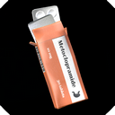
* Item class: _InediaPain_Metoclopramide_
* Prevents the vomiting symptom while active.
* Duration: 300 seconds.

##### **Calcium Hydroxyapatite caps**
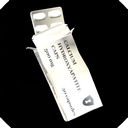
* Item class: _InediaPain_Calcium_
* Increases bone regeneration speed by 2 times while active.
* Duration: 300 seconds.

##### **Surgical Kit**
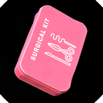
* Item class: _InediaPain_SurgicalKit_
* Allows performing procedures for stitching deep wounds, extracting bullets, and stopping internal bleeding.
    * Chance to stitch a deep wound: self - 90%, assist - 100%, blood loss: 50 ml.
    * Chance to extract a bullet: self - 70%, assist - 80%, blood loss: 100 ml.
    * Chance to stop internal bleeding: self - 30%, assist - 40%, blood loss: 500 ml.

##### **Splint Kit**
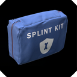
* Item class: _InediaPain_SplintKit_
* Allows stabilizing any of the 4 limbs.
* Increases bone regeneration by 3 times.
* Reduces additional shock from fractures by 3 times.

##### **Hemostatic Dressing**
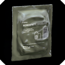
* Item class: _InediaPain_HemostaticDressing_
* Stops bleeding for 3600 seconds (basically, effectively until any wound heals).
* Increases limb regeneration by 3 times.

#### Additionally, the following vanilla medical items have some influence on the pain system and injuries:

##### **Morphine**
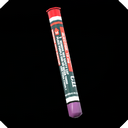
* Reduces pain level by 100% while active, but does not heal the pain.
* Allows performing the procedure of stitching a deep wound, extracting a bullet, and stopping internal bleeding.
* While active, increases health regeneration by 20 times.
* Duration: 60 seconds.

##### **Painkillers (Codeine)**
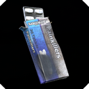
* Reduces pain level by 30% while active, but does not heal the pain.
* Allows performing the procedure of stitching a deep wound.
* While active, increases health regeneration by 2 times.
* Duration: 300 seconds.

##### **Vodka (liquid)**
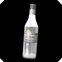
* Reduces pain level by 30% while active, but does not heal the pain.
* Allows performing the procedure of stitching a deep wound.
* Duration: 120 seconds per liter.

##### **Sewing Kit**

* Allows performing procedure for stitching deep wounds.
    * Chance to stitch a deep wound: self - 30%, assist - 40%, blood loss: 150 ml.

##### **Bandage dressing**
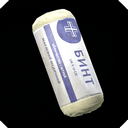
* Stops bleeding for 600 seconds, after which it becomes ineffective and bleeding resumes at 50% of the original rate.
* Increases limb regeneration by 1.5 times.

##### **Rags, bandanas**

* Stops bleeding for 300 seconds, after which it becomes ineffective and bleeding resumes at 50% of the original rate.
* Does not affect limb regeneration, essentially, it is the worst option in this regard. Rags need to be replaced constantly, and the process takes a long time since the limb heals slowly.

##### **Splint (made of rags and sticks)**
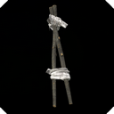
* Allows stabilizing only legs and arms.
* Increases bone regeneration by 1.5 times.
* Reduces additional shock from fractures by 1.5 times.

##### **Any vanilla knife, except for crafted ones**
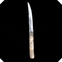
* Allows performing procedure for extracting bullets.
    * Chance to extract a bullet: self - 20%, assist - 30%, blood loss: 300 ml.

***

# Modifying the properties of current medications and medical items and adding custom ones

I strongly recommend not changing the default duration of fractures and deep wounds (1800 seconds), as well as the duration and parameters of default medical items and medications, as they are perfectly balanced for treating injuries with a duration of 1800 seconds.

For example, when consuming Vikasol (regen x2), the recovery time of a deep wound will be halved, which, in combination with a Hemostatic Dressing (regen x3), will give a recovery multiplier of 6 times, and the deep wound will heal in 1800 / 6 = 300 seconds, which is the duration of one Vikasol tablet.

The same applies to fractures: a tablet of Calcium hydroxyapatite combined with a Splint Kit will heal the fracture in 300 seconds, i.e., the time of one tablet's effect.

Alternatively, when treating a deep wound with vanilla bandages, which last for 600 seconds and have a limb regeneration rate of 1.5, you will heal the deep wound with exactly 1 bandage and 2 Vikasol tablets, i.e., 1800 / (1.5 * 2) = 600 seconds (the duration of one bandage and two tablets).

Thus, only change the vanilla values for fracture and deep wound durations, as well as medications, if you are fully aware of what you're doing and confident you won't break the balance.

Now, regarding how to modify item properties or add your own items, this can be done by modifying the item class properties in the default `config.cpp` file.

### Properties of medications

For example, this is how you can make any edible item a painkiller of any level:

    class CfgVehicles
    {
        class PainkillerLightItemClass
        {
            class InediaPain
            {
                ShowTips=1;

                IsPainkillerLightItem=1;
                PainkillerLightItemDurationSeconds=300;
            }
        }

        class PainkillerMediumItemClass
        {
            class InediaPain
            {
                ShowTips=1;

                IsPainkillerMediumItem=1;
                PainkillerMediumItemDurationSeconds=180;
            }
        }

        class PainkillerStrongItemClass
        {
            class InediaPain
            {
                ShowTips=1;

                IsPainkillerStrongItem=1;
                PainkillerStrongItemDurationSeconds=60;
            }
        }
    }

The _ShowTips_ parameter enables or disables the item properties hint that appears before use.

This is how you can make any item a blood regenerating item:

    class CfgVehicles
    {
        class BloodRegenItemClass
        {
            class InediaPain
            {
                ShowTips=1;

                IsBloodRegenItem=1;
                BloodRegenItemDurationSeconds=300;
                BloodRegenItemRegenMultiplier=5;
            }
        }
    }

Properties can be combined, for example, to create an item that regenerates blood while also being a strong painkiller:

    class CfgVehicles
    {
        class PainkillerStrongBloodRegenItemClass
        {
            class InediaPain
            {
                ShowTips=1;

                IsBloodRegenItem=1;
                BloodRegenItemDurationSeconds=300;
                BloodRegenItemRegenMultiplier=5;

                IsPainkillerStrongItem=1;
                PainkillerStrongItemDurationSeconds=60;
            }
        }
    }

These parameters can also be applied to any liquid, granting it specific properties. For example, this is how you can make "Vodka" a weak painkiller:

    class cfgLiquidDefinitions
    {
        class Vodka
        {
            class InediaPain
            {
                ShowTips=1;

                IsPainkillerLightItem=1;
                PainkillerLightItemDurationSeconds=120;
            }
        }
    }

List of classes for vanilla liquids used in the game: Water, Vodka, Gasoline.

Keep in mind that for liquids, the duration is calculated based on the volume relative to one liter. For example, if the effect duration for vodka is set to 120 seconds, drinking half a liter will grant the character 60 seconds of pain relief. If the remaining half-liter is consumed afterward, the effects will not stack, and the next dose will replace the previous one, as it will be more effective.

The same applies to items that have a consumption scale. The effect duration will be based on the percentage of the item consumed.

When it comes to consuming multiple items of the same type, the effect from the item with the higher impact will always replace the effect from the item with the lower impact. For example, if the character consumes item 1, which increases blood regeneration by 10 times for 60 seconds, and then consumes item 2, which increases blood regeneration by 5 times for 300 seconds, the effect from item 2 will replace the effect from item 1, as **300\*5 > 10\*60** (in fact, the duration of the first item will be less than 60 seconds, as the second item is consumed later, and the first item has already been active for some time, reducing its duration).

Here is the full list of properties that you can assign to items or liquids:

    class CfgVehicles
    {
        class YourItemClass
        {
            class InediaPain
            {
                ShowTips=1;

                // Light painkiller
                IsPainkillerLightItem = 1;
                PainkillerLightItemDurationSeconds=120;

                // Medium painkiller
                IsPainkillerMediumItem=1;
                PainkillerMediumItemDurationSeconds=180;

                // Strong painkiller
                IsPainkillerStrongItem=1;
                PainkillerStrongItemDurationSeconds=60;

                // Blood regeneration
                IsBloodRegenItem=1;
                BloodRegenItemDurationSeconds=300;
                BloodRegenItemRegenMultiplier=5;

                // Bleeding slowdown
                IsBloodClottingItem=1;
                BloodClottingItemDurationSeconds=300;
                BloodClottingItemClottingMultiplier=2;

                // Prevention of vomiting
                IsVomitReliefItem=1;
                VomitReliefItemDurationSeconds=300;

                // Bone regeneration
                IsBoneRegenItem=1;
                BoneRegenItemDurationSeconds=300;
                BoneRegenItemRegenMultiplier=2;

                // Deep wound regeneration
                IsDeepWoundRegenItem=1;
                DeepWoundRegenItemDurationSeconds=300;
                DeepWoundRegenItemRegenMultiplier=2;

                // Health regeneration
                IsHealthRegenItem=1;
                HealthRegenItemDurationSeconds=60;
                HealthRegenItemRegenMultiplier=20;
            }
        }
    }

### Properties of medical tools

Similar to medications, you can add properties to any of your items that allow them to function as tools for treating various types of injuries:

    class CfgVehicles
    {
        class YourItemClass
        {
            class InediaPain
            {
                ShowTips=1;

                // Tool for closing deep wounds
                IsDeepWoundClosureItem=1;
                DeepWoundClosureItemAllowedLimbs[]={"head", "arms", "legs", "torso"};
                DeepWoundClosureItemRequiredPainkillerLevel=1;
                DeepWoundClosureItemActionTimeSeconds=10;
                DeepWoundClosureItemActionText="#STR_inediainfectedai_wound_closure_tool_close_wound";
                DeepWoundClosureItemActionAnimationId=71; // 59 - craft, 71 - sew, 58 - bandage, see DayZPlayerConstants.CMD_ACTIONFB_* constants
                DeepWoundClosureItemQuantityPerUse=1;
                DeepWoundClosureItemSuccessChancePercent=30;
                DeepWoundClosureItemAssistSuccessChancePercent=40;
                DeepWoundClosureItemProcedureBloodLossMl=150;

                // Tool for bullet extraction
                IsExtractBulletItem=1;
                ExtractBulletItemAllowedLimbs[]={"head", "arms", "legs", "torso"};
                ExtractBulletItemRequiredPainkillerLevel=2;
                ExtractBulletItemActionTimeSeconds=10;
                ExtractBulletItemActionText="#STR_inediainfectedai_bullet_extraction_tool_extract_bullet";
                ExtractBulletItemActionAnimationId=71; // 59 - craft, 71 - sew, 58 - bandage, see DayZPlayerConstants.CMD_ACTIONFB_* constants
                ExtractBulletItemQuantityPerUse=20;
                ExtractBulletItemSuccessChancePercent=70;
                ExtractBulletItemAssistSuccessChancePercent=80;
                ExtractBulletItemProcedureBloodLossMl=100;

                // Tool for stopping internal bleeding
                IsInternalBleedingStoppingItem=1;
                InternalBleedingStoppingItemRequiredPainkillerLevel=3;
                InternalBleedingStoppingItemActionTimeSeconds=10;
                InternalBleedingStoppingItemActionText="#STR_inediainfectedai_internal_bleeding_treatment_tool_stop_internal_bleeding";
                InternalBleedingStoppingItemActionAnimationId=71; // 59 - craft, 71 - sew, 58 - bandage, see DayZPlayerConstants.CMD_ACTIONFB_* constants
                InternalBleedingStoppingItemQuantityPerUse=20;
                InternalBleedingStoppingItemSuccessChancePercent=30;
                InternalBleedingStoppingItemAssistSuccessChancePercent=40;
                InternalBleedingStoppingItemProcedureBloodLossMl=500;

                // Tool for bandaging deep wounds
                IsDeepWoundBandageItem=1;
                DeepWoundBandageItemAllowedLimbs[]={"head", "arms", "legs", "torso"};
                DeepWoundBandageItemEffectiveDurationSeconds = 600;
                DeepWoundBandageItemRegenerationMultiplier = 1.5;
                DeepWoundBandageItemActionTimeSeconds=5;
                DeepWoundBandageItemActionText="#STR_inediainfectedai_bandage_wound";
                DeepWoundBandageItemActionAnimationId=58; // 59 - craft, 71 - sew, 58 - bandage, see DayZPlayerConstants.CMD_ACTIONFB_* constants
                DeepWoundBandageItemQuantityPerUse=1;

                // Tool for stabilizing broken limbs
                IsFractureStabilizationItem=1;
                FractureStabilizationItemAllowedLimbs[]={"head", "arms", "legs", "torso"};
                FractureStabilizationItemShockReductionMultiplier = 1.5;
                FractureStabilizationItemRegenerationMultiplier = 1.5;
                FractureStabilizationItemActionTimeSeconds=10;
                FractureStabilizationItemActionText="#STR_inediainfectedai_stabilize_break";
                FractureStabilizationItemActionAnimationId=59; // 59 - craft, 71 - sew, 58 - bandage, see DayZPlayerConstants.CMD_ACTIONFB_* constants
                FractureStabilizationItemQuantityPerUse=1;

                // Tool for closing vanilla scratches
                IsCutClosureItem=1;
                CutClosureItemActionTimeSeconds=5;
                CutClosureItemActionText="#STR_inediainfectedai_remove_scratch";
                CutClosureItemActionAnimationId=71; // 59 - craft, 71 - sew, 58 - bandage, see DayZPlayerConstants.CMD_ACTIONFB_* constants
                CutClosureItemQuantityPerUse=5;
            }
        }
    }

Naturally, these parameters can also be combined to create multitools.

### Troubleshooting

If you need to make an item that does not have a consumption action consumable, you can add an Inedia consumption action to it, allowing it to provide various medication buffs described above. For example (just as an example), we can make "Firewood" an item that regenerates health as follows:

    class CfgVehicles
    {
        class Inventory_Base;
        class Firewood: Inventory_Base
        {
            class InediaPain
            {
                ShowTips=1;

                IsUsableItem=1;
                UsableItemQuantityPerUse=1;
                UsableItemActionText="#use";

                IsHealthRegenItem=1;
                HealthRegenItemDurationSeconds=60;
                HealthRegenItemRegenMultiplier=20;
            }
        }
    }

Sometimes, a situation may arise where an item uses its own non-vanilla consumption actions. In this case, Inedia is unaware of these actions, and the parameters that grant the item various buffs will not work.

This issue can only be resolved by radically removing all actions on the item except for Inedia-actions. This radical solution can be implemented using the following parameter:

    class CfgVehicles
    {
        class YourItemClass
        {
            class InediaPain
            {
                ShowTips=1;

                EnableFlugegeheimen=1;

                // .. here will be properties of Inedia medications and medical tools ...
            }
        }
    }

Keep in mind that after this, the item will lose all modded and vanilla actions, leaving only the Inedia actions and properties. These are the limitations of the Flugegeheimen, and it's up to you to decide whether to use this or implement everything through a script-based solution.

***

# Auxiliary methods in scripts that can influence the pain system.

In order to enable the activation of different levels of painkillers based on specific logic, this modification introduces the following auxiliary methods that should be overridden and return true if the activation conditions for the desired painkiller action are met:

    modded class InediaPain_Restrictions
    {
        override static bool PainSystem_PainkillerLightEffectIsActive(PlayerBase player)
        {
            /*
            if ( #your conditions# ) {
                // If the method returns true, it will be considered that the player is under the effect of light painkiller (minus 30% pain).
                return true;
            }
            */

            return false;
        }

        override static bool PainSystem_PainkillerMediumEffectIsActive(PlayerBase player)
        {
            /*
            if ( #your conditions# ) {
                // If the method returns true, it will be considered that the player is under the effect of medium painkiller (minus 50% pain).
                return true;
            }
            */

            return false;
        }

        override static bool PainSystem_PainkillerStrongEffectIsActive(PlayerBase player)
        {
            /*
            if ( #your conditions# ) {
                // If the method returns true, it will be considered that the player is under the effect of strong painkiller (minus 100% pain).
                return true;
            }
            */

            return false;
        }
    }

By default, painkillers statuses do not heal pain but only reduce their pain level by removing debuff symptoms.

However, if you need to heal pain, use the method:

_PlayerBase.InediaInfectedAI_GetPainManager().AddPainPercentForLimb(string limb, float value)_:
* _limb_ => "head", "arms", "legs", "torso";
* _value_ => percentage, negative floating-point value for treatment;

Call this method when the character consumes the item you need with the desired parameters.

However, this method cannot heal a broken limb, as the fracture will not allow the pain to be reduced below 80%. But if you need to heal a fracture, you can use the method:

_PlayerBase.InediaInfectedAI_GetPainManager().DeactivateBreakForLimb(string limb)_:
* _limb_ => "head", "arms", "legs", "torso";

To deactivate a deep wound, use the method:

_PlayerBase.InediaInfectedAI_GetPainManager().DeactivateDeepWoundForLimb(string limb)_:
* _limb_ => "head", "arms", "legs", "torso";
