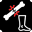

# Introduction

This modification introduces a pain system that includes various debuffs and injuries that a player can incur on different limbs.

In addition to the pain system, this modification introduces a [medical system](Inedia-Medicine-guide) that includes a range of medications and medical tools to counteract debuffs and injuries from the pain system, and also allows you to equip any vanilla or custom items and liquids with these properties.

The system is called the pain system because pain is the cornerstone of the entire system and affects the debuffs. The more intense the pain in a limb, the worse and stronger the debuffs. Various types of injuries (deep wounds, fractures, bullet wounds) in themselves cause almost no debuffs, but they affect the pain level and can exacerbate pain-related debuffs. However, if there is no pain (for example, under the effect of painkillers), there will be no debuffs from this injuries.

Visual guide for the Inedia Pain System:
* [EN](Inedia-Pain-System-Visual-Guide-EN)
* [RU](Inedia-Pain-System-Visual-Guide-RU)

***

# Pain system

When receiving shock damage to any limb (head, arms, legs, torso), the player incurs pain that apply a specific debuff corresponding to that body part.

This can be any damage, damage from infected, from animals, from players, as well as from explosions (explosions always damage the head, and can also damage multiple limbs at the same time). Hitting walls and creatures with your bare hands will also cause damage to your hands, and falling from heights will cause damage to your legs (and other limbs if the height is significant).

When damage is received, the corresponding icon appears at the bottom right of the screen. The color of the icon changes depending on the intensity of the pain, ranging from yellow to red. The character's screen will blur depending on the number of limbs with pain and the intensity of the pain, but this blur can be disabled using the parameter _Players.ShowPainBlur_.

Each limb has a percentage of pain ranging from 0% to 100%. When an pain is sustained to a limb, the percentage increases.

The pain received by limbs depends on the character's armor, so it makes sense to wear a helmet and vest even on PvE servers to reduce pain and injuries. There is also the possibility to influence the resulting damage for any type of infected using multipliers, parameters _Zombies.PainToPlayer#LIMB#Multiplier_ and _Zombies.PainToPlayer#LIMB#InBlockMultiplier_. If you want to disable pain to a particular limb, simply set this multiplier to "0".

If you want to completely disable the pain system, set parameter _Players.PainSystemIsActive_ to "0".

If you want to disable the pain system for the damage that players receive from other players but leave it for damage from infected and animals, disable the parameter _Zombies.PainToPlayerHandlerIsActive_ for the class "SurvivorBase". Please note that in the InediaInfectedAI modification, there is also damage from projectiles, which are separate entities themselves, inflicting damage and not affected by this parameter. To disable the pain inflicted by projectiles, it is necessary to set the projectile parameter _Parameters.TargetPainMultiplier_ to "0" for all projectiles.
The projectiles themselves are configured in the parameter [Zombies.ThrowingProjectiles](Description#zombiesthrowingprojectiles).

Pain in each limb naturally decreases at a rate of 0.1% per second by default, but this can be adjusted using parameter _Players.PainHealingRatePerSecondPercent_. If you need to accelerate limb recovery (debuffs will be active for less time), simply increase the value of this parameter.

There are 3 levels of limb pain:
* Level 1 (yellow icon) - limb pain ranges from 10% to 30%;
* Level 2 (orange icon) - limb pain ranges from 30% to 50%;
* Level 3 (red icon) - limb pain ranges from 50% to 100%;

Depending on the level of pain, corresponding debuffs are applied to the limb:

## Arm pain
*  **Level 1 (10-30%)**:
    * Slight hand tremors when aiming (effect is influenced by fractures and bullets);
    * Close combat damage reduced by 20% (damage reduction to creature due to damaged arms will not work when the parameter Zombies.DamageToZombieHandlerIsActive is disabled);
    * Cannot use combo attacks (combination attacks with frequent left mouse button presses);
    * When aiming, the character's arms lower after a certain duration (effect is influenced by fractures and bullets). A large amount of aiming time, which depends on the level of pain in the arms and the weight of the weapon. At the same time, it is still possible to hold the weapon from the hip, but shock regeneration will be disabled, and the player will take medium shock damage. While prone, the aforementioned debuffs will not apply, allowing for comfortable aiming and shooting. The arms lowering mechanic is disabled by the parameter _Players.ArmsLowerWhenAimingWithPainedArms_;
    * When performing various animated actions (crafting, reloading weapons, chopping wood, etc.), the character receives minor shock damage (effect is influenced by fractures and bullets). You can adjust the shock damage of any action using the parameter _Players.ArmsPainShockDamageActions_.
*  **Level 2 (30-50%)**:
    * Slight decrease in movement speed (~12 km/h – jogging, ~20 km/h – sprinting);
    * Medium hand tremors when aiming (effect is influenced by fractures and bullets);
    * Close combat damage reduced by 40% (damage reduction to creature due to damaged arms will not work when the parameter Zombies.DamageToZombieHandlerIsActive is disabled);
    * Cannot use combo attacks (combination attacks with frequent left mouse button presses);
    * In close combat, the character won't be able to heavily stun the infected;
    * Performing close combat attacks causes the character to receive minor shock damage (effect is influenced by fractures and bullets). This mechanic is disabled by the parameter _Players.ShockIfAttackingWithPainedArms_;
    * When aiming, the character's arms lower after a certain duration (effect is influenced by fractures and bullets). A medium amount of aiming time, which depends on the level of pain in the arms and the weight of the weapon. At the same time, it is still possible to hold the weapon from the hip, but shock regeneration will be disabled, and the player will take medium shock damage. While prone, the aforementioned debuffs will not apply, allowing for comfortable aiming and shooting. The arms lowering mechanic is disabled by the parameter _Players.ArmsLowerWhenAimingWithPainedArms_;
    * When performing various animated actions (crafting, reloading weapons, chopping wood, etc.), the character receives medium shock damage (effect is influenced by fractures and bullets). You can adjust the shock damage of any action using the parameter _Players.ArmsPainShockDamageActions_.
*  **Level 3 (50-100%)**:
    * Medium decrease in movement speed (~10 km/h – jogging, ~15 km/h – sprinting);
    * Strong hand tremors when aiming (effect is influenced by fractures and bullets);
    * Close combat damage reduced by 60% (damage reduction to creature due to damaged arms will not work when the parameter Zombies.DamageToZombieHandlerIsActive is disabled);
    * Cannot use combo attacks (combination attacks with frequent left mouse button presses);
    * In close combat, the character won't be able to heavily stun the infected;
    * Performing close combat attacks causes the character to receive average shock damage (effect is influenced by fractures and bullets). This mechanic is disabled by the parameter _Players.ShockIfAttackingWithPainedArms_;
    * When aiming, the character's arms lower after a certain duration (effect is influenced by fractures and bullets). A small amount of aiming time, which depends on the level of pain in the arms and the weight of the weapon. At the same time, it is still possible to hold the weapon from the hip, but shock regeneration will be disabled, and the player will take medium shock damage. While prone, the aforementioned debuffs will not apply, allowing for comfortable aiming and shooting. The arms lowering mechanic is disabled by the parameter _Players.ArmsLowerWhenAimingWithPainedArms_;
    * If the percentage of arms pain exceeds 90% after receiving damage, then if the character takes aim, he will lower his arms. This mechanic is disabled by the parameter _Players.ArmsLowerWhenOverPainedArmsReceivingHits_;
    * When performing various animated actions (crafting, reloading weapons, chopping wood, etc.), the character receives high shock damage (effect is influenced by fractures and bullets). You can adjust the shock damage of any action using the parameter _Players.ArmsPainShockDamageActions_.
    * If arms pain exceeds 90%, the player will begin to lose health from pain shock at a rate of _Players.HealthDrainWithOverPainedLimbPerSecondPercent_ percent HP per second. Since it’s pain shock, the health drain will not occur while the player is unconscious;

\* If the character is lying down, the debuff of lowering the weapon, as well as the debuffs from arm tremors, do not apply.

\* If the percentage of arms pain exceeds 10%, there is a chance that a creature, when dealing damage to the player's arms, will disarm them (the chance is adjusted by parameters _Zombies.PainToPlayerArms\*DisarmMultiplier_).

\* If the character hits with bare hands without gloves, they take pain to their hands (this mechanic is disabled by the parameter _Players.PainArmsWhenHitWithoutGloves_).

\* If the arm is broken  or has a bullet in it , or if the pain level exceeds 50%  - the character's will be unable to perform a backstab, and they won’t be able to climb over obstacles higher than 1.5 meters.

## Leg pain
*  **Level 1 (10-30%)**:
    * Medium decrease in movement speed (~10 km/h – jogging, ~15 km/h – sprinting);
*  **Level 2 (30-50%)**:
    * Significant decrease in movement speed (~8 km/h – jogging, ~11 km/h – sprinting) and the character cannot jump over high obstacles;
    * While moving, shock does not recover but is only consumed, 0.3% per second (effect is influenced by fractures and bullets). This mechanic is disabled by the parameter _Players.ShockIfRunsWithPainedLegs_;
*  **Level 3 (50-100%)**:
    * Very significant decrease in movement speed (~6-7 km/h – jogging) and the character cannot sprint and jump over high obstacles;
    * While moving, shock does not recover but is only consumed, 0.6% per second (effect is influenced by fractures and bullets). This mechanic is disabled by the parameter _Players.ShockIfRunsWithPainedLegs_;
    * If the legs pain exceeds 90%, the player will begin to lose health from pain shock at a rate of _Players.HealthDrainWithOverPainedLimbPerSecondPercent_ percent HP per second. Since it’s pain shock, the health drain will not occur while the player is unconscious;

## Torso pain
*  **Level 1 (10-30%)**:
    * 5% chance per second of completely draining stamina (effect is influenced by fractures and bullets);
*  **Level 2 (30-50%)**
    * Slight decrease in movement speed (~12 km/h – jogging, ~20 km/h – sprinting);
    * 10% chance per second of completely draining stamina (effect is influenced by fractures and bullets);
*  **Level 3 (50-100%)**:
    * Medium decrease in movement speed (~10 km/h – jogging, ~15 km/h – sprinting);
    * 15% chance per second of completely draining stamina (effect is influenced by fractures and bullets);
    * If the percentage of torso pain exceeds 90% after receiving damage, the character will be forced to crouch. This mechanic is disabled by the parameter _Players.CrouchWhenOverPainedTorsoReceivingHits_;
    * If the torso pain exceeds 90%, the player will begin to lose health from pain shock at a rate of _Players.HealthDrainWithOverPainedLimbPerSecondPercent_ percent HP per second. Since it’s pain shock, the health drain will not occur while the player is unconscious;

## Head pain
*  **Level 1 (10-30%)**:
    * With a 0.1% chance per second (effect is influenced by fractures and bullets), the player hears auditory hallucinations (infected sounds, gunfire, bullet whizzes). This mechanic is disabled by the parameter _Players.AuditoryHallucinationsWithPainedHead_;
*  **Level 2 (30-50%)**:
    * Slight decrease in movement speed (~12 km/h – jogging, ~20 km/h – sprinting);
    * With a 0.2% chance per second (effect is influenced by fractures and bullets), the player hears auditory hallucinations (infected sounds, gunfire, bullet whizzes). This mechanic is disabled by the parameter _Players.AuditoryHallucinationsWithPainedHead_;
    * With a 0.1% chance per second (effect is influenced by fractures and bullets), the player might vomit, but it doesn't work if the character is in a resting pose. Vomiting mechanic is disabled by the parameter _Players.VomitWithPainedHead_;
*  **Level 3 (50-100%)**:
    * Medium decrease in movement speed (~10 km/h – jogging, ~15 km/h – sprinting);
    * With a 0.3% chance per second (effect is influenced by fractures and bullets), the player hears auditory hallucinations (infected sounds, gunfire, bullet whizzes). This mechanic is disabled by the parameter _Players.AuditoryHallucinationsWithPainedHead_;
    * With a 0.2% chance per second (effect is influenced by fractures and bullets), the player might vomit, but it doesn't work if the character is in a resting pose. Vomiting mechanic is disabled by the parameter _Players.VomitWithPainedHead_;
    * If the percentage of head pain exceeds 90% after receiving damage, the character loses consciousness for a long time. This mechanic is disabled by the parameter _Players.UnconsciousWhenOverPainedHeadReceivingHits_.
    * If the head pain exceeds 90%, the player will begin to lose health from pain shock at a rate of _Players.HealthDrainWithOverPainedLimbPerSecondPercent_ percent HP per second. Since it’s pain shock, the health drain will not occur while the player is unconscious;

\* If the pain damage to the head is greater than or equal to "5", then ambient sounds are muted by 70%, the player hears ringing in the ears, vision is blurred (for a duration of 2.5 to 10 seconds depending on the head protection and damage received), and movement speed is severely reduced (for a duration of 5 to 20 seconds depending on the head protection and damage received). The effects are activated no more than once every 60 seconds. Any of these effects can be turned off: _Players.TinnitusWhenHeadReceivingHits_, _Players.BlurWhenHeadReceivingHits_, _Players.SoundAttenuationWhenHeadReceivingHits_, _Players.MovementCoordinationImpairmentWhenHeadReceivingHits_.

\* Head cannot be injured by melee attacks if the player is in a block, in this case, all the damage is redirected to other parts of the body.

\* If the skull fracture  is active - the character has a 0.2% chance per second to lose consciousness, regardless of the existing shock (7 seconds before losing consciousness, the character will experience blurred vision and muffled sounds), but loss of consciousness doesn't work for characters in resting poses. Loss of consciousness will also not occur if the limb is stabilized with a stabilization item, such as a "Splint Kit". The mechanic of losing consciousness is disabled by the parameter _Players.UnconsciousWhenHeadBreak_;

\* The blur effect from head pain is 3 times stronger than the same effect from pain in other limbs.

### Medications that affect pain mechanics.

* The vanilla **Painkillers** reduce limb pain percentage by 30% during their effect. Thus, previously almost useless painkiller tablets now become much more useful as they can slightly alleviate pain, thereby removing debuff symptoms. They also double the character's HP recovery speed while active.
* The vanilla **Epinephrine** reduces the pain level by 30% while active.
* The vanilla **Morphine** reduces limb pain percentage by 100% during its effect, meaning it removes all debuffs. Morphine also increases the character's HP recovery speed by 20 times while active.
* This modification introduces the "Tramadol" pills, item class _InediaPain_Tramadol_. The pill lasts for 3 minutes and, while active, reduces the pain level by 50%. It also increases the character's health recovery speed by 4 times during its effect.
* Remember, these medications do not heal the limb but only temporarily reduce its pain level. After the medication's effect wears off, the pain will return (unless the limb naturally heals itself by that time).

***

# Fractures system

When receiving damage from various creatures, the player can suffer fractures to any of the limbs.

   

* If for any reason you wish to disable the extended fracture system, you can set the parameter _Players.LimbsBreakSystemIsActive_ to "0". In this case, only the vanilla leg fracture will remain, and the vanilla icon will return. In other words, limb pain will no longer affect fractures at all, including leg fractures and creatures will no longer break the player's limbs (including legs) by any method other than the vanilla one - keep that in mind.
* Alternatively, you can disable the extended fracture for any of the body parts by setting the parameter _Players.#LIMB#BreakDurationSeconds_ to "0". This same parameter can be used to change the fracture's active duration after it is sustained, with the default being "1800" seconds.
* These fractures have their own debuffs, described above in the limb debuffs section, and prevent the pain level in the corresponding limb from dropping below a certain threshold while the fracture is active, thereby causing problems for the player.
* A fractured limb without a splint prevents the pain level from dropping below 80% (red level), while a fractured limb with a splint applied prevents the pain from dropping below 50% (orange level).
* Fractures increase limbs pain shock debuffs by 3 times, but this number can be reduced by using a stabilization item, depending on the item.
* The player can apply various types of splints to fractures    . A basic crafted splint made of sticks and cloth can only be applied to legs and arms fractures, while plastic cast splints (from the "InediaPain_SplintKit" item) can be applied to any limb. Applying a splint reduces the limb's recovery time and also decreases pain shock debuffs depending on the type of splint.
* Using the parameter _Players.LimbsBreakFromFalls_, you can disable limb fractures from falls, and with the parameter _Players.LegsBreakFromTraps_, you can disable leg fracture from stepping into a bear trap.
* How is the chance of getting a fracture calculated?
    * If, after receiving pain damage to a limb, its pain level exceeds or equals _Players.LimbsBreakPainThresholdPercent_ percent, the character has a chances to suffer a fracture of that limb. The fracture chance in percent is calculated using the formula: `0.03125 * 2 ^ (LimbPainPercent / 10)`, where "^" denotes exponentiation. A limb fracture cannot occur more than once per minute.
    * With the _Zombies.PainToPlayerLimbsBreakChancesMultiplier_ parameter, you can influence the chance of getting a fracture when taking damage from any type of creature.

### Medications that affect fractures.
* The vanilla splint can accelerate the recovery of leg fractures by 1.5 times, but it only works on legs and arms fractures and does not work on other types of fractures. The vanilla splint also reduces shock debuffs from fractures by 1.5 times.
* This modification introduces a special item, "Splint Kit", the item class _InediaPain_SplintKit_, that allows the player to apply splints (plastic bandages and dressings) to any limb. This type of splint increases the limb's recovery time by 3 times and also reduces limbs pain shock debuffs by 3 times.
* Also this modification added item "Calcium hydroxyapatite caps", the item class _InediaPain_Calcium_. By default, the capsule lasts for 5 minutes after use, doubling the fracture recovery speed. Please note that the medication also affects the healing speed of vanilla leg breaks.
* You can find the _types.xml_ for all Inedia-medications in the root of the modification add-on, directory "types".

***

# Deep wounds system

When receiving damage from various creatures, the player can suffer deep wounds to any of the limbs.

   

* If for any reason you wish to disable the deep wounds system, you can set the parameter _Players.LimbsDeepWoundSystemIsActive_ to "0".
* Alternatively, you can disable the deep wound for any of the body parts by setting the parameter _Players.#LIMB#DeepWoundDurationSeconds_ to "0". This same parameter can be used to change the deep wound active duration after it is sustained, with the default being "1800" seconds.
* Deep wounds themselves do not apply specific debuffs, but while they are active, they prevent the pain level from dropping below a certain threshold, causing problems for the player.
* If a deep wound is not bandaged, the pain cannot drop below 80% (red level), and if it is bandaged, it cannot drop below 50% (orange level).
* Just like regular cuts, deep wounds cause bleeding, which can be stopped by applying a bandage to the affected limb    .
* The bleeding rate of a deep wound depends on the pain damage the player received at the moment the wound was inflicted.
* If the character receives damage to a bandaged wound, there is a 30% chance the bandage will start to bleed.
* When the functionality of deep wounds is active, vanilla cuts turn into scratches and their bleeding rate decreases by 10 times. You can affect the bleeding multiplier of vanilla cuts using the parameter _Players.LimbsDeepWoundVanillaCutBleedRateMultiplier_.
* Deep wounds cannot be inflicted on NPCs and bots, as they cannot treat them.
* Using the parameter _Players.LimbsDeepWoundFromFalls_, you can disable limb deep wounds from falls, and with the parameter _Players.LegsDeepWoundFromTraps_, you can disable leg deep wound from stepping into a bear trap.
* The _Players.PainSystemNotificationsType_ parameter allows you to change the notification type for the deep wounds system (to in-game chat, pop-up, or disable notifications altogether).
* How is the chance of receiving a deep wound calculated?
    * A deep wound cannot be inflicted on a limb that is 100% protected against blood damage. For example, it is impossible to cause a deep wound to the torso if the character is wearing a bulletproof vest.
    * If blood damage occurs, then the chance of getting a deep wound is determined by the ammo used to inflict the damage, specifically the "CfgAmmo AmmoClass DamageApplied bleedThreshold" parameter. The chance of getting a deep wound is equal to [bleedThreshold * 100] percent.
    * The chance of infected causing deep wounds has been reduced by 10 times.
    * With the _Zombies.PainToPlayerLimbsDeepWoundChancesMultiplier_ parameter, you can influence the chance of getting a deep wound when taking damage from any type of creature.

### Medications that affect deep wounds.

* You can stitch a deep wound only while under the effect of a painkiller higher than low level ("Morphine", "Codeine", "Adrenaline", "Vodka" liquid, "Tramadol", item class _InediaPain_Tramadol_).
* If the character performs surgery with an unsterilized item, they will get a blood infection with a 100% chance.
* Bleeding can be stopped with any bandage item. After the bleeding is stopped, the pain will no longer be fixed at 80% (red level) and will decrease to 50% (orange level).
* Each bandage has an effective duration, after which it starts to allow 50% of the blood to leak, and the player will be informed with a corresponding sound and icon    .
* If the character receives damage to a bandaged wound, there is a 30% chance the bandage will start to bleed.
* Bandages can provide a regeneration bonus to a limb. The higher the bonus, the faster the limb will heal under the effect of that bandage.
* Vanilla rags do not have regeneration bonus and also have a very short effective duration. The vanilla bandage has a medium duration and provides a x1.5 regeneration bonus. The hemostatic bandage (item class _InediaPain_HemostaticDressing_) has a x3 regeneration bonus and the longest duration, sufficient for complete wound healing.
* Any sewing kit can be used to stitch the limb, but it only has a 50% success rate. In case of failure, the wound will reopen, causing bleeding, setting the pain level to at least 80%. As a result of the procedure, regardless of the outcome, the character loses blood, with the amount of blood loss depending on the type of item used. To stitch the wound with a 100% success rate, you need to use a special item introduced by this modification - the "Surgical Kit", item class _InediaPain_SurgicalKit_. With this item, there is no chance of failure, and the character loses very little blood as a result of the procedure. Once the wound is stitched, it disappears, and the pain level can drop to zero.
* This modification also introduces "Vikasol" pills, item class _InediaPain_Vikasol_. After consumption, the pill lasts for 5 minutes, doubling the wound healing speed and halving the rate of any bleeding (including vanilla bleeding). These pills can be especially helpful in situations where failed attempts to stitch a wound result in significant blood loss. Taking this pill can mitigate such effects.
* Additionally, the modification introduces "Sorbifer Durules" pills, item class _InediaPain_Sorbifer_, which boost blood regeneration by 10 times but only last for 2 minutes. These pills can also be useful during wound-stitching operations.
* You can find the _types.xml_ for all Inedia-medications in the root of the modification add-on, directory "types".

***

# Bullet wounds system

When receiving damage from firearms to unprotected parts of the body, the character may suffer a gunshot wound.

   

* The bullet wound system can be disabled using the parameter _Players.LimbsBulletSystemIsActive_.
* If the deep wound mechanic is active, a bullet wound cannot be obtained without causing a deep wound. Therefore, the bullet itself does not significantly affect the pain, as the pain is primarily caused by the wound it created, which can essentially be stitched up, leaving the bullet inside and thus reducing the pain.
* As long as the bullet is in the limb, it increases shock effects of pain, similar to fractures, which can be read about above.
* A bullet in the limb increases limbs pain shock debuffs by 3 times.
* A bullet in the limb has two stages of effect. The time from the first to the second stage can be adjusted using the parameter _Players.LimbsBulletTimeToSecondStageSeconds_.
    * In the first stage, the bullet prevents the pain level from dropping below 30% (yellow level).
    * In the second stage, the pain level rises to 50% (orange level), and the player begins accumulating heavy metal poisoning agents, which will eventually kill the player if the bullet is not removed.
* When extracting the bullet, it will always create a deep wound, and if the wound already exists, it will update it and slightly increase the bleeding.
* Bullet wounds cannot be inflicted on NPCs and bots, as they cannot treat them.
* How is the chance of receiving a bullet wound calculated?
    * An important condition for sustaining a bullet wound is receiving a deep wound.
    * The chance of sustaining a bullet wound is calculated based on the damage caused by the bullet but cannot be less than 30%. Additionally, there is a minimum damage threshold below which a bullet cannot cause a bullet wound and will instead leave only a deep wound. The more powerful the bullet, the lower the chance it will remain in the body. For example, a .22 LR bullet has a very high chance of staying in the body (almost 100%) but causes only minor bleeding. In contrast, a rifle bullet has a much lower chance of remaining in the body (as it is more likely to pass through) but will leave a deep wound with severe bleeding.

### Medicine that affects bullet wounds.

* The bullet can only be extracted under the effect of a medium or higher level painkiller ("Morphine", "Tramadol", item class _InediaPain_Tramadol_), or the character may be unconscious.
* If the character performs surgery with an unsterilized item, they will get a blood infection with a 100% chance.
* Bullet extraction always results in blood loss, regardless of the outcome of the procedure. The blood loss depends on the item used - higher quality items result in less blood loss. Additionally, blood loss can be reduced with a medication that increases blood clotting ("Vikasol" pills, item class _InediaPain_Vikasol_).
* The bullet can be extracted using the "Surgical Kit" (item class _InediaPain_SurgicalKit_) with a very high chance and minimal blood loss.
* The bullet can be extracted with any knife, but with a very small chance and significant blood loss, making it a risky procedure.
* You can find the _types.xml_ for all Inedia-medications in the root of the modification add-on, directory "types".

***

# Internal bleeding system

When receiving gunshot or piercing weapon damage to the torso from other players, the character may suffer internal bleeding.

* When the torso is injured, leading to bleeding (gunshot, stabbing, etc.), the player has a chance to develop internal bleeding.
* This is the most unpleasant and dangerous status in the Inedia pain system, as it can only be treated with a "Surgical Kit" (item class _InediaPain_SurgicalKit_), with a very low success rate and significant blood loss. A very strong painkiller ("Morphine") will also be required for the procedure. Therefore, it will require either great luck or a lot of blood packs.
* If the character performs surgery with an unsterilized item, they will get a blood infection with a 100% chance.
* With this status, the character slowly loses blood until death, and the status has no time limit, meaning it can only be removed through surgery.
* Despite being a very harsh status, it can be prevented by wearing a regular bulletproof vest. A player in a bulletproof vest will never get this status, as they will not suffer bleeding in the torso, which is the initial condition for developing internal bleeding.
* The parameter _Players.InternalBleedingBloodLossRateMl_ allows you to set the number of milliliters of blood the character will lose per second when internal bleeding is present.
* Internal bleeding cannot be inflicted on NPCs and bots, as they cannot treat it.
* How is the chance of receiving a internal bleeding calculated?
    * The main condition is receiving a deep wound to the torso, after which the chance of developing internal bleeding is calculated based on the type of attack and the damage dealt.
    * The chance is influenced by the vanilla parameter `CfgAmmo Ammo DamageApplied bleedThreshold`, which is always set to "1" for bullets ammo and has different values for various melee weapons. The sharper the weapon, the higher the value.
    * Currently, the player can only receive internal bleeding from player attacks, meaning infected and animals cannot inflict this status.

***

# Other settings and parameters.
* Using parameters _Players.VehicleCrashPainMultiplier_, _Players.VehicleCollisionsPainMultiplier_, _Players.FallPainMultiplier_, and _Players.ExplosionsPainMultiplier_, you can specify the pain multipliers that the character receives from vehicle crashes, collisions with vehicles, falls from height, and explosions.
* Using the parameter _Players.ArmsPainUnrestrainItems_ you can adjust the amount of pain damage per second for any item from which the character attempts to break free (e.g., handcuffs).
* If you want to keep the pain system and debuffs but only disable debuff badges, use parameter _Players.ShowPainBadges_.
* The _Players.PainSystemNotificationsType_ parameter allows you to change the notification type for the pain system (to in-game chat, pop-up, or disable notifications altogether).
* The parameter _Players.ShowMedicationInfo_ can be used to disable the effect list tips that appear before use, globally for all medical items.
